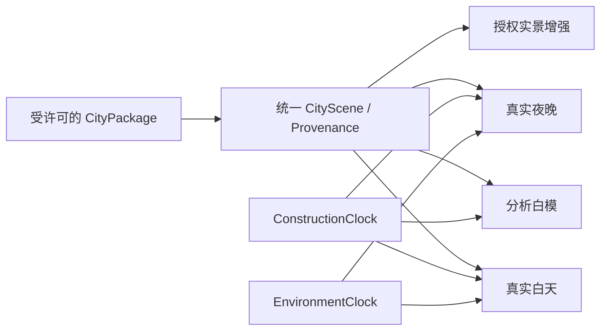

# city.md — 城市推演台路线图（Real City Observatory）

> **状态**：`cityview.html` 已于 2026-08-15 经产品负责人明确授权升为公开 `active` 页面并进入 Labs 导航，生产地址为 `https://feida.au/cityview.html`。公开入口现只保留上海、墨尔本、香港三个程序化过渡 profile；内部另保留不可见的合成测试 fixture。实体设备人工签署与真实 GIS / 许可证据尚未闭环。
> **整理基线**：2026-08-15（上海、墨尔本、香港公开数据与许可研究已更新）
> **方向更新**：产品从“通用 Sandbox + 三座概念城市”转向“上海 / 墨尔本 / 香港三座真实城市窗口”。`CITY-REAL-P0-01` 已删除公共 Sandbox、将旧链接迁移到上海，并把内部基准隔离为不可见的 `synthetic-test-fixture-v1`；白模保留，但改为未来真实几何的分析表现层。三座 generated-concept adapter 只作为过渡公开实现保留到 `CITY-REAL-P1-05`，三个 approved CityPackage 就绪后生成器才完全退出用户路径。
> **发布决策**：本次公开上线覆盖了本文较早的“真机签署前保持 prototype + noindex”建议；旧记录保留为实现历史，不再代表当前路由状态。真实数据包获批前，现网页面必须继续标注 `generated concept—not GIS`，不能因已公开而绕过许可、坐标或地图合规闸门。
> **实施历史**：2026-08-15 已完成确定性 8×8 plan、可逆 0–210 天状态机、白模场景、巡游、批量立面与结构线、状态派生指标、共享渲染预算/WebGL 生命周期、静态 poster、双语 DOM、三座概念城市及真机证据采集器。四 profile 自动候选矩阵、香港短稳与上海 30 分钟长稳只作为迁移前基线；它们不构成真实城市数据证据。
> **范围**：Project Afflatus 的新城市网页专项路线图；只排列 City 项目内部优先级，不改写全站 backlog。
> **上位约束**：技术冲突以 [`tech.md`](./tech.md) 为准，视觉与 UX 冲突以 [`design.md`](./design.md) 为准，实施纪律以 [`CLAUDE.md`](./CLAUDE.md) 为准。
> **审查结论**：现有生成器、可逆施工、相机、因果指标和共享 Three.js 治理可复用；8×8 正交网格不能继续承担城市真实性。下一阶段不再扩充随机城市资产，而是建立可追溯的道路、水岸、地形、地块、建筑和城市公共空间数据包，并让白模、白天和夜晚共用同一几何真相。
> **优先级命名**：新迁移工作使用 `CITY-REAL-P0/P1/P2/P3`；旧 `CITY-P*` 只作为历史证据，避免与 [`urgent.md`](./urgent.md) 的全站优先级混淆。

---

## 0. 结论先行

这个项目不再把“Sandbox”当成一座可选城市，也不试图一次复制完整 Google Earth。产品只有上海、墨尔本、香港三座城市；每座城市共享同一份真实几何与来源清单，再切换三种主要表现状态和一个可选增强层：

| 表现状态 | 主要价值 | 几何与材质 | 长期角色 |
| --- | --- | --- | --- |
| **分析白模 / Analysis** | 最清楚地解释城市结构、施工与数据置信度 | 真实道路、水岸、地形、地块和建筑体块；白色无光材质 + 灰色结构线 | 默认低成本模式、施工/比较、弱设备降级 |
| **真实白天 / Day** | 呈现城市尺度、材质、空气与公共空间 | 同一真实几何；语义 PBR、真实太阳、天空、水体和适度阴影 | 默认沉浸展示；不得使用带烘焙日照的纹理伪装可变太阳 |
| **真实夜晚 / Night** | 呈现城市活动、交通和港湾光层 | 同一真实几何；确定性窗光、道路/桥梁/码头灯与克制反射 | 独立环境状态；所有占用、车流和招牌强度明确标“模拟” |
| **授权实景 / Scenic** | 在覆盖、许可、费用允许时提供摄影测量级远景 | 授权正射影像、摄影测量或 3D Tiles；不可拆解的完成态 | 可关闭增强；失效时回退到 Day / Analysis，而不是空白 |



### 我的主张

1. **删除的是公共 Sandbox 城市，不是白模。** 白模改为真实城市几何的分析皮肤；三座概念 adapter 在真实包迁移期暂留，`CITY-REAL-P1-05` 后随机生成器才只留在 CI、离线失败测试和可复现回归中。
2. **先保证空间关系真实，再追求照片感。** 道路—地块—建筑—水岸—地形的对齐，比高分辨率纹理更能决定沉浸感。
3. **菜单顺序与工程顺序分开。** 对外仍以“上海 → 墨尔本 → 香港”展示；对内先用墨尔本开放数据校准 ETL，再把同一管线用于上海和香港。
4. **施工时间与环境时间必须分离。** `ConstructionClock` 负责 0–210 天；`EnvironmentClock` 负责城市当地日期、太阳高度、黄昏和夜晚。切夜景不能修改施工日。
5. **夜晚不是给白天贴图整体压暗。** 烘焙阴影的航摄影纹理只适合白天/远景；夜晚优先切换到无纹理或语义建筑壳，再叠加确定性 emissive。
6. **城市辨识度不能只靠地标。** 黄浦江两岸反差、Hoddle Grid 与巷道、维港与山地压缩，必须在隐藏城市名和英雄地标后仍成立。
7. **梦幻感来自时间、空气和节奏。** 太阳、薄雾、蓝时刻、水面留白、雨后反射与连续镜头优先于重 bloom、过曝和全屏青紫。
8. **数据权利是渲染依赖。** 没有明确许可、坐标系、垂直基准、版本和署名的资源一律 `review`，不得进入公开资产。
9. **香港默认不是赛博朋克。** 霓虹只属于可关闭的局部夜景层；真实身份先由港湾、山体、双岸天际线、裙楼细塔与立体步行建立。

---

## 1. 产品目标、假设与边界

### 1.1 产品一句话

目标是一个只展示上海、墨尔本和香港三个有界真实片区、可在分析白模 / 真实白天 / 真实夜晚之间切换，并能用 0–210 天施工代理和电影化镜头解释城市空间的浏览器城市观测台。

### 1.2 当前假设

- City 是一条新的独立页面路线，不替换首页，也不改变现有深空舰长日志人格。
- 页面已经公开 `active`；真实数据迁移必须用 feature flag 与逐城 fail-closed 数据包上线，不能在公开页边下载边试验来源不明的 GIS。
- “单文件 HTML”只允许作为可丢弃的技术 spike；正式版本必须适配现有 Vite 8 MPA、vanilla ES modules、原生 CSS 和 Three.js 架构。
- 第一批不是整座城市，而是三块有明确边界的英雄区域。默认候选：
  - 上海：外滩—小陆家嘴—北外滩—苏州河口，约 5 × 5 km；
  - 墨尔本：Hoddle Grid 西/中段—Docklands—Yarra 两岸第一排，约 3 × 2 km；
  - 香港：中环—金钟—湾仔—尖沙咀—维港与中半山边缘，约 5 × 5 km。
- 精确 bounds、数据版本和许可必须在 GIS spike 后冻结；本文的地名是范围方向，不是已批准的数据裁切边界。
- City 内部的 `CITY-P0` 不会自动高于 `tech.md §10` 的全站最高优先级；是否开工仍由全站排期决定。

### 1.3 成功标准

首个真实城市候选版必须同时证明七件事：

1. 同一 `packageVersion` 可稳定复现同一几何、属性、施工代理和巡游；
2. 任意日期正向、倒向、跳转都能得到正确施工状态；
3. 上海、墨尔本和香港即使去掉城市名，也能凭城市结构而非单一地标被区分；
4. 外部地图或瓦片失败时，当前城市的本地分析白模、城市专属 poster 和核心 DOM 控件仍完整可用；
5. 所有数值明确标注为“模拟 / 官方延迟 / 实时 / 风格化”，不把随机波动包装成真实城市状态。
6. 白天、黄昏、夜晚共享同一地理真相，切换环境不改施工日、相机选择或数据读数；
7. 每一层能在界面和构建清单中追溯到来源、采集/更新日期、许可、变换记录和置信度。

### 1.4 明确不做

- P0 不做整座城市、全球地球、自由飞行游戏、多人协作、WebXR 或真实施工档案系统。
- P0 不接实时人口、就业、能源或空气质量接口；先做由静态城市属性与施工状态推导、且明确标注的情景指标。
- 不下载、抓取、缓存、逆向提取或烘焙 Google、百度、天地图、量子城市 A 星、Digital Twin Victoria 中没有明确再利用授权的内容。
- 不用摄影测量网格假装逐层施工；它通常没有钢筋、楼板、幕墙、屋顶等可拆分语义。
- 不因 City 单页需求迁移 React/Vue/Next/Astro/Tailwind，也不无证据升级全站 Three.js。
- 不把文本、来源、控件和数据语义只画进 Canvas；可访问的 DOM 层必须保留。
- 不再新增公共随机城市、随机 seed 重建入口或通用 Sandbox 营销文案；`?profile=sandbox` 迁移到上海并提示一次。

---

## 2. 体验蓝图

### 2.1 默认访问路径

1. 首屏先出现当前城市的静态海报、真实 DOM 标题、片区名、数据日期与来源状态；3D 按可见性/意图懒加载。
2. 默认城市是上海，默认表现为“分析白模”或上次选择；城市选择器只保留上海 / 墨尔本 / 香港。
3. 用户切换“分析 / 白天 / 夜晚”，只更换环境与材质，不重载城市几何，不修改施工日、镜头或数据选择。
4. 环境控件提供 `当地实时 / 白天 / 日落 / 夜晚 / 自定义时间`；“当地实时”使用城市 IANA 时区，墨尔本必须正确处理夏令时。
5. 用户点击“建设”后，施工代理约 23 秒走完 0–210 天；时间轴仍可拖动、键盘微调、暂停和倒回。它与环境时间是两个独立控件。
6. 独立“巡游”只接管镜头并使用 `TourClock`，不写两个业务时钟；“建设 + 巡游”则只读 `ConstructionClock → tourProgress` 映射。取消、Esc、减少动态效果和用户拖拽都能安全退出并交还控制。
7. 数据面板与图层面板互斥；巡游时临时折叠，结束后恢复。来源与 attribution 始终可见，不能被巡游隐藏。
8. 数据包、外部 provider 或 WebGL 失败时，显示所选城市的本地白模或 poster；不得悄悄切回随机城市。

原需求里“常驻数据卡片”和“数据面板默认不打开”存在冲突，本路线图明确为：**默认折叠；用户打开后作为两侧常驻卡片，直到主动关闭或巡游临时折叠。**

### 2.2 表现状态的职责边界

| 能力 | 分析白模 | 真实白天 | 真实夜晚 | 授权实景增强 |
| --- | --- | --- | --- | --- |
| 几何真相 | 本地真实 CityPackage | 同左 | 同左 | provider 完成态；自有 overlay 单独标源 |
| 0–210 天可逆施工 | 完整代理 | 完整代理 | 完整代理 | 只在封顶后交叉淡入，不能伪拆摄影测量 |
| 数据拾取 | 实体/道路/地块级 | 同左 | 同左 | 只拾取自有语义 overlay，不假定 provider 可查询 |
| 光照 | 无光照、结构清晰 | 真实太阳 + 语义 PBR | emissive + 环境光；零或极少动态点光 | 受原始采集光照限制 |
| 离线/外部失败 | 必须完整运行 | 本地材质包可运行 | 本地夜景包可运行 | 回退到 Day，再回退 Analysis |
| 性能档 | 最低成本 | 中等 | 中等；远景窗光批处理 | 最高成本、桌面优先、受费用控制 |

白模、白天、夜晚不是三套城市，也不是三套 renderer。它们消费同一 `CityScene`，差异只存在于材质、环境、后期与可选细节密度。这样才能保证白天的一栋楼不会在夜晚平移、消失或改高度。

### 2.3 “真实且梦幻”的正确拆法

接近 Google Earth 的观感不是“把 `MeshBasicMaterial` 换成照片”这一件事，而是七层共同作用：

1. 可信坐标、地形、水体、道路和建筑比例；
2. 可流式加载的多级细节与无明显爆跳的瓦片过渡；
3. 真实太阳方位、天空、大气散射、距离雾与接触关系；
4. 城市远/中/近景有不同的细节密度；
5. 稳定、连续、有叙事目标的相机运动；
6. 可关闭的电影化时间、天气、色调与声音预设。
7. 画面内常驻且可读的来源/时间/精度说明，让用户知道哪些是官方、社区、估算或表现性内容。

“梦幻”层必须是可关闭的表现层，不能改变真实地理、遮掉建筑轮廓或让数据无法阅读。

---

## 3. 生产架构裁决

### 3.1 不采用生产级单文件 HTML

原提示词可以继续作为视觉需求总纲，但生产实现建议落为：

```text
cityview.html                     Vite MPA 入口；真实 DOM shell、no-WebGL fallback
src/pages/cityViewEntry.js       页面启动与共享 i18n/transition 装配
src/pages/cityView.js            UI、懒加载、指标与 teardown
src/city/model.ts                CityScene / CityEntity / CityProfile 契约
src/city/packages.ts             真实城市包 manifest、来源、许可与版本类型契约
src/city/adapters/               上海 / 墨尔本 / 香港数据 adapter（待建）
src/city/generate.ts             迁移期概念生成；最终只供 synthetic-test-fixture
src/city/schedule.ts             0–210 天排期与纯施工状态
src/city/environment.ts          当地时间、太阳、黄昏与日夜状态纯函数（待建）
src/city/facades.ts              等距单面幕墙、住宅双条与稀疏背面阳台 plan
src/city/outlines.ts             硬表面结构边与曲面等参线纯数据生成器
src/city/landmarks.ts            三城英雄轮廓 → 四类共享渲染原语编译器
src/city/camera.ts               确定性巡游路径、默认机位与连续性测试入口
src/city/budget.ts               City P0 draw-call / triangle / p95 合同
src/city/deviceAudit.ts          真机样本归一化、失败关闭检查与 JSON 证据 schema
src/city/profiles.ts             上海 / 墨尔本 / 香港空间 profile 与许可闸门
src/city/ridge.ts                确定性概念山脊带；不是 GIS 高程模型
src/city/projection.ts           WGS84/CRS84 → ECEF → 局部 ENU；AHD 单独映射 scene Y
src/city/geoGeometry.ts          GeoJSON 闭环、矩形裁切与面积纯函数
src/lib/validateCityDataLedger.js 逐层来源、权利、空间与四方签署的 fail-closed 校验器
src/scene/cityScene.js           中性 renderer；只消费 renderPlan，不判断随机或真实来源
src/scene/citySandbox.js         旧导入兼容桥；不得成为新的生产入口
src/pages/cityDeviceAudit.js     仅 opt-in 的设备动作记录与本地分享/下载控制器
src/scene/cityStyleTwin.ts       Analysis / Day / Night 材质与环境 adapter（待建）
public/styles/cityview.css       City 独立页面样式
public/assets/city/              仅存明确许可、带 attribution 的资产
scripts/city/                    墨尔本建筑 acquire + ENU/裁切/QA 已建；跨层与 LOD 待扩展
data/city/city-data-ledger.json  三城候选层、缺口、许可快照/hash 与签署状态；不含原始 GIS
data/city/inventory/             已批准 source artifact 的可提交 checksum/CRS/条款清单
data/city/qa/                    可提交几何 QA、排除理由与 fixture hash
data/city/raw/                   本地隔离、Git ignored 的原始 GIS 与响应 headers
data/city/README.md              acquisition / production 晋级纪律
tests/cityModel.test.js          seed、排期与数据契约测试
tests/cityDataLedger.test.js     台账结构、阻断与完整证据晋级合同
tests/cityFacades.test.js        立面单面/等距/实例数量合同
tests/cityOutlines.test.js       方盒结构边、椭圆环线/母线与密度合同
tests/cityLandmarks.test.js      英雄街区预留、六种轮廓与构件编译合同
tests/cityDeviceAudit.test.js    真机报告完整/失败/无 heap 支持合同
e2e/cityview.spec.js             页面、回放、RM 与响应式浏览器门禁
```

`src/config/siteManifest.js` 仍是 build、nav、sitemap、locale、metadata 和 capabilities 的唯一真源；Cityview 当前已经是 `active`。真实数据试验不能靠把整个公开页面退回 prototype 规避治理，应使用逐城 `dataStatus`、构建期许可闸门和运行时 feature flag，让未经批准的数据包在生产构建中失败关闭。

### 3.2 统一城市语义模型

渲染对象不能成为数据本体。最低契约应包含：

```ts
type CityEntity = {
  id: string;
  kind:
    | 'terrain'
    | 'water'
    | 'parcel'
    | 'road'
    | 'rail'
    | 'pedestrian-link'
    | 'bridge'
    | 'building'
    | 'landmark'
    | 'vegetation'
    | 'vehicle'
    | 'crane'
    | 'amenity';
  transform: { x: number; y: number; z: number; rotationY: number };
  bounds: { width: number; height: number; depth: number };
  level?: number;
  zRange?: [minimum: number, maximum: number];
  geometryRef: string;
  propertiesRef?: string;
  assetId?: string;
  schedule?: { startDay: number; endDay: number };
  lodProfile: string;
  sources: readonly [Provenance, ...Provenance[]];
};

type Provenance = {
  datasetId: string;
  layerId: string;
  sourceUrl: string;
  provider: string;
  capturedAt: string | null;
  retrievedAt: string;
  datasetVersion: string;
  sourceCrs:
    | { status: 'declared'; identifier: string; axisOrder: string; unit: 'degree' | 'metre' }
    | { status: 'review'; reportedLabel: string | null };
  verticalDatum:
    | { status: 'declared'; name: string; unit: 'metre'; transformPipeline: string }
    | { status: 'not-applicable'; reason: string }
    | { status: 'review'; reportedLabel: string | null };
  licenceSpdx: string | null;
  licenceUrl: string;
  licenceSnapshotHash: string;
  attribution: string;
  checksum: string;
  cacheable: 'yes' | 'no' | 'review';
  redistributable: 'yes' | 'no' | 'review';
  derivativesAllowed: 'yes' | 'no' | 'review';
  commercialUse: 'yes' | 'no' | 'review';
  truthClass: 'authoritative' | 'community' | 'inferred' | 'art-directed';
  transformHistory: readonly string[];
  confidence: 'surveyed' | 'official' | 'community' | 'estimated';
};

type CityPackageManifest = {
  schemaVersion: string;
  packageId: string;
  packageVersion: string;
  cityId: 'shanghai' | 'melbourne' | 'hong-kong';
  precinctLabel: { en: string; zh: string };
  boundsWgs84: [west: number, south: number, east: number, north: number];
  anchorWgs84: [longitude: number, latitude: number, ellipsoidHeight: number];
  localFrame: 'ENU';
  ianaTimeZone: 'Asia/Shanghai' | 'Australia/Melbourne' | 'Asia/Hong_Kong';
  sourceLayers: readonly [Provenance, ...Provenance[]];
  entitiesIndex: string;
  tiles: readonly { id: string; lod: 0 | 1 | 2; uri: string; checksum: string }[];
  generatedAt: string;
  approval: {
    dataOwner: 'review' | 'approved';
    legal: 'review' | 'approved';
    engineering: 'review' | 'approved';
    productRelease: 'review' | 'approved';
  };
};
```

关键约束：

- 运行时坐标统一为米；所有真实城市先在离线 ETL 中从声明的 source CRS / vertical datum 转到版本化 WGS84 锚点下的局部 ENU。经纬度不直接进入 GPU 顶点。
- 每个实体有稳定 ID，时间轴、拾取、数据卡、编辑器与截图测试共用它。
- 真实实体 ID 优先继承官方稳定 ID；没有时使用 `datasetId + sourceFeatureId + geometryHash`，不得因重新切片而变化。
- 程序化窗光、树木补点、施工排期和镜头可以使用 `packageId + entityId` 派生 seed；“重新播放”不得改变它。
- 同一几何只允许一个 authority source；其他来源补属性或做 QA。禁止把两套 footprint 取平均、静默覆盖或肉眼平移。
- 现有 `src/city/profiles.ts` 的 `sourceCrs: 'EPSG:4326'` 只够描述候选锚点；迁移时改名为 `anchorCrs`，每个 source layer 独立声明真实水平/垂直基准。不得把候选 bounds 或一个城市级 CRS 复制成所有图层的“已验证”元数据。
- `src/lib/cities.js` 中上海/墨尔本坐标只服务出生城市选择器，精度不足，不能成为 GIS 锚点或数据源。
- `public/*.json` 已有全注册校验纪律；未来 City 静态数据也必须有 schema、来源和 freshness/版本验证，不能放一个未登记大 JSON 绕过门禁。

### 3.2.1 离线数据生产线

真实城市不在浏览器里直接拼 WFS、原始 GeoJSON、点云和 45 GB 正射影像。标准生产线固定为：

```text
discover
  → licence snapshot + owner decision
  → immutable raw inventory + checksum
  → CRS / vertical-datum inspection
  → reproject to local ENU
  → precinct clip + edge buffer
  → topology / duplicate / water-intersection repair
  → height and land-use resolution with confidence
  → semantic entity IDs
  → 250–500 m tiles + LOD0/1/2
  → GLB/KTX2/Meshopt + compact metadata
  → geometry / licence / render validation
  → hashed CityPackage release
```

工程规则：

- 原始数据和许可快照不可覆盖；新版本生成新 `packageId`，保留可重建日志和 checksum。
- 每次坐标转换保存完整 PROJ pipeline、输入/输出轴序、datum grid 版本与控制点残差。`MGA55`、`HK80` 或“WGS84”这类模糊标签不足以通过。
- 水体与海岸先生成禁止区；普通建筑不得落入水面，桥、隧、码头、高架和多层步行用显式 `level/zRange` 表达。
- 建筑高度优先级为：官方 top/base elevation → 官方高度/层数 →批准的 3D 模型 → 社区 `height` → 城市/用途层高估算。估算值永远写 `confidence: estimated`。
- 三个有界片区第一版优先生成自托管 GLB tile + metadata；只有范围扩大、HLOD 调度成为瓶颈时才开 3D Tiles/Cesium RFC，不提前引入全球地球壳。
- 运行时不依赖外网才能显示核心城市。远程影像/摄影测量只作可关闭增强；Playwright 阻断外网时仍能得到城市专属 Analysis 与完整 DOM。

### 3.2.2 以后新增或更新数据的寻找方法

每次找数据按层而不是按“整座数字孪生”搜索，固定执行：

1. 在官方城市/州/特区数据目录分别检索 `building / road / pedestrian / rail / hydro / shoreline / parcel / planning / elevation / tree / orthophoto / 3D`，记录 custodian 和 dataset ID。
2. 打开数据记录页、information sheet、schema、API 文档和许可页；门户预览图、新闻稿或“open data”标签都不能替代这些证据。
3. 先下载一个最小图幅，读取 `.prj`、GeoPackage/FGDB/SLPK metadata、z 单位、vertical datum、字段空值率、feature 数和真实 bounds；不要根据文件名猜 CRS。
4. 比较 capture date、update cadence 和 spatial coverage。较新数据不自动覆盖较旧但更精确的 geometry；先指定 authority，再决定其他来源是属性还是 QA。
5. 保存原始 URL、条款页面/PDF、accessedAt、文件 checksum 和联系人；条款有歧义时把具体问题发给 data owner，要求书面回答缓存、裁切、派生 mesh、公开网页、商业展示和再分发。
6. 用 20–100 个控制点、岸线/道路交叉口和代表建筑做小样 QA；只有 residual、许可和渲染成本都可接受，才扩大 precinct。
7. 每次上游发布只生成差异报告，不自动覆盖生产包。新增/删除建筑、岸线移动、道路层级、地标高度和许可变化必须人工复核。

搜索引擎只用于发现入口；最终决策只能引用 data custodian、政府门户、官方项目文档、正式标准或 provider 自己的条款。

### 3.3 施工状态必须由“当前天数”纯计算

不要把建设实现成只能向前累积的动画。任何一帧都应由 `day + entity.schedule` 直接得到：

```text
stateAt(entity, day)
  → hidden
  → skeleton(progress)
  → slabs(progress)
  → shell(progress)
  → roof(progress)
  → complete
```

因此在第 147 天 → 第 30 天 → 第 210 天之间来回跳转，不会残留幕墙、塔吊、屋顶或错误缩放。道路也采用同一原则，按中心距离和稳定抖动算出铺设窗口。

- 先确定完工日，再反推开工日；CBD 地标保持 135–165 天长工期。
- CBD 封顶的叙事锚点默认落在约第 147 天（总进度 70%）；只有“建设 + 巡游”组合动作把施工进度单向映射到镜头进度，独立巡游使用自己的 `TourClock`。
- 建筑与结构线从地面 pivot 生长，禁止围绕几何中心缩放导致“漂浮施工”。
- 塔吊退场是由完成进度计算出的平滑下落，不是一次性的 `visible=false`。
- 所有边界日、零工期、倒放、快速拖动和页面恢复都进入纯函数测试。

迁移前 `CITY-P1-04` 基线优先为中央主塔与三个英雄工地生成稳定 ID 塔吊，再按建筑高度为普通大体量建筑提出最多八个候选。调度器用完整施工区间加退场区间做事件扫描，只接受不会让任意时刻超过六座活动塔吊的候选，因此不会在运行时为腾名额突然切换工地。位置由 `seed + ownerId` 决定并留出建筑 footprint 安全距离；塔身高度跟随各自建设进度，完工后继续显示 `10–14` 天并使用 smoothstep 整机降到地面以下，而不是瞬间消失。高档由四柱格构塔身、横撑/斜撑、双轨吊臂、配重臂、平台、回转柱、驾驶室、前后/侧窗、挑檐顶板、移动小车、双吊索与吊钩组成；medium 减少格构与窗件，silhouette 只保留塔身、吊臂和配重。全部塔吊被编译成橙/白/深色三个 `InstancedMesh` 与一条合并线 buffer，因此增加普通工地后仍是固定批次数。

### 3.4 白模与结构线的性能裁决

原提示词“每个 mesh 自动挂一个 EdgesGeometry 子对象”在小样板可用，但直接扩到数千幕墙条、窗台、楼板、树木会制造大量 draw call、对象和内存开销。生产方案应分三类：

1. **唯一硬表面**：缓存共享的 `EdgesGeometry`，阈值从约 1° 起调；模型和结构线共享 transform。
2. **高重复构件**：幕墙条、柱、树、车、灯具用 `InstancedMesh`；重复线合并成分区级 `LineSegments` buffer，而不是一条一个对象。
3. **曲面与薄板**：球、圆环、车削体用手写等参线；楼板默认省线，只有近景/编辑选择态补结构边。

结构线放独立 layer，并关闭其 raycast；拾取只命中语义实体。先做 batching/instancing，再增加幕墙和城市小件，顺序不可反过来。

`LineBasicMaterial` 在常见 WebGL 实现中通常不能可靠提供大于 1px 的线宽，因此 P0 不把“可变粗线”写进视觉合同；若近景确需粗线，再以受控 spike 评估屏幕空间线方案，不能为了线宽先引入全场景高成本几何。

迁移前 `CITY-P1-01` 基线已将普通建筑立面先编译成纯数据 plan，再由两组 `InstancedMesh` 与一条合并 `LineSegments` 批次消费：

- 每栋普通建筑通过稳定 ID 选择且只选择一个主立面，不能四面铺满伪细节；
- 幕墙 bay 中心严格使用 `面宽 ÷ (bay 数+1)`，因此首尾和 bay 间距一致；
- 写字楼/住宅/商场/圆柱条宽分别为 `0.21 / 0.13 / 0.35 / 0.25`；住宅每个 bay 生成一对双条；
- 少量住宅在主立面的反面生成 2–3 块阳台，地标暂不套普通立面，留给独立英雄资产；
- 幕墙和阳台只在 shell 到达对应高度后出现，随任意日期正逆 scrub 重算；silhouette 档整体关闭，不留下幽灵线。
- 圆柱塔不再错误复用方盒轮廓：曲面由闭合椭圆高度环和竖向母线生成；high 档为 `12 radial / 8 vertical / 5 rings`，medium 为 `8 / 4 / 3`，LOD 变化只触发一次结构线缓存重建。

该基线让数百个立面构件只增加固定绘制批次，硬表面与圆柱曲面也共用可测试的纯数据线生成器；但尚未完成分区级静态 buffer 和地标专用曲线，因此 `CITY-P1-01` 仍保持“进行中”。

### 3.5 相机与巡游

- 轨道控制保留阻尼、最近 25、最远 1250；白模默认机位 `(180,160,220)` 只是局部 profile 参数，不用于真实城市。
- 复用 `src/bootengine/catmullRom.ts`、`src/combat/cameraMath.js` 的曲线与 `smoothDamp` 思路；禁止另引 GSAP 或写生硬线性 tween。
- P0 先交付一条短巡游证明接管/取消/交还；P1 才补完整三个半圈：远绕 → CBD 近环 → 拉远俯视。
- 真实城市的半径和高度从 precinct bounds、最高建筑与安全包围体计算，不能硬套 `r650/y360`。
- 巡游全程单方向、roll 限幅、视线焦点连续；曲线位置与一阶速度必须连续，无停顿、回摆或穿楼。
- 用户一旦拖拽、按 Esc 或点击“退出巡游”，相机立即平滑交还；焦点回到触发按钮。
- `prefers-reduced-motion` 下不自动巡游、不自动播放 23 秒建设，默认直出稳定终态并提供手动日期控制。
- 独立 Tour 只推进 `TourClock`，不得重置或反写施工日；组合 Build + Tour 允许相机读取施工进度，但仍不得由相机回写。现有 `startTour()` 会把 day 重置到 0，这是迁移期 legacy 行为，必须在 `CITY-REAL-P1-04` 移除并补状态不变量测试。

当前相机基线不再把 `(180,160,220)` 强塞给所有 profile：`createCityCameraRig(plan)` 从城市 extent、最高建筑和三个英雄实体生成 home、hero views、外/内圈半径与高度。上海采用更高更远的总览，墨尔本贴近低层街廓，香港从维港侧拉开英雄距离以容纳高密塔群和山脊。巡游使用一条位置 Catmull-Rom 与一条注视 Catmull-Rom；因此“移动方向连续”和“视线目标连续”可以分别测试。页面的“英雄视角”依次查看当前 profile 的地标，明确不修改 day、seed 或 construction state。

三段巡游节奏已由纯函数固化：第一段保持远景 90° 后在后 90° 收进 CBD，第二段保持内圈，第三段拉高拉远；总计仍是单方向 540°。施工进度不再直接等同镜头曲线进度：`createCityTourTimeline(plan)` 读取中央地标的真实 `endDay`，`constructionProgressToTourProgress()` 把该封顶日精确映射到第二段结束点，再把剩余工期映射到拉远段。FOV 在 `38.2°–43°` 内平滑收放，roll 限制在 `±2.5°` 内且首尾回零；这些参数和三段状态均可脱离 WebGL 单测。取消、回位、手动 scrub 与 reduced-motion 会恢复中性 FOV/roll，不把镜头状态泄漏到自由轨道控制。

近景接管增加了独立的安全高度场：`createCityTourSafetyField(plan)` 把普通建筑与英雄地标的旋转 footprint 转为带 `7` 单位水平余量、`12` 单位屋顶余量的保守包围体，并在外围 `22` 单位内 smoothstep 羽化。每帧只对镜头 `Y` 轴做必要抬升，不改 `X/Z`、巡游角度或注视曲线；从用户当前低机位开始时，前 6% 巡游进度逐步启用，因此起始帧保持原位置又能平滑脱离建筑范围。上海/墨尔本/香港全部包围体、低机位接管、连续性和幂等性均由纯函数测试覆盖。

环境运动先加入一架可解释、可降级的巡检直升机：机体、驾驶舱、尾梁、垂尾、主旋翼、尾桨和双滑橇均由共享低多边形几何与基础材质组成；轨道半径从 precinct extent 计算，高度始终大于最高建筑 `24` 个场景单位。`cityHelicopterPoseAt()` 只由时间与 rig 决定，保证可复现；high 档显示尾桨与滑橇，较低 LOD 自动省略细件。reduced-motion 下直升机、主旋翼、尾桨和车辆全部固定在 `t=0` 的稳定姿态。

车辆、树木与直升机现在共用确定性环境密度合同：high 保留 `100% / 100%` 车辆与树木；medium 保留约 `62% / 72%`；silhouette 保留约 `22% / 38%` 并隐藏直升机。抽样先用 `seed + entityId` 稳定排序再截取前缀，因此低档集合严格是高档子集，不会在 LOD 切换时随机换车或换树。场景会压紧实例到 buffer 前段并同步降低 `InstancedMesh.count`，是真正减少顶点处理，不是把全部对象缩到零仍交给 GPU。该合同只影响渲染；交通、人口、就业与能耗仍从完整 `CityPlan` 推导。

### 3.6 独立昼夜系统

`ConstructionClock` 与 `EnvironmentClock` 是两个正交状态：

```ts
type EnvironmentState = {
  mode: 'auto-local' | 'day' | 'sunset' | 'night' | 'manual';
  instantUtc: string;
  ianaTimeZone: 'Asia/Shanghai' | 'Australia/Melbourne' | 'Asia/Hong_Kong';
  sunAzimuthDeg: number;
  sunAltitudeDeg: number;
  twilight: 'day' | 'civil' | 'nautical' | 'night';
  weatherPreset: 'clear' | 'haze' | 'overcast' | 'after-rain';
};
```

- 复用仓库已有 `astronomy-engine`，根据 CityPackage 锚点和 UTC 时刻求太阳水平坐标；时区只负责显示当地时间，太阳计算不靠手写固定偏移。
- 上海使用 `Asia/Shanghai`，墨尔本使用 `Australia/Melbourne`，香港使用 `Asia/Hong_Kong`；墨尔本夏令时由 `Intl` / IANA 数据处理。
- 建议以太阳高度连续混合：`>0°` 白天，`0…-6°` civil twilight，`-6…-12°` 蓝时刻，`<-12°` 夜晚；阈值是表现参数，不应伪称官方日出日落定义。
- `auto-local` 默认跟随所选城市当地时间；固定 Day/Sunset/Night 用可复现日期和时刻，便于视觉回归、分享和跨城比较。
- reduced-motion 下环境切换立即到位，不自动播放延时摄影；环境动画在页面隐藏/离屏时停止。
- `auto-local/manual` 先由 `instantUtc + anchor` 派生太阳与 twilight；固定 Day/Sunset/Night 先选择版本化的当地时刻，再换算 UTC 并派生同一组天文字段。validator 必须拒绝 `mode: night` 却太阳高度为正、或 `mode: day` 却落入 nautical/night 的非法组合。

渲染分层：

| 层 | 白天 | 夜晚 | 性能裁决 |
| --- | --- | --- | --- |
| 天空/空气 | 太阳、天空梯度、城市薄雾、云影可选 | 蓝黑天空、地平线空气辉光 | 不用全屏高采样体积云作为移动默认 |
| 建筑 | 语义 PBR、少量近景接触阴影 | 无纹理/语义壳 + emissive atlas | 远景窗光批量或 shader mask；不建成千上万个灯 |
| 道路/交通 | 车道、轨道、树影与移动交通 | 路灯、车灯、电车/渡轮灯 | 动态点光目标为 0；光晕不参与真实照明 |
| 水体 | 太阳高光、岸线与浅雾 | 岸灯/船灯的低频反射 | 移动端不用 SSR；用分辨率受控的平面/屏幕近似 |
| 后期 | ACES、克制 AO/阴影 | 极低 bloom、曝光保护、暗部不死黑 | 每项可独立降级；UI 不跟场景曝光漂移 |

夜间窗光由 `entityId + buildingUse + localHour + scenarioId` 确定性生成。用地只改变亮灯概率和色温，不代表真实占用：住宅偏暖且分散，办公楼工作日晚间逐步熄灭，零售/车站低层较活跃。页面必须显示“基于用地的模拟照明”，不能写“实时城市灯光”。

城市调性：

- 上海：外滩暖白连续立面、陆家嘴冷白/低饱和蓝青、北外滩介于两者；彩色媒体立面与节庆灯光是 opt-in，不复制受版权保护的屏幕内容。
- 墨尔本：较暖的街网与巷道、电车和站台成为运动焦点，办公窗光相对克制；Yarra 与 Docklands 用蓝时刻和雨后反射建立气候感。
- 香港：港湾航标、渡轮、道路层级和密集但不均匀的窗光优先；霓虹只在真实商业走廊的近景 LOD 作为可关闭 atlas，不把全城统一染成青紫。

### 3.7 数据卡不能随机“装实时”

P1 的卡片先是**可解释的模拟情景**：

| 指标 | 第一版来源 | 显示要求 |
| --- | --- | --- |
| 人口容量 | 已完工住宅面积/户型容量模型 | 标“模拟容量”，不是实际人口 |
| 就业容量 | 已完工商办面积 × 入驻曲线 | 标“模拟就业容量” |
| 能耗 | 施工设备负载 + 已投用资产基准 | 标“情景能耗”并公开口径 |
| 交通 | 已通道路、车辆密度、路段容量 | 标“模拟交通指数” |
| 空气质量 | 没有可信因果模型时先不显示；有模型后标“情景 AQ” | 禁止随机数冒充官方 AQI |

图表从 `CityState` 派生，未建时为 0，暂停时只保留有意义的低频情景波动；面板隐藏后停止全部 DOM 更新。P2 接官方数据时，必须同时显示范围、年份/时间、时区、刷新状态、来源和 `实时 / 延迟 / 静态` 标签。

### 3.8 道路、景观、港湾与规划如何进入体验

真实数据不能只变成更精确的背景模型；它要改变镜头、交互和解释方式：

| 空间层 | 页面表达 | 真相边界 |
| --- | --- | --- |
| 道路/轨道/步行 | 可独立开关的路权、桥隧、车道、电车/渡轮与多层步行层；英雄镜头沿真实城市轴线组织 | 路线可以是真实静态数据，车辆/班次/拥堵若非实时必须标模拟或延迟 |
| 公园/树木/公共空间 | 真实绿地 polygon、树点/canopy 与广场边界决定植被密度、视线开口和停留点 | 缺单株测绘时只在真实绿地内补 `inferred` 树，不随机铺满街区 |
| 河流/港湾/岸线 | 独立水体 mesh、码头/海堤/桥梁语义、跨岸视角和昼夜反射；水面是空间留白而非装饰平面 | 潮位、流速、船位和水色没有数据时只作情景表现，不称实时 |
| 当前建成 | 默认可拾取的建筑/道路/地形真相层，显示采集日期和高度置信度 | 不把规划方案、旧 photomesh 或估算高度混成“当前” |
| 法定规划/规划控制 | 单独的半透明 2D/2.5D overlay、图例、年份和条款；点击显示 zone/overlay/高度控制原意 | 规划控制不等于当前用途，也不保证未来建筑形态；香港 TPB 未获书面许可则不加载 |
| 已批准/在建提案 | 与现状分色的幽灵体块或差异层，必须有项目阶段、发布日期和来源 | 不接入 0–210 天施工代理冒充真实工期；过期或撤回项目保留版本记录 |

“现状 / 规划 / 情景”是第三条独立状态轴，不能塞进 `ConstructionClock` 或 `EnvironmentClock`。默认只显示现状；规划层由用户主动打开，并在画面与 DOM 图例中持续显示其法律性质、日期和许可状态。这样城市规划能增强理解和沉浸，而不是把未来想象伪装成已经发生的城市。

### 3.9 复用仓库已有治理能力

| 已有能力 | City 用法 |
| --- | --- |
| `src/lib/renderBudget.js` + `renderBudgetCoordinator.js` | 统一 DPR、p95 帧时、hidden/offscreen pause、质量降档；不另写孤立的 1.5→1.25→1.0 governor |
| `src/lib/webglLifecycle.js` | context 租约、丢失恢复、第二次失败静态 poster、AbortSignal 与 dispose |
| `src/lib/proceduralLod.js` | 建筑、树、车、地标 high/medium/silhouette 三档及滞回 |
| `src/bootengine/seed.ts` | 可复现城市、排期、巡游和视觉截图 |
| `src/bootengine/catmullRom.ts` / `src/combat/cameraMath.js` | 无人机曲线、相机平滑、roll/FOV 连续性 |
| `src/scene/sectorsStarfield.js` | 全屏 Three 舞台、指针/触摸、fly-to、RM、DOM 兜底参考 |
| `src/scene/combatAssetLoader.js` + Basis/Meshopt | 少数高细节自有地标的 glTF/KTX2/Meshopt 管线参考 |
| `THIRD_PARTY_NOTICES.md` / 资产 attribution 目录 | 地图、地标、声音、影像、点云来源登记模式 |

WebGPU 只能作为后续增强路径；白模、时间轴和基础孪生必须在 WebGL2 工作，并有静态 poster 降级。

---

## 4. 上海、墨尔本与香港首批样板

### 4.1 三城分工

| 维度 | 上海样板 | 墨尔本样板 | 香港样板 |
| --- | --- | --- | --- |
| 产品角色 | **品牌首屏优先**；高空天际线与建造叙事 | **真实数据工程优先**；街道和人尺度细节 | **山海垂直都市验证**；宏观天际线与多层城市 |
| 默认区域 | 陆家嘴—黄浦江—外滩—北外滩有界窗 | Hoddle Grid—Flinders—Fed Square—Yarra/Southbank 有界窗 | 中环—金钟—湾仔岛岸；维港、尖沙咀与山脊作中远景 |
| 城市骨架 | 黄浦江宽水面、两岸反差、超高层簇与外滩低层连续立面 | Hoddle Grid、Yarra 河、CBD/Southbank 高度变化、细密巷道 | 维港横向切面、山体压迫、填海台地、细塔群与连续裙楼 |
| 核心地标 | 东方明珠、上海中心、金茂、环球金融中心、外滩轮廓 | Flinders Street、Federation Square、Arts Centre 尖塔、Southbank 天际线 | 国际金融中心、中银大厦、中环广场、会展中心、尖沙咀文化滨水；名称用于空间识别，精细模型/纹理权利逐件审查 |
| 交通语法 | 滨水道路、轮渡、密集车流、桥梁/隧道入口暗示 | 电车、轨道与架空线、自行车、步行网络、左侧行驶 | 左侧行驶、双层电车/巴士、渡轮、天桥、坡道、楼梯与层级道路 |
| 近景细节 | 滨水栏杆、轮渡、历史立面节奏、局部夜景与潮湿路面 | 蓝石铺装、巷道、街树、座椅/护柱、站台、电车线与多变天气 | 海堤、招牌、冷气机、屋顶机电、MTR 入口、湿路与高密行人 |
| 梦幻预设 | 银雾清晨、金色黄昏、雨后夜航 | 冷调清晨、快速云影、雨后蓝时刻 | 港湾蓝时刻、湿润夜航、局部霓虹记忆层 |

上海负责回答“这座城市能否让人一眼惊艳”，墨尔本负责回答“多源真实数据能否被可靠地清洗、对齐、流送并变成细节”，香港负责回答“山海、极端密度和垂直交通能否进入同一城市语义”。三城必须使用同一 `CityProfile` 契约，不能成为三套特制 renderer。

### 4.2 辨识度验收

每城至少有：

- 3 个稳定英雄机位：高空总览、河岸/街区中景、近地人尺度；
- 1 条无穿模巡游路径；
- 8–12 个经过许可审查的重点地标或轮廓资产；
- 2–3 条高细节代表街段；
- 一套道路、水岸、地块、高度、植被、交通、街具和天气 profile。

盲测分两轮：

1. 隐藏城市名，保留地标；
2. 再隐藏最著名的单一地标，只看城市语法。

第二轮仍能被明显区分，才说明不是“随机城市换皮”。

### 4.3 数据与许可优先表

本表研究截至 `2026-08-15`。链接必须在每次 CityPackage 发布时重新检查，网页“可浏览”不等于允许批量下载、缓存、派生或商用。本节是工程决策记录，不替代数据 owner 或专业法律意见。

#### 4.3.1 跨城来源顺序

| 优先级 | 来源 | 用途 | 裁决 |
| --- | --- | --- | --- |
| 1 | 城市/州/特区官方可下载数据 | 建筑、道路、水岸、地形、规划、交通、植被 | 每层首选；保留数据记录页、许可快照、更新日与 custodian |
| 2 | [Overture Maps](https://docs.overturemaps.org/) / [OpenStreetMap](https://www.openstreetmap.org/copyright) | 三城统一的建筑、路网、水体、用地缺口 | 按 theme/source 处理 CDLA/ODbL 与署名；不能把 `tile.openstreetmap.org` 当数据下载服务 |
| 3 | [Copernicus Sentinel / DEM](https://dataspace.copernicus.eu/terms-and-conditions) | 高空季节色、远景地表与低频地形 | Sentinel-2 的 10 m 与 GLO-30 的约 30 m 不承担建筑或街道真实性；改动产物按要求署名 |
| 4 | 商业正射、摄影测量、3D Tiles | Google Earth 级视觉增强 | 另开成本/覆盖/缓存/归属 RFC；不能成为核心几何唯一真源 |

一个 layer 只指定一个 `geometryAuthority`。其他来源只能作为 `attributeSource`、`validationSource` 或 `presentationSource`；冲突写入 QA 报告，不能静默融合。

#### 4.3.2 上海

推荐候选窗为外滩—小陆家嘴—北外滩—苏州河口：`WGS84 bbox [121.4700, 31.2200, 121.5200, 31.2650]`，候选 ENU 原点 `[121.4950, 31.2425]`。它同时包含历史街墙、宽阔黄浦江、超高层簇、北外滩与两河交汇；坐标只作待控制点验证的裁切候选。

| 层 | 候选来源 | 已核实能力 | 生产裁决 |
| --- | --- | --- | --- |
| 建筑/道路/水体/用地 | [Overture Buildings](https://docs.overturemaps.org/guides/buildings/)、[Transportation](https://docs.overturemaps.org/guides/transportation/)、[Base](https://docs.overturemaps.org/guides/base/) | GeoParquet / bbox 导出；WGS84；含 building parts、道路层级、水体、土地利用与来源 ID | 作为首块统一几何主源；固定 release ID、自托管裁剪包并显示 `© OpenStreetMap contributors, Overture Maps Foundation`；逐 theme 核对 [许可与署名](https://docs.overturemaps.org/attribution/) |
| 公园/设施/专题属性 | [上海市公共数据开放平台](https://data.sh.gov.cn/view/) 与[平台条款](https://data.sh.gov.cn/view/footer-nav/) | 文件/API 数据；2025 后可有逐数据集个性化协议 | 只做属性补丁；逐数据集保存协议，不把平台响应直接打成可下载前端数据库 |
| 官方地图核验 | [天地图·上海](https://shanghai.tianditu.gov.cn/) 与[版权说明](https://shanghai.tianditu.gov.cn/map/views/about.html?type=3) | 官方矢量、影像、地形、地名和 API 入口 | P0 只人工核对岸线、道路、桥隧、码头和地名；无书面缓存/商用许可前不抓瓦片、不烘焙、不自托管 |
| 规划/城市叙事 | [上海总体规划 2017–2035](https://ghzyj.sh.gov.cn/gtztgh/20230920/9799aa7eeed84b8aa318983474f9eccf.html)、[黄浦江沿岸 2025–2035 专项规划](https://ghzyj.sh.gov.cn/gzdt/20250311/d5c1504b27f94e3ca73b14c7dda4e30b.html) | 官方规划结构、公共空间与“外滩—陆家嘴—北外滩”关系 | 用于叙事和 QA，不把 PDF 示意图当 GIS 几何 |
| 地标参数 | [上海中心](https://www.shanghaitower.com/ProjectIntroduction.html)、[上海环球金融中心](https://www.swfc-shanghai.com/about_intro.php) 等业主官方资料 | 高度、层数和项目事实 | 单独 `landmark-overrides.shanghai.json`；只引用事实，自建低多边形轮廓，不复制官网图纸、图片纹理或第三方模型 |
| 远景色/地形 | [Sentinel-2](https://dataspace.copernicus.eu/data-collections/copernicus-sentinel-missions/sentinel-2)、[Copernicus DEM GLO-30](https://dataspace.copernicus.eu/explore-data/data-collections/copernicus-contributing-missions/collections-description/COP-DEM) | 10 m 影像、约 30 m DSM；DEM 为 WGS84/EGM2008 | 只做高空低频色与远景；上海平坦核心首版可用经核验平面 + 显式桥/岸高程，不用 DSM 冒充街道地形 |

上海夜景构图以[官方景观照明规划](https://lhsr.sh.gov.cn/zctj/20171027/0039-9E43F7B3-1A55-4126-8047-223EA27F60E4.html)和[2024 年规划实施答复](https://lhsr.sh.gov.cn/jytabl/20240521/5c8f33bc3c4745a4a5e65d1c14a8b9cb.html)为叙事依据：外滩、小陆家嘴、北外滩是层级明确的核心，而不是全城等强度发光。具体启闭随节庆/活动变化，因此默认夜景只模拟空间层级；“节庆灯光秀”必须是单独的 art-directed preset，不能标实时。

Overture 是跨城开放数据集合，不是上海官方数据。它在缺少可直接再利用的上海官方建筑群几何时充当首版临时 `geometryAuthority`；官方资料负责控制点、地标事实、规划叙事与合规核验，不能用“官方核验”反向洗白 Overture 中缺失或估算的属性。

上海另有独立的公开地图合规门：[国务院《地图管理条例》](https://www.gov.cn/zhengce/zhengceku/2015-12/14/content_10403.htm) 与[《上海市地图管理办法》](https://www.shanghai.gov.cn/nw12344/20210526/1f08ddbb59384a67a1de0a21a1e91ad0.html)。开放数据许可不自动等于地图审核/互联网地图服务合规；正式推广、定位、搜索或用户标注前，必须获得持证服务商或专业顾问的书面结论。未完成时关闭用户地理标注并保留上海包 feature flag / 快速下线能力。

#### 4.3.3 墨尔本

墨尔本是数据工程首站。首包建议为 Hoddle Grid 西/中段（Spencer–Swanston、La Trobe–Yarra）+ Docklands/Harbour Esplanade + Yarra 两岸第一排，约 `3 × 2 km`；精确 bounds 从下载数据和控制点生成，不手写假精度。

| 层 | 官方来源 | 已核实能力 | 生产裁决 |
| --- | --- | --- | --- |
| 建筑主几何 | [2023 Building Footprints](https://data.melbourne.vic.gov.au/explore/dataset/2023-building-footprints/information/) | May 2023；约 41,701 个 stacked podium/tower/setback footprint；含 min/max elevation、extrusion、tier、roof；AHD；GeoJSON/SHP/FGB/GeoParquet/API；CC BY | 三城 ETL 的首个权威建筑 fixture；从下载包 `.prj` 解析水平 datum，不能只凭页面猜 EPSG |
| 道路/巷道 | [Vicmap Transport Road Line](https://discover.data.vic.gov.au/dataset/vicmap-transport-road-line) + [CoM Road Corridors](https://data.melbourne.vic.gov.au/explore/dataset/road-corridors/information/) | 州级中心线持续更新；城市道路面/laneway 较旧；CC BY | Vicmap 负责拓扑/桥隧与较新主路，Road Corridors 负责宽度/巷道；冲突保留双来源与时间 |
| 步行/电车 | [Pedestrian Network](https://data.melbourne.vic.gov.au/explore/dataset/pedestrian-network/)、[Public Transport Lines and Stops](https://discover.data.vic.gov.au/dataset/public-transport-lines-and-stops)、[GTFS Schedule](https://discover.data.vic.gov.au/dataset/gtfs-schedule) | footpath/lane/arcade/crossing；公共交通周更；CC BY | 静态路线和站点是真实；班次/人流只作带日期的模拟，不能称实时 |
| Yarra/港池 | [Vicmap Hydro REST API](https://discover.data.vic.gov.au/dataset/vicmap-hydro-rest-api) | water/shoreline/wharf/marina/breakwater 等；CC BY | 作为水体语义 authority；近景岸壁仍需正射、地籍和道路面生成带来源的 derived shoreline |
| 地块/规划 | [Vicmap Property](https://discover.data.vic.gov.au/dataset/vicmap-property-property-polygon-with-property-detail)、[Planning Zone](https://discover.data.vic.gov.au/dataset/vicmap-planning-planning-scheme-zone-polygon)、[Planning Overlay](https://discover.data.vic.gov.au/en_AU/dataset/vicmap-planning-planning-scheme-overlay-polygon) | 地籍、zone、heritage 等；CC BY；持续/周更 | 规划控制不等于当前用途，也不等于未来确定建筑；UI 分层显示 |
| 用地/夜灯先验 | [CLUE Blocks](https://data.melbourne.vic.gov.au/explore/dataset/blocks-for-census-of-land-use-and-employment-clue/)、[Building information](https://data.melbourne.vic.gov.au/explore/dataset/buildings-with-name-age-size-accessibility-and-bicycle-facilities/information/) | 年度用地/楼层/建造年等；CC BY | 只驱动 `simulated from land-use mix` 窗光和容量模型；不推断真实在场人数 |
| 植被 | [Urban Forest Trees](https://data.melbourne.vic.gov.au/explore/dataset/trees-with-species-and-dimensions-urban-forest/) + [Tree Canopies 2021](https://data.melbourne.vic.gov.au/explore/dataset/tree-canopies-2021-urban-forest/export/) | 8 万+树点、树种/DBH/precinct 与 canopy polygon；CC BY | 树点驱动实例，canopy 决定 crown scale；数据日期可见，不把寿命字段当实时健康 |
| 正射/实景/地形 QA | [2020 True Ortho](https://data.melbourne.vic.gov.au/explore/dataset/2020-aerial-imagery-true-ortho/)、[2020 Photomesh](https://data.melbourne.vic.gov.au/explore/dataset/city-of-melbourne-3d-textured-mesh-photomesh-2020/information/)、[2018 DSM](https://data.melbourne.vic.gov.au/explore/dataset/digital-surface-model/) | 10 cm JPEG2000 / MGA2020 zone 55；2 cm GSD SLPK/OBJ / MGA55+AHD；0.1 m DSM/AHD；均 CC BY、静态且体量大 | 离线裁切与 QA；photomesh 只作白天远景/比对，不能把烘焙阴影整体压暗做夜景；DSM 含楼和树，派生地面须标 `derived terrain` |

坐标门：明确区分 GDA2020 / MGA Zone 55（`EPSG:7855`）与 GDA94 / MGA Zone 55（`EPSG:28355`），垂直统一到 AHD。任何只写 `MGA55` 的旧资产必须从 SLPK/PRJ/元数据解析 datum；解析失败即停止合并。许可按 [DataVic copyright guidance](https://www.data.vic.gov.au/copyright-datavic) 和每个 record page 执行，页面署名与 `THIRD_PARTY_NOTICES.md` 同步。

#### 4.3.4 香港

候选窗为 `WGS84 bbox [114.145, 22.265, 114.190, 22.310]`、候选 ENU 原点 `[114.1675, 22.2875]`，覆盖中环/金钟/湾仔、尖沙咀、维港与中半山边缘。最终必须用 LandsD 1:1000 图幅索引冻结 tile IDs 和实际 coverage，不能把手写 bbox 当权威。

| 层 | 官方来源 | 已核实能力 | 生产裁决 |
| --- | --- | --- | --- |
| 单体 3D / 白天材质 | [3D Visualisation Map — Individualised](https://data.gov.hk/en-data/dataset/hk-landsd-openmap-3d-visualisation-map-individualised-models) | 2025 全港；GLTF/FBX/MAX；building/infrastructure/vegetation/site/waterbody/terrain；按图幅 revision | 白天近中景候选；每 tile 记录 revision/checksum，不写单一“全城更新时间” |
| 无纹理/夜景几何 | [3D Visualisation Map — Non-textured](https://data.gov.hk/en-data/dataset/hk-landsd-openmap-3d-visualisation-map-non-textured-models)、[3D Spatial Data API](https://portal.csdi.gov.hk/csdi-webpage/apidoc/3d-spatial-data-api) | 全港 building/infrastructure/terrain；GLTF 或 WGS84 Cesium 3D Tiles；免费 key | Analysis/Night 首选；生产优先离线获批裁剪包，API 只作可关闭增强并记录 endpointVersion |
| 摄影测量远景 | [3D Visualisation Map — Tile-based](https://data.gov.hk/en-data/dataset/hk-landsd-openmap-3d-visualisation-map-tile-based-models) | 全港倾斜航摄 mesh；Cesium 3D Tiles/OBJ/OSGB；按图幅更新 | 只作白天 Scenic/远景；烘焙日照不直接压暗做夜景 |
| 建筑语义 | [Building FSDT](https://data.gov.hk/en-data/dataset/hk-landsd-openmap-landsd-building) | 月更 footprint、类型/名称、base/top/height/storey、CSUID 等 | 建筑查询、稳定 ID、用途和夜灯概率 authority；与 3D 模型以 CSUID/空间 QA 对齐 |
| 道路与立体步行 | [Road Network 2nd Generation](https://data.gov.hk/en-data/dataset/hk-td-tis_15-road-network-v2)、[3D Pedestrian Network](https://data.gov.hk/en-data/dataset/hk-landsd-openmap-3d-pedestrian-network) | 道路月更；方向/转向/行人区；3D 步行季更，含无障碍与障碍属性 | 香港辨识度核心；天桥、坡道、楼梯和层级道路不能降成同一平面 |
| 海岸/水体/地表 QA | [iB1000](https://data.gov.hk/en-data/dataset/hk-landsd-openmap-development-hkms-digital-b1k) | 1:1000；hydrography/land cover/relief/transport 等；双周更 | 维港独立水面和海岸 authority；与 3D model 交叉核验，不从航摄纹理描边 |
| 地形 | [5 m DTM](https://data.gov.hk/en-data/dataset/hk-landsd-openmap-5m-grid-dtm/resource/d696b7ac-20e4-4ffe-a5cf-cf97334d974a)、[CEDD LiDAR](https://data.gov.hk/en-data/dataset/hk-cedd-csu-lidar) | DTM 为 HK1980 Grid + HKPD、90% ±5 m，且可能含高架/植被；LiDAR 需再查图幅分类/密度/年份 | DTM 只作远景；Central 近景坡道以 3D model/3D pedestrian 为真值，LiDAR spike 通过后再替代 |
| 正射 QA | [TDOP 0.25 m](https://data.gov.hk/en-data/dataset/hk-landsd-openmap-true-digital-orthophoto/resource/4d822bd7-0b3b-4776-b4a9-be4e2f5ea8f1)、[DOP5000 0.2 m](https://data.gov.hk/en-data/dataset/hk-landsd-openmap-development-hkms-digital-dop5k) | 全港 GeoTIFF，HK1980 Grid，按需更新 | 离线对齐/QA；若进网页须保留独立 provenance，不二次烘焙后丢失来源 |

香港 2D / DTM 原生坐标常为 Hong Kong 1980 Grid，高程为 HKPD；WGS84 3D API 与 HK80/HKPD 不能直接拼。使用[官方 CRS 数据集](https://data.gov.hk/en-data/dataset/hk-landsd-openmap-landsd-coordinate-reference-system)、[转换 API](https://data.gov.hk/en-data/dataset/hk-landsd-openmap-coordinates-transformation-api)和 HKGEOID2016_SMO 路径，并记录转换版本；官方也警告在线转换不适合精密点位，因此控制点残差仍是发布门。

[CSDI 条款](https://portal.csdi.gov.hk/csdi-webpage/doc/TNC)允许在满足条件时为商业/非商业目的浏览、下载、复制和分发，产品需清晰署名 Government 与 `Common Spatial Data Infrastructure (CSDI) Portal` 并链接条款；高价值 3D/正射派生包仍需逐层许可决定与书面确认。严格例外是 [Town Planning Board statutory planning GIS](https://data.gov.hk/en-data/dataset/tpd-tpb1-digital-planning-data-of-statutory-plans/resource/1545cf35-43a9-4380-b4d2-d232150c5c33)：其版权条件禁止未经书面许可的复制、改编与分发，P0 必须排除，只有取得 TPB 书面许可才可加入规划层。

#### 4.3.5 商业实景与街景边界

[Google Photorealistic 3D Tiles](https://developers.google.com/maps/documentation/tile/3d-tiles-overview)可以快速提供摄影测量观感，但 [Map Tiles API Policies](https://developers.google.com/maps/documentation/tile/policies)要求动态归属，并限制预取、缓存、提取、离线使用和从其内容描摹/机器派生自有对象；每个 tile 的 attribution 还要聚合显示。它只能是运行时视觉底座，不能成为本项目的 ETL 数据源。覆盖与费用会变化，开工时按三块精确 bounds 重查[覆盖表](https://developers.google.com/maps/coverage)与[当前定价](https://developers.google.com/maps/billing-and-pricing/pricing)。

“俯视实景 3D”和“街景全景”继续分开验收。街景只在 P3 由 provider API 按需打开，不下载、不做立面纹理、不作为三维建模参考；香港优先评估 LandsD 官方 [Streetscape 360 API](https://portal.csdi.gov.hk/csdi-webpage/apidoc/streetscape-360-api)，墨尔本/上海分别走各自授权链。

### 4.4 数据合规红线

- 每项资源都必须记录 `datasetId / sourceUrl / provider / capturedAt / retrievedAt / datasetVersion / licenceSpdx / licenceUrl / licenceSnapshotHash / attribution / sourceCrs / verticalDatum / checksum / cacheable / redistributable / derivativesAllowed / commercialUse / truthClass / confidence / transformHistory`。
- 没有明确许可的资源默认 `review`，不进仓库、不进构建、不做训练数据、不制作衍生纹理。
- `approved` 不是一个布尔值：数据 owner、许可/法律、工程 QA、产品发布四项必须各自签署；任一项仍为 `review` 时，生产构建拒绝该 package。
- 中国版与国际版允许使用独立 provider、密钥、缓存策略和数据仓；统一的是渲染 adapter，不是原始地图数据。
- 上海地图坐标不能靠肉眼平移，也不能混淆 WGS84、GCJ-02、BD-09 或来源自有 CRS；以授权接口的说明和控制点为准。
- 墨尔本不能把 GDA94/MGA55 与 GDA2020/MGA55 当成同一 CRS，也不能把 AHD 当椭球高；香港不能混用 HKPD、平均海平面和 WGS84 椭球高。
- Google Photorealistic Tiles 只能作为视觉底座；自有 3D overlay 不得从 Google 内容追踪、手工描摹或机器提取。
- 全景必须由 provider API 独立展示，不下载、不烘焙进建筑材质、不混合成无来源场景。
- attribution 是产品 UI，不是只写进 notices：画面内显示当前可见 layer 的简短署名，详情抽屉列完整来源、日期、许可、精度和衍生说明。
- 自采街景、航拍或点云在 P3 前不启动；先完成飞行许可、测绘资质、保险、数据驻留、人脸/车牌模糊和隐私评估。

### 4.5 香港视觉裁决：真实山海为身份，夜景为表现层

`hong-kong-concept-v0` 的左行、高密 core、横向水面和程序化山脊只保留为历史原型证据，并在真实香港包可用后退出公共运行路径。它验证了香港不能只靠“更高楼 + 霓虹”换皮；下一版必须由 LandsD 真实港湾、地形、Building FSDT、道路与 3D Pedestrian Network 建立身份。

长期视觉层固定为：

1. **White Massing**：消费真实香港 CityPackage 的分析层；施工、数据比较、回归与低端降级都使用它。
2. **Material Twin**：香港默认白天展示层；低饱和玻璃、石材/混凝土、绿色山体、蓝灰港水、接触阴影与克制太阳，不靠霓虹证明“这是香港”。
3. **Harbour Nocturne**：用户主动开启的港湾蓝时刻；窗光、路灯、渡轮、湿路、港面反射和局部招牌，状态切换不得改变 day、seed、施工或指标。
4. **Neon Memory**：若需要更电影化或历史记忆感，只能作为实验预设。避免全景洋红/青色调色、常驻大雨、全楼霓虹和重 bloom。

建议夜景保持约 `85%` 可信城市照明、`15%` 表现性光色。实现上不创建成百上千个动态灯：窗光使用 emissive atlas，招牌批处理，远景合并，动态点光目标为 `0`；Nocturne 相对 Twin 的预算增量先限制为 `≤6 draw calls / ≤3 ms p95 / ≤16 MB`，再由实体真机收紧。香港真实性优先级固定为：**真实山体/海岸 → 高度与裙楼分布 → 多层交通 → 代表街段 → 材料窗格 → 局部霓虹**。

---

## 5. 严格工程优先级

> 当前排序覆盖本文较早的白模施工顺序。原则是：**移除公开假城市 → 权利与坐标 → 可重复数据包 → 真实几何 → 昼夜 → 三城复制 → 近景细节 → 商业实景/街景**。展示顺序仍为上海、墨尔本、香港；工程验证先从墨尔本开始。前两项可并行，其余必须按依赖推进。

| 顺序 | 工作项 | 依赖 | 完成出口 |
| ---: | --- | --- | --- |
| 1 | `CITY-REAL-P0-01` 删除公共 Sandbox | 本文 | 选择器/URL/SEO/摘要/OG/测试只剩三城；`?profile=sandbox` 迁到上海；`synthetic-test-fixture-v1` 只作内部 fixture，三座 generated-concept adapter 过渡保留到 P1-05 |
| 2 | `CITY-REAL-P0-00` 冻结三城窗口、layer authority 与四方签署模板 | 本文 | 每城 bounds/tile inventory、CRS/vertical datum、owner、许可、缓存、商用、署名、下线 owner 与四方审批均有书面状态 |
| 3 | `CITY-REAL-P0-02` 中性化场景与数据契约 | P0-00/01 | `citySandbox.js` 迁为 `cityScene.js`；renderer 不认识随机/真实来源；CityPackage/Provenance schema fail closed |
| 4 | `CITY-REAL-P0-03A` 建立 raw inventory、重投影与几何 QA | P0-00/02 | checksum、PROJ pipeline、控制点残差、裁切、拓扑、水体与高度 QA 可重复通过 |
| 5 | `CITY-REAL-P0-03B` 建立 spatial tile、LOD 与 package validator | P0-03A | 250–500 m tile、LOD0/1/2、GLB/KTX2/Meshopt、metadata、版本 diff 与不可变 manifest 可重建 |
| 6 | `CITY-REAL-P0-04` 墨尔本真实 Analysis 垂直切片 | P0-03B | 2023 stacked footprints + road/laneway + Yarra + tram + tree 的本地包；无外网可完整浏览，明确数据日期 |
| 7 | `CITY-REAL-P0-05` 真实包 loader、空间 tile、LOD、拾取与 fallback | P0-04 | tile 按需加载；实体 ID 稳定；provider/asset 失败保持墨尔本本地白模与 DOM |
| 8 | `CITY-REAL-P0-06` 独立 `EnvironmentClock` 与 Analysis/Day/Night | P0-04/05 | 太阳/时区/黄昏纯函数；环境共享几何；RM/隐藏页正确；夜灯明确模拟 |
| 9 | `CITY-REAL-P0-07` 墨尔本四环境真机签署 | P0-06 | 固定相机 × Analysis/Day/Sunset/Night × desktop/iPhone/Samsung；预算、热、内存、Axe、200% zoom 与离线通过 |
| 10 | `CITY-REAL-P1-00` 上海数据包与地图合规裁决 | P0-07 | Overture 裁剪 + 官方地标参数 + 岸线/道路 QA；数据许可与中国公开地图合规分别签署；可快速下线 |
| 11 | `CITY-REAL-P1-01` 上海 Day/Night 品牌切片 | P1-00/P0-06 | 外滩—黄浦江—陆家嘴—北外滩结构成立；暖/冷两岸夜景、江面留白与四个自建 hero 资产通过 |
| 12 | `CITY-REAL-P1-02` 香港数据包 | P0-07 | LandsD 3D/Building FSDT/iB1000/道路/3D 步行/HKPD 地形对齐；逐 tile revision 与 CSDI attribution 完整 |
| 13 | `CITY-REAL-P1-03` 香港 Day/Night 山海切片 | P1-02/P0-06 | 双岸 skyline、真实维港、山地压缩、天桥/坡道/高架成立；无纹理夜景栈不压暗 baked daylight |
| 14 | `CITY-REAL-P1-04` 三城统一相机、巡游、施工代理与数据卡 | P1-01/03 | 按真实 bounds/高度生成安全相机；独立 Tour 不改业务时钟；施工代理不伪称历史；指标区分 official/static/simulated |
| 15 | `CITY-REAL-P1-05` 三城公开切换与概念 profile 退场 | P1-04 | 生产只加载三个 approved CityPackage；概念上海/墨尔本/香港和生成器退出用户路径；城市专属 poster 完整 |
| 16 | `CITY-REAL-P2-00` 近景城市细节与英雄地标 | P1-05 | 三城各 2–3 条代表街段、8–12 个经版权审查的 hero/公共空间资产；不以对象数量换真实感 |
| 17 | `CITY-REAL-P2-01` 授权正射/摄影测量/3D Tiles 增强 | P1-05 | provider 覆盖、费用、配额、归属、缓存和失败回退书面关闭；Scenic 不污染自有数据来源 |
| 18 | `CITY-REAL-P2-02` 规划、交通和更新层 | P2-00 | 只接许可清楚的数据；每层显示时间/范围/静态或延迟状态；香港 TPB 无书面许可则保持 unavailable |
| 19 | `CITY-REAL-P2-03` 数据刷新与差异审查 | P1-05 | 新 release 自动生成 geometry/attribute/license diff；删除/新增/大高度变化需人工批准后换 package |
| 20 | `CITY-REAL-P3-00` 独立街景入口 | P2-01 | 三城各一条授权示范走廊；全景按需加载、归属/隐私/返回相机完整，不抽图 |
| 21 | `CITY-REAL-P3-01` 扩区、神经渲染与更多城市 | P3-00 | 先证明维护成本、LOD、许可和真机预算；Gaussian Splat/NeRF 仅作可关闭英雄点 |

### 5.1 当前真实城市迁移状态（2026-08-16）

| 工作项 | 状态 | 当前证据 | 下一出口 |
| --- | --- | --- | --- |
| `CITY-REAL-P0-00` | 进行中（墨尔本 acquisition 与工程窗口冻结完成） | 五个 P0 城市层于 2026-08-15 获 acquisition 批准；Survey Control Marks 与 DEM 10m 于 2026-08-16 获 acquisition/processing 批准。七层均有 immutable raw inventory、许可证据与 SHA-256；Flinders Street–Federation Square 工程片区已冻结 | 上海/香港分别完成许可、地图合规与精确 artifact 裁决；墨尔本所有 package engineering / product release 审批仍保持 review |
| `CITY-REAL-P0-01` | 已完成（2026-08-15） | 公开选择器、双语 DOM、metadata/schema、OG 与公开视觉/稳定性矩阵只剩三城；默认上海；`?profile=sandbox` 保留 seed 并原地迁到上海、只提示一次；内部 fixture 已改名 `synthetic-test-fixture-v1` | 保持三座 generated-concept adapter 到 P1-05；下一项转入逐 layer licence ledger，不把本次通过误写为 GIS 批准 |
| `CITY-REAL-P0-02` | 已完成（2026-08-15） | `CityPackageManifest/Provenance/Registry` 类型与运行时 schema 已落地；生产入口迁至 `cityScene.js + createCitySceneRenderer(renderPlan)`；空生产 registry 明确三城无真实包；prebuild 同时校验 manifest hash、package 四方批准和 ledger layer 的独立 production approval | 保持旧 `citySandbox.js` 只作兼容桥；支持 P0-03A/03B，但不把工程 fixture 当 production package |
| `CITY-REAL-P0-03A` | 已完成工程证据（2026-08-16；production 未批） | 七层 inventory / CRS / vertical datum / fixture / CI 均闭环；40 个可信控制点的 published coordinate residual 最大 `0.011509 m`；32 个地面控制比较在 DEM 已发布 `12.5 m / 5 m` 精度包络内全部通过；cross-layer QA 无 blocker、保留四项 warning | 警告项随 package 保留，不通过移动控制点或重采样 DEM 强行消除；后续 production 仍需独立签署 |
| `CITY-REAL-P0-03B` | 工程候选已完成（2026-08-16；production 未批） | 非公开 candidate 已冻结 4 × 5 个 250 m tile、LOD0/1/2、10,156 个 vector entity 与 9,761 个未重采样 native DEM cell；60 个 Meshopt Analysis GLB 共 6,596,972 bytes，最大单 asset 332,980 bytes、最大 6 draw calls，manifest/index/asset hash、tile seam、membership、dependency 与 provenance 已纳入 `data:check` | 保持 candidate 不进入 `public/`；转入 P0-04 本地 Analysis renderer 与视觉/预算基线，签署仍独立进行 |
| `CITY-REAL-P0-04` | 进行中（本地 full-precinct Analysis path 已接入） | loopback/Vite-only 预览已覆盖 20 个 spatial tile × LOD0/1/2；固定首帧纠正为 4 个直接 ownership dependency assets、428,448 bytes、22 draw calls、6,640 triangles；真实 Chromium 连续跨区/LOD 后保持 ≤18 decoded assets / ≤2.5 MB，并实际触发 10 次释放；production build 不含入口或 candidate bytes | 补稳定视觉基线、长窗口内存/p95、无障碍与 desktop/iPhone/Samsung 签署，并保持 public Cityview 不切换 |
| `CITY-REAL-P0-05` | 部分完成（非公开 runtime 契约） | reusable verified session、直接 dependency、camera-driven LOD hysteresis、引用计数 LRU/释放、取消/原子切换、`_FEATURE_ID_0` picking 与 manifest attribution 已在本地 adapter 通过；尚未接公开 adapter | 完成 public-shell DOM/poster fallback、package mismatch/checksum/404/禁网回归和 attribution UI 审查；未签署前不接 production registry |
| `CITY-REAL-P0-06` | 未开始 | 现有场景无独立当地环境时间和 Day/Night 材质栈 | 先在墨尔本实现太阳/时区/黄昏纯函数与可复现四时截图 |
| `CITY-REAL-P0-07` | 未开始 | 既有真机采集器只签白模概念负载 | 真实墨尔本包 + Day/Night 进入实体 iPhone/Samsung 预算与热稳定签署 |
| `CITY-REAL-P1+` | 未开始 | 上海、香港数据源已经研究，但无已批准数据包、adapter 或真实渲染 | P0 墨尔本管线通过后再复制；不为赶视觉并行造三套不可维护 ETL |

**当前真相**：生产页已经公开，公共 Sandbox 已退场，但三个城市仍是程序化过渡概念。墨尔本已有 `7 acquisition-approved layers / 7 isolated raw artifacts / 1 passed-with-findings cross-layer QA / 1 non-public candidate CityPackage / 1 loopback-only real Analysis streaming adapter / 0 production-approved CityPackage / 0 production runtime adapter / 0 authorised imagery package`。candidate 只存在于 `data/city/candidates/`；四项 package approval 仍为 review，不能进入 `public/`、production registry 或当前网页。

#### `CITY-REAL-P0-01` 关闭证据（2026-08-15）

- 公开 profile 契约固定为 `shanghai / melbourne / hong-kong`；无 profile 与未知公开值均安全落到上海，内部生成器仍可通过不可见 fixture 做确定性、失败与预算回归。
- 旧 `?profile=sandbox&seed=…` 使用 `history.replaceState` 迁移为上海并保留 seed；首次迁移有可访问状态提示，刷新后不重复宣告。
- Cityview 的中英文标题、description、schema、social copy、社交图与站点投影已改为“三城建造观测台”，不再把 Sandbox 当公开产品能力。
- 自动证据：Vitest `174 files / 1764 tests`；Cityview Chromium E2E `13/13`；三城固定 seed × 关键施工日视觉/预算矩阵及香港三英雄视角 `2/2`；`site:check`、`lint:i18n`、`typecheck`、`og:check`、production build 全部通过。
- 本项没有下载、缓存或接入外部 GIS，也没有把 concept 改称 real/live；实体 iPhone/Samsung 只需在首个真实墨尔本包与 Day/Night 成立后按 P0-07 重签。

#### `CITY-REAL-P0-00` 机器基线（2026-08-15，尚未关闭）

- 台账固定上海、墨尔本、香港三个候选 precinct，并要求 `buildings / roads / pedestrian / water / terrain / vegetation / imagery / planning` 每类要么有逐层候选，要么有显式 `unresolved / blocked` 缺口；上海 terrain、imagery、planning 当前如实保持缺口。
- 每层显式记录 provider、dataset ID、版本、采集/更新信息、source CRS、vertical datum、许可与 attribution、四类权利、source/licence SHA-256、acquisition/production 决策、四方签署和下线机制。模糊 CRS 与空 hash 可以留在候选态，但不能晋级。
- acquisition 必须具备不可变 licence snapshot、允许缓存、已解析全部权利，以及 data owner / legal 的实名日期证据；production 还必须冻结 precinct/tile/control points、验证 source artifact 与空间转换、允许全部目标权利、关闭城市级 blocker，并取得 engineering / product release 签署。
- 上海 ODbL 权利与中国公开地图合规保持两道独立门；墨尔本 `MGA55` datum 与 AHD 分开核验；香港 CSDI 派生包需项目书面裁决，TPB 规划层在获得书面授权前固定为 `blocked`。
- 墨尔本首批五层（2023 Building Footprints、Vicmap Road Line、Pedestrian Network、Vicmap Hydro、Urban Forest Trees）已建立 `melbourne-p0-licence-evidence-2026-08-15.json`。它保存官方记录的规范化字段、原始 HTTP 响应 hash、DataVic / CC BY 控制页 hash 和当时未决项；文件本身的 SHA-256 为 `6cfeacc65b1486e274ffcd225af3fd49e47e69f4c5a39f2fc2c23e6b2934fde2`。该 snapshot 自身仍明确 `legalApproval:false`；后续 Feida Wang 的独立签署记录才批准 acquisition，两份证据不能混为一份。
- 跨文件闸门会验证 snapshot 文件字节 hash、record ID 与 layer ID 的归属；证据文件被替换、记录错配或台账引用缺失时 `data:check` 失败。证据包即使存在，rights 或实名签署仍为 `review` 时 acquisition / production 继续失败关闭。
- 自动证据：`data:check` 已注册并通过台账、证据 schema 与跨文件引用；`cityDataLedger.test.js` 覆盖三城结构、核心层缺口、伪造批准拒绝、证据漂移/冒签拒绝、TPB 阻断和完整证据正向晋级。五层 acquisition 已有实名日期证据；production 与浏览器运行时资源接入仍为零。

#### `CITY-REAL-P0-02` 关闭证据（2026-08-15）

- `src/city/packages.ts` 固定三城 manifest、precinct、source layer、CRS/vertical datum、权利、资产 hash、四方批准和撤回契约；`src/lib/validateCityPackages.js` 提供运行时 schema 与 production 判定。
- `data/city/city-package-registry.json` 是生产唯一 allow-list，上海、墨尔本、香港当前均为 `null`。包资产只能是 `/assets/city/packages/…` 下的本地 checksum 资源，不能把远程 GIS URL 当生产资产。
- `data:check` 会读取 registry 指向的 manifest 实际字节并核对 SHA-256；package 自身 production approval、对应城市、package ID、manifest hash、每个 ledger layer 的独立 production approval 与 source artifact hash 任一不一致即失败。
- 正式页面改从 `src/scene/cityScene.js` 创建 `createCitySceneRenderer({ renderPlan })`；renderer 不读取许可或 truth class。旧 `citySandbox.js` 只把历史 `{ plan }` 调用转为 `{ renderPlan }`，不再是公开入口。
- `CityScene` 的每个实体支持非空多来源数组；licensed-real-data provenance 必须有 HTTPS 来源、许可快照 hash、原始数据 hash、显式 CRS 和 production approval，生成 adapter 则明确 `packageId:null / approvalStatus:generated`。
- 本项只建立契约、构建闸门和兼容边界，没有创建或批准任何真实 CityPackage，也没有下载 GIS。
- 自动证据：Vitest `176 files / 1779 tests`、Cityview desktop Chromium `13/13`、`typecheck`、`data:check`、全站 prebuild 与 production build 全部通过；构建产物已经从 `citySandbox-*` 改为 `cityScene-*` chunk。

#### `CITY-REAL-P0-03A` 建筑黄金路径证据（2026-08-15，工作项进行中）

- acquisition 脚本先调用 `canAcquireCityLayer`，只有台账 layer、许可 snapshot 和签署证据一致才访问官方 API；原始 GeoJSON 与响应 headers 写入 `.gitignore` 覆盖的 `data/city/raw/`，不会进入公开资产或 Git。
- 当前黄金窗口为 `144.9615,-37.8205 → 144.9715,-37.8105`，覆盖 Flinders Street—Federation Square 周边约 1 km²。官方 API 返回 1,957 个 Polygon/MultiPolygon 要素，原始文件 1,810,241 bytes，SHA-256 为 `7934300a2e436bc8b50cdc214a8359dc0d37ac25b5617b02943338838ea415f6`。
- 横向坐标明确为 GeoJSON `OGC:CRS84`（longitude, latitude），高度字段保持 AHD；管线使用 WGS84 ellipsoid ECEF→local ENU，Three 场景映射为 `x=east / y=AHD-up / z=-north`，不把 AHD 当 ellipsoid height。
- 矩形裁切、闭环、有限坐标、面积、高程顺序与稳定 `objectid` 检查后保留 1,946 个实体；11 个要素仅与 API 查询边界微相交、裁切后有效面积低于 1 m²，按 `empty-after-clip` 排除并写入 QA，没有静默修复或放大。
- 完整 ENU work artifact 留在 ignored `data/city/work/`；仓库只保存 inventory、QA report 与 24 个覆盖高度分布的工程 fixture。`data:check` 会交叉校验 ledger raw hash、inventory、QA 和 fixture 实际字节；raw 在本机存在时还会再次核对 1.81 MB 原文件。
- 自动证据：Vitest `179 files / 1807 tests`、`data:check` 的 `47 files` 与 `typecheck` 已通过；五层 acquisition 脚本均已验证不可覆盖同名 raw artifact，后续版本必须使用新 artifact ID。cross-layer report 会在 CI 中反查五个 layer QA/work hash；全站 prebuild 与 production build 的本轮结果见 cross-layer 证据段。
- 这证明建筑 acquire→inventory→clip→ENU→geometry QA 路径成立，但尚未完成独立地面控制点 residual、道路/步行/水体/树木跨层拓扑，因此 `P0-03A` 保持进行中。

#### `CITY-REAL-P0-03A` 道路黄金路径证据（2026-08-15，工作项进行中）

- 官方 Vicmap Transport `TR_ROAD` WFS 固定为 `OGC:CRS84`，使用与建筑相同的黄金窗口和 local ENU anchor；下载物为 518 个 LineString，959,403 bytes，SHA-256 为 `0d7fba7a54ae5c03d68d1f8a93c2c30f0c148ea945345546f609077f91e3294a`。
- 管线保留 PFI、UFI、from/to UFI、道路名、class、direction、status、vehicular access 和 bridge/tunnel 等类型；不把真实路网降成程序化网格，也不把二维中心线伪装为带真实高程的道路表面。
- 矩形线裁切与最小长度检查后保留 510 个实体、510 个线段部分，总长度 24,617.58 m；8 个 WFS bbox 候选裁切后为空，作为 `empty-after-clip` 留在 QA。有效集包含 420 road、5 bridge、4 foot_bridge、78 trail 与 3 tunnel。
- 完整路网 work artifact 保持 ignored；仓库保存 32 个分布式工程 fixture。重建得到稳定的 work / fixture hash，重复 acquisition 会在任何网络访问前因 immutable artifact ID 失败。
- 这完成了第二个 acquire→inventory→clip→ENU→linear QA 纵切，但尚不能宣称建筑—道路拓扑已签署：道路是二维中心线，独立控制点 residual、桥隧层级、道路面宽与建筑穿越语义仍需后续图层共同判断。

#### `CITY-REAL-P0-03A` 步行网络与 Plan B 证据（2026-08-15，工作项进行中）

- 已确认官方完整包仍可用：City of Melbourne v1 metadata 的 alternative export `Pedestrian_Network.zip` 返回 3,845,208 bytes，SHA-256 为 `c2b84ad5aea248cc686011d759f174398db07db82eb986115f302890eaec2fa2`。它不是 v2 导出的字段残缺版本。
- ZIP 内的 `Pedestrian_network.json` 为 38,224,447 bytes / 71,060 LineString，保留 `OBJECTID / NETID / TYPE / MCCID* / OTIME / CTIME / COST / Shape_Length / DESCRIPTION / TRAFFIC`；`Property_centroid.json` 为 14,266 Point。本阶段只把线网络纳入 QA，property centroids 留在原始包但不进入场景。
- `OBJECTID=65923` 的 ZIP 坐标与官方 v2 WGS84 record 完全一致，因此横向 CRS 固定为 `OGC:CRS84`；源没有高程，继续声明 `not-applicable-2d`，不能从平面线虚构天桥或地下层级。
- 黄金窗口保留 6,613 个稳定 `OBJECTID` 实体、89,251.181 m：1,894 footpath、441 arcade、426 lane、164 个各类过街、1,775 entrance connector 和 1,906 centroid connector。v2 窗口的 7,285 条结果还包含 672 个 centroid Point，和线网络 6,613 的差值可解释，不是静默丢失。
- Plan B 已写入独立策略记录：上游 ZIP 消失时优先复现本地 immutable raw，并在 production 前把同一 hash 的字节备份到受控、版本化、带 retention 的私有对象存储（尚未执行）；未来更新若只有 v2 GeoJSON，则只能作为 geometry-only，缺失语义保持 `unknown`；Footpaths / Road Corridors 只能作为独立来源生成显式 `derived` 分类；OSM 必须另建 ODbL 台账和审批，不能自动混入。
- 完整源基于 2019 修改、2022 portal processing，适合静态城市形态与路线语法，不代表当前可达性、开放时间或实时人流；production 前仍需 engineering / product release 对陈旧性和默认可见层作裁决。

#### `CITY-REAL-P0-03A` Hydro 黄金路径证据（2026-08-15，工作项进行中）

- 采用官方 Vicmap Hydro ArcGIS FeatureServer 的 Water Area（layer 1）与 Water Structure Line（layer 6）；同一窗口内 Water Structure Area（layer 7）及 fuzzy water（layer 8）为空，因此没有制造空层或以其他数据填充。服务 item 固定为 `1e37a8817bc7497da0fbe6abdf5fade5`；源服务原生为 EPSG:3857，下载查询明确使用 `inSR=4326 / outSR=4326 / f=geojson`，inventory 保存了两个实际查询 URL 和响应证据。
- 与前三层共用 `144.9615,-37.8205 → 144.9715,-37.8105` 黄金窗口和 local ENU anchor。原始 ZIP 为 489,829 bytes，SHA-256 `4695bcdeee3a55860052a0b2a884625f45063208be3254d5e9ff28746d7feb24`；它只包含官方 `water-area.geojson` 与 `water-structure-line.geojson` 两个原样响应，成员 byte length 与 SHA-256 均写入 inventory 并由 CI/本地 raw 复核。
- API 的空间相交会返回超出窗口的整条 Yarra polygon，geometry 管线再作确定性矩形裁切。8 个源实体全部保留：1 个 `YARRA RIVER` 水面与 7 条 water structure line；裁切后水面 73,575.025 m²、源岸线 1,694.489 m、结构线 1,689.161 m。`source shoreline` 从原始 polygon ring 单独裁切得出，不把矩形窗口的人造切边冒充真实岸线。
- 保留 PFI/UFI、官方 feature type 和名称；当前官方值为 6 条 `breakwater`、1 条 `wharf`、1 个 `watercourse_area_river`，命名包括 `FEDERATION WHARF / VRA LANDING / BANANA ALLEY WHARF`。即使标签与日常语义看似不一致，也不在 ETL 中擅自把官方 `breakwater` 重命名为 wharf。
- 源数据是二维水体/结构语义，不含真实岸壁高程、潮位、水深或实时水况；页面将来可据此生成独立 Yarra surface，但水位、反射、雾与船流必须标作 presentation/simulated。近景 quay/boardwalk 精度仍需正射、地籍与道路面交叉验证并记录为 derived shoreline。
- 重建两次得到一致 work/fixture hash；同 artifact ID 的 acquisition 在网络访问前失败关闭。Vitest `179 files / 1800 tests`、`data:check 42 files`、`typecheck`、全站 prebuild 与 production build 均已通过。production 仍为 `review`，本层没有进入 `public/` 或 CityPackage registry。

#### `CITY-REAL-P0-03A` Urban Forest 树木黄金路径证据（2026-08-15，工作项进行中）

- 使用 City of Melbourne 官方 Opendatasoft Explore API v2.1 的 GeoJSON export，在同一黄金窗口用 `in_bbox(coordinatelocation, …)` 过滤，并明确请求 `use_labels=false / epsg=4326`。原始文件为 652,477 bytes、1,039 个 Point，SHA-256 `2475d6e769b452bf46896e00bde49b6e8e14b3a837411dada178ec6f433e07ea`；版本固定为 source modified/data processed `2025-09-22`，不是“当前实时树况”。
- 1,039 个点全部保留并使用 City of Melbourne `com_id` 生成稳定 entity ID：798 株标作 `Street`、241 株标作 `Park`；覆盖 68 个 common names、47 个 genus、28 个 family。原始 Point 与独立 longitude/latitude 字段的最大水平差仅 0.004403 m，可作为字段一致性检查，但仍不是外部测量控制点 residual。
- 保留 common/scientific name、genus/family、precinct、location class、planting/age/useful-life 字段及 MGA94 Zone 55 easting/northing 原值。`diameter_breast_height` 有 311 条缺失，且官方元数据没有在字段定义中声明单位；管线以 nullable source value 保存，不擅自按 cm/m 换算，也不把 useful-life/age 字段宣传为实时健康诊断。
- 数据只提供二维点位，没有 ground/tree-top elevation。ENU fixture 只保存 `[east,-north]` 水平位置，垂直放置明确延迟到经批准的 terrain/ground surface；在此之前不能让树木直接落在虚构 `y=0` 并称真实。production renderer 后续需按真实地面采样、实例化和 LOD，树冠尺度属于可披露的 presentation rule。
- 40 株 golden fixture 同时覆盖 23 个 common names 与空间分布；完整 1,039 株 work artifact 保持 ignored。重建 hash 稳定，同 artifact ID acquisition 在联网前失败关闭。Vitest `179 files / 1803 tests`、`data:check 45 files`、`typecheck` 与全站 production build 均已通过；至此墨尔本五个已批准 acquisition 均具备第一轮 reproducible geometry QA，production 仍全部为 `review`。

#### `CITY-REAL-P0-03A` 五层 cross-layer QA 与 Plan B（2026-08-15，release blocked）

- 新的 cross-layer 报告固定 buildings / roads / pedestrian / Hydro / trees 五个完整 work artifact 的 SHA-256，并验证同一 clip bounds 与 local anchor。CI 在本机 work 存在时复核实际字节；CI 没有 ignored work 时，仍会反查每个 committed layer QA 的 `artifactId/workSha256`，避免一层重建后交叉报告悄悄过期。
- 水平叠加没有出现全局错位信号：1,039 株树到最近 road 的 median/p95 为 `8.265 / 17.564 m`，到 pedestrian network 为 `2.255 / 14.012 m`；分别 1,005 / 1,018 株位于 20 m 内。26 个与水面相交的 building tiers 来自 21 个 source structures，官方 footprint type 全部是 `11 Bridge / 12 Jetty / 3 Ramp`，因此保留为合理水上结构，不当作普通建筑穿河错误删除。
- 边界 findings 保持可追踪：8 株树落在 Hydro polygon 内，但都距边界不超过 1.203 m；2 株树落在 building polygon 内，距边界不超过 0.423 m。它们更像不同采集时间/边界精度造成的近边界冲突，当前只标记、不自动位移或删除，后续用正射/ground authority 复核。
- 双坐标检查不是全通过：GeoJSON geometry 与独立 longitude/latitude 字段最大只差 0.004403 m，但把同一 geometry 按 GRS80 投到 MGA94 Zone 55 后，993 株与发布的 easting/northing 在 2 cm 内，35 株却偏差超过 1 m，最大 7.495305 m。官方配对样本的投影单测在厘米级成立，因此保留异常清单；本 artifact 暂以实际用于 bbox/export 的 GeoJSON geometry 为水平权威，不覆盖 MGA 字段，也不把这种 source-field consistency 冒充独立测量控制。
- **Plan A（推荐）**：新增独立许可/审批项 [Vicmap Position — Survey Control Mark Point](https://discover.data.vic.gov.au/en_AU/dataset/vicmap-position-survey-control-mark-point)。它来自 SMES，包含 GDA2020/GDA94、AHD、来源/技术与不确定度；只有保存下载时条款、完成 acquisition 签署后，才裁切 adjusted horizontal + adjusted/levelled AHD marks，建立 EPSG:28355 / EPSG:7855 / WGS84 / ENU 的外部 residual。另行在 Vicmap DEM 10m 与 City of Melbourne 2018 DSM-derived ground 之间作 ground authority/许可裁决；DSM 含建筑和树，若用必须 mask/interpolate 并标 `derived terrain`。
- **Plan B（控制/ground 暂未获批）**：允许继续做不公开的 horizontal-only tile/LOD 工程 spike，但 manifest 固定 `truthClass=licensed-real-data-engineering-fixture / productionApproved=false`，UI 只称 `2D planimetric analysis`；不生成真实地形、不恢复程序化树高、不显示多层步行或把 bridge/tunnel 铺到同一平面后称 3D。线上继续显示现有城市概念或同城 poster，production registry 保持空。
- 两个阻塞项已经机器化：`independent-survey-control-missing` 与 `vertical-ground-authority-missing`。报告状态固定 `passed-with-findings / releaseBlocked:true`，因此“cross-layer QA 可重复”不等于“可上线”。Vitest `179 files / 1807 tests`、`data:check 47 files`、`typecheck` 与全站 production build 全部通过后，才算完成本轮诊断证据。

### 5.2 迁移前实现基线（历史证据，不代表当前优先级）

以下表格保留概念白模阶段的完成证据，便于回归与追责；每行状态都是**当时的历史快照**。其中 `prototype/noindex/active 待补/升 active 前` 已被 2026-08-15 的公开发布决策覆盖，不代表当前路由状态；四 profile 数字也不得直接外推到三座真实 CityPackage。

| 工作项 | 状态 | 已有证据 | 下一出口 |
| --- | --- | --- | --- |
| `CITY-P0-00` | 进行中 | 三层模式、数据/许可模板与上海/墨尔本/香港三个 `candidate-unverified` 空间 profile 已写入；代码明确禁止加载外部真实数据 | 用控制点冻结精确 bounds，并逐城逐源完成商用与缓存裁决 |
| `CITY-P0-01` | 自动化候选闭环 | `cityview.html` 为 noindex prototype；页面层持有 day；no-JS、模块失败、首次 context restore 与第二次 loss 降 poster 已在真实浏览器通过，fallback 下 range/指标继续工作 | 保持候选回归；升 active 前补完整 metadata/nav/OG/schema，不能只改状态字段 |
| `CITY-P0-02` | 已完成（Sandbox 语义基线） | `src/city/sceneModel.ts` 已定义 `CityScene/CityEntity/Provenance`、稳定 `assetId`、LOD 与 fail-closed 来源；现有 `CityPlan` 可确定性转换为 Sandbox scene | P2 再实现带许可、CRS 与版本的 Melbourne/Shanghai 真实 adapter；当前 adapter 只声明 `generated` |
| `CITY-P0-03` | 已完成 | 施工阶段由当前 day 纯计算；边界与正逆 scrub 单测通过 | 增补随机属性测试与完整关键日截图 |
| `CITY-P0-04` | 已完成（基线） | 64 街区、18 道路、建筑/地标/树/车/简化吊车已可玩 | P1 继续补立面、屋顶与曲面线 |
| `CITY-P0-05` | 桌面浏览器签署，真机待补 | OrbitControls、播放/暂停/回位；巡游从当前机位连续接管，严格单方向 1.5 圈；运行中聚焦 range 会暂停并保持同一 day；Esc 交还焦点且恢复原面板，浏览器回归已通过 | 补实体触控、长时间手势、动态 RM 偏好切换和文案可理解性人工检查 |
| `CITY-P0-06` | 本地自动化/长稳/真机采集工具闭环，实体签署待补 | coordinator、DPR/LOD/lifecycle/poster、固定 line buffer、实例 scratch、初始暂停和事务回滚成立；恢复/repeated loss、初始 hidden/offscreen 均通过；当前完整质量已通过四 profile 90 帧预算门、香港 2 分钟短稳与上海完整资产版 30 分钟 scrub；opt-in 采集器会导出本地、失败关闭的设备报告 | 在参考实体设备运行报告并补浏览器工具的 CPU/GPU 与物理热状态；启动预热和持续帧预算分开记录 |
| `CITY-P1-00` | 已完成（概念层） | 上海/墨尔本/香港共用 `CityExperienceProfile`、`CityConceptGenerationProfile`、生成器和 renderer；候选 bounds、交通侧、core offset、水岸/山脊/密度语法和许可闸门均为数据；页面可访问切换 | 精确坐标/许可通过后再逐城接 adapter 与本地 fixture；概念参数不能作为真实数据层证据 |
| `CITY-P1-01` | 进行中（本地批次基线） | 普通建筑单面幕墙、住宅双条与稀疏背面阳台由确定性 plan 生成；实例网格 + 合并线批次随施工和 LOD 更新；动态全城批次禁用不可靠的缓存包围体裁剪；直升机旋翼/滑橇/橙色件已实例化，地标已有扭转、玉米曲线、阶梯冠顶、明珠与折面等专用轮廓 | 下一步只做分区级静态 buffer 与更明确的近中远裁剪；新细节必须继续守住四 profile 完整档预算 |
| `CITY-P1-02A` | 进行中（上海概念白模） | 纵向水岸、更高天际线、更多圆塔、扭转主塔，以及明珠塔体、阶梯冠顶和玉米形曲线塔；英雄四阶段代理已补齐；三个英雄机位具有完成态建筑包围体与视线避障；完整线框关键日已人工查看；明确不是 GIS | 优化早期施工构图与资产辨识度；授权真实数据仍属于 P2 |
| `CITY-P1-02B` | 未开始真实 slice；概念白模已有 | 横向水岸、低疏街廓、左侧通行，以及长站房/城市折面/艺术尖塔；明确不是 GIS | 先完成墨尔本许可、控制点、CRS/高程与本地 footprint/height fixture；概念 profile 不能作为真实 slice 的完成证据 |
| `CITY-P1-02C` | 香港概念白模候选闭环，真机/真实语义待补 | 左侧通行、横向维港、向水岸偏移的高密 core、紧街区、26 辆计划车辆、金融折面/阶梯冠顶/文化裙楼三个英雄轮廓，以及确定性连续山脊；中英文实画、四 profile 90 帧预算、完整/RM 关键日、三个英雄截图、逐 profile Axe 与香港短稳已通过，明确不是 GIS | 进入私有真机签署；通过后再做真实海岸、高程道路、裙楼/塔楼复合语义 |
| `CITY-P1-03` | 已完成（本地规则资产基线） | 已有 office/residential/mall/cylinder、单面幕墙/稀疏阳台；确定性设备层/风机、停机坪、草坪/花槽/棚架、退台冠顶/天线、公园长椅/桌台/路灯/自行车架及玉米形曲线塔均已批处理并随日期生长；小品扩充复用既有实例/线框批次，没有新增 draw call；上海完整资产版 30 分钟签署通过 | 不再继续堆几何；转入因果图表与近中远裁剪，真实地标留给授权数据阶段 |
| `CITY-P1-04` | 四 profile 关键日桌面签署，真机待补 | 普通楼四阶段与塔吊合同成立；现有九个城市英雄地标都复用骨架、楼板、外壳、独立屋顶代理；完整档 `4 × 4`、RM `4` 张固定截图及香港三个英雄截图和语义计数通过 | 实体移动构图仍待签署；新增资产后必须重跑同一矩阵 |
| `CITY-P1-05` | 桌面交互/预算签署，真机待补 | 相机双样条、540° 巡游、安全高度、直升机与环境 LOD 成立；英雄静态机位会确定性搜索最近的完成态无遮挡候选，并逐机位输出 0 遮挡合同；车辆只有自身日期和对应道路均完成才可见；巡游/道路/车辆浏览器回归与帧预算通过 | 补实体设备手势、GPU/CPU 帧时和热状态 |
| `CITY-P1-06` | 本地桌面闭环，真机待补 | 五项因果文本卡及环形、竖条、横条、折线和分段条图均由同一 `CityMetricSnapshot` 确定性投影；图形 `aria-hidden`，数值与因果文字仍是语义真相；面板隐藏时数值和图表均零 DOM 写入。互斥面板、焦点、AA、RM、三状态 Axe 与中英文桌面实画已通过 | 现在进入私有真机预览；完成中文人工流程、实体触摸、热状态与后台恢复签署 |
| `CITY-P1-07` | 历史快照：当时四 profile 本地候选与采集出口通过，active/实体签署待补 | `release-candidate + noindex` 下四 profile Playwright/Axe/预算/完整与 RM 视觉、香港英雄截图与短稳、三轮 Lighthouse 及上海 30 分钟长稳均通过；opt-in 真机面板另通过双语、导出、完整检查和 Axe；首次四 profile 实跑发现并修复非香港 profile 空山脊占用一条 draw call | 当时下一步为私有预览实体 iPhone/Samsung；active 后该出口只保留为历史证据 |

### 5.3 迁移前代码审查与诊断（历史，2026-08-15）

#### 总体评估

`cityview.html` 已经证明白模产品主循环可行：生成和排期确定、施工可逆，上海/墨尔本/香港概念 profile 共用控制器，指标由状态推导而非随机伪实时，外部真实数据默认 fail closed。它现在应被称为**可信的程序化白模原型**，而不是完成的 P1 展示版，更不是城市孪生或实景产品。

本轮审查范围是当时的 City 源码、静态页面、单元/E2E 用例、共享渲染治理与发布清单。下列记录解释概念版为何能上线以及测试如何演进；“未跟踪 / prototype / 升 active”是当时快照，当前发布事实以文首为准。移动仿真仍不等同于实体真机，概念版预算也不等同于真实包预算。

#### 本轮验证记录

- City 定向 Vitest：21 个测试文件、109 项测试通过。
- 全量 Vitest：174 个测试文件、1764 项测试通过。
- `npm run typecheck`：通过。
- `npm run build`：通过；其前置 data/site/header/CSS/combat asset/i18n/OG 检查全部通过。真机采集器加入后的产物快照为 `cityview.html 26.48 kB（gzip 8.08 kB）`、入口 JS `27.76 kB（gzip 10.12 kB）`、仅审核模式按需加载的采集器 `13.41 kB（gzip 5.05 kB）`、懒加载场景 JS `51.81 kB（gzip 17.65 kB）`；共享 Three vendor 仍为 `722.76 kB（gzip 185.71 kB）`。
- 四 profile desktop Chromium 候选复跑：`29 passed / 0 failed`；覆盖逐 profile Axe 的默认/Data/Layers 共 `12` 个状态、完整档 `4 × 4` 关键日、RM day 210 `4` 张、香港三个英雄截图、90 帧预算与 active-route 回归。Cityview desktop/iPhone/Samsung 模拟组合另为 `15 passed / 24 intentionally skipped / 0 failed`（39 个 project 结果）；skip 是明确只运行一次的 desktop-only 恢复、视觉和诊断门，不代表失败。no-JS、模块失败、首次恢复/第二次 loss poster、初始 hidden/offscreen、forced-colors、动态 RM、短视口、时间轴聚焦、巡游返焦、面板恢复和三城切换均通过。
- 真机采集器加入后的 desktop Chromium `cityview + quality-gates` 为 `39 passed / 0 failed`；审核面板在默认 URL 保持隐藏，只有 `device-audit=1` 才按需加载。自动流程完成设备标签、横竖屏、触摸/双指、时间轴、Build、Tour、中英文、RM on/off、前后台、矮屏纵向恢复、预算与无 fallback 检查，导出的 `city-device-audit-v1` 报告为 `readyForReview:true`；审核面板独立 Axe 为零 serious/critical。Cityview 三项目复跑为 `14 passed / 22 intentional skips / 0 failed`；iPhone/Samsung 模拟各自的确定性可逆主流程继续通过。
- 资产收口后的最终构建另复跑 Cityview desktop Chromium 候选：`11 passed / 0 failed`；其中上海三个英雄机位按顺序验证为阶梯冠顶、玉米形曲线塔、明珠塔体，逐个 `currentHeroOcclusions=0`。
- `CITY-P1-06A` 图表收口后，Cityview desktop Chromium 再次 `11 passed / 0 failed`，打开数据状态的独立 Axe 为 `1 passed / 0 failed`；浏览器实画在 `1280×720`、day 210 下复核中英文标题、因果说明与五类图形，页面横向溢出为 `0`，数据面板以自身滚动容纳完整内容。隐藏面板后 scrub 的数值与图表 render count 均不增长。
- 香港增量的应用内浏览器实画已复核 day `0/70/147/210`、约 23 秒完整 Build、三个完成态英雄镜头，以及互斥的 Data/Layers 披露；真实 Build 后进入英雄视角仍保持 day 210。页面横向溢出为 `0`，英文 profile select `clientWidth=scrollWidth=225`，中文标题和 profile 文案同步，控制台 `0` error。第一轮重复尖锥山体与长标签截断没有被单元测试发现，肉眼审查后分别改为连续低面数山脊带和纵向 profile label；本轮又把桌面侧栏最大高度与底部控制台之间的重叠收成可见间隙。自动候选首次执行还发现 `applyAssetVisibility()` 会把无数据的空山脊重新显示，使上海 day 147 占用 `41` draw calls；现已把山脊从通用 landscape 批次移出，并用 `ridgePeakCount > 0` 守卫，复跑恢复为上海 `40`、香港 `39`。
- 四 profile day 147 完整质量 90 帧预算实测分别为：Sandbox `27 calls / 43,210 tris / p95 0.6 ms`，上海 `40 / 38,702 / 0.4 ms`，墨尔本 `33 / 33,358 / 0.4 ms`，香港 `39 / 41,914 / 0.4 ms`；全部为 `high` LOD/quality，均通过 `40 / 100k / 18 ms` 合同。
- 香港 2 分钟短稳：`120,360 ms / 414` 次正逆 scrub / `105` 个 heap 样本；稳态窗口中位数 `16.63 → 19.04 MiB`（`+2.41 MiB`），短窗拟合斜率约 `+1.04 MiB/min`；全程峰值 `39 draw calls / 43,082 triangles / p95 1.8 ms`，稳态 p95 `1.7 ms`；最终 `39` 个完整窗口、`39 / 41,582 / 1.2 ms`、thermal `nominal`、无 fallback。两分钟结果关闭 `CITY-HK-01` 的短稳出口，但不能替代上海 30 分钟正式长稳或实体 GPU/热签署。
- 真机采集器加入后重新执行 Lighthouse 12.6.1 默认移动模拟三轮，断言全部通过；中位数为 performance `0.96`、FCP `1885 ms`、LCP `2582 ms`、Speed Index `1885 ms`、TBT `29 ms`、CLS `0`、script `231,830 B`、total `255,318 B`。审核模块在普通 URL 不加载，但静态双语面板与入口判断仍增加少量传输；LCP 通过回归门，却比 `2500 ms` 产品目标慢约 `82 ms`，不能视为目标达成。升 active 前应在真机结果之后重录正式 baseline，而不是现在放宽目标。
- 修复动态实例裁剪后的 Sandbox 30 分钟正式 soak：`1,800,706 ms / 3,365` 次 scrub / `1,474` 个精确 heap 样本；稳态窗口中位数 `15.02 → 24.63 MiB`（`+9.60 MiB`），拟合斜率 `+0.43 MiB/min`，均低于 `32 MiB / 4 MiB/min` 门；全程峰值 `25 draw calls / 46,074 triangles / p95 1.5 ms`，去预热后 p95 `1.2 ms`；最终 `540` 个完整窗口、`22 / 42,362 / 0.9 ms`、thermal `nominal`、无 fallback。该结果保留为完整建筑正确性基线；现行资产阶段签署见下条。
- 历史 Sandbox 30 分钟 soak 曾记录更低的 `14 calls / 15,394 triangles`，但随后人工视觉发现当时建筑批次被错误视锥裁掉；该记录仅保留为测试盲点复盘，不再参与当前版本签署。修复后 Sandbox 结果只作为正确性基线，现行完整资产基线以下条上海签署为准。
- 历史上海/墨尔本短稳数据同样只用于说明 `evaluatedWindows` 方法学演进，不再代表当前几何负载。当前候选在 `no-preference` 完整质量下逐 profile 等待完整 90 帧窗口；四者都低于或等于 `40 draw calls` 且低于 `100k triangles / p95 18 ms`，没有靠放宽阈值通过。
- 完整规则资产加入后，完整/RM 的 `4 × 4 + 4` 关键帧、香港三个英雄截图及四 profile 90 帧预算通过；day 0 明确要求屋顶/休闲细节为零，day 210 明确要求渲染数等于确定性计划数。P1-03A 最终上海完整资产版 30 分钟签署为 `1,800,191 ms / 6,562` 次正逆 scrub / `1,635` 个不同 heap 样本；稳态窗口中位数 `17.57 → 27.04 MiB`（`+9.47 MiB`），拟合斜率 `+0.55 MiB/min`，均低于 `32 MiB / 4 MiB/min` 门；全程峰值 `40 draw calls / 38,954 triangles / p95 2.1 ms`，去预热后 p95 `2.0 ms`；最终 `610` 个完整窗口、`26 / 31,094 / 1.1 ms`、thermal `nominal`、无 fallback，所有采样点预算合格。这是当前规则资产版本的现行长稳基线。
- 初始 hidden/offscreen 保持零 draw calls 并在恢复后启动、forced-colors 焦点可见性、运行中 RM 切换完成建设/退出巡游/恢复面板也已通过 desktop Chromium。桌面关键日人工视觉和当前负载 30 分钟长稳已完成；尚未完成的是实体 iPhone/Samsung，这仍是发布证据空白。

#### 候选浏览器实测后的诊断补充

真实浏览器首次执行发现并关闭了四个单元测试没有暴露的问题：生命周期恢复回调拿不到块级 `resize` 绑定；Three r160 在 context loss 事件派发前一帧可能读取空 shader log；播放中聚焦 range 会在 DOM day 与场景 day 之间产生竞态；profile 属性名同时命中 stage 和 select。整改后恢复改为双 `requestAnimationFrame` 分阶段、渲染前检查 `isContextLost()`、时间轴聚焦立即暂停，并把 stage profile 状态改为独立属性。后续候选矩阵与修复后 30 分钟 soak 均未再出现 page error。

第二轮人工视觉又发现了一个更重要的测试盲点：旧视觉用例只校验 PNG 签名和字节数，`day 210` 即使只剩地面/树木也会“通过”。根因是全城 `InstancedMesh` 在 day 0 以地下隐藏矩阵首次生成缓存 bounding sphere，后续建筑矩阵长高时 Three 不会自动刷新该包围体，整批成品因此被视锥裁掉。现在所有跨全城、逐日改矩阵的实例批次都显式 `frustumCulled=false`；测试同时校验道路/外壳/屋顶/英雄构件实际写入数、结构线段数、三角面、完整档与 RM LOD。最初的三 profile `3 × 4 + 3` 截图曾作为修复证据；香港加入后，现行签署已经升级为四 profile `4 × 4 + 4`，另加香港三个英雄镜头。这个事件也证明：截图“存在”不是视觉回归，测试必须绑定渲染语义。

屋顶批次没有把设备房、风机、草坪、花槽、棚架、退台冠顶、天线和停机坪逐件挂进 scene graph。`createCityRooftopPlan()` 只从稳定 building ID 派生资产；渲染端把所有盒状细节压进一个有 instance color 的 `InstancedMesh`，轮廓追加到现有结构线 buffer，并按 roof phase 逐件长出。花园基础板保持白色，绿色只属于内缩草坪，白色花槽形成可见边界；设备与停机坪按实际屋顶 footprint 约束，不允许伸进道路或悬在退台之外。为抵消新增的一次绘制，英雄骨架/楼板/屋顶代理按可见数量紧密打包，空阶段 `count=0`；随后又把材质相同的平屋顶与花园底座合并成一个 `plateRoofs` 批次，为公园家具的填充/线框各腾出一次绘制。公园长椅、桌台、路灯与自行车架同样共用一个彩色实例批次和一条合并线框，低 LOD 整批退出。完整规则资产加入后上海峰值仍守在 `40` calls。这一取舍比“给每栋楼或每件小品加一个独立 Group”更适合持续扩展。

内置浏览器的实际 1280×720 画面检查还发现：原 flex 控制栏会在固定 940px 面板内把 `Build / Tour / Data` 等英文单词压成两行，原有无横溢测试对此不敏感。控制栏现在改为一个 profile 列加七个明确比例的 action 列，按钮标签强制单行；复核结果为七个标签各 `1` 个文本 fragment、actions overflow `0`、上海 profile 选择框 `clientWidth=scrollWidth=161`。三种 Playwright 视口随后为 `13 passed / 20 intentional skips / 0 failed`。这说明“页面不横向溢出”并不等价于控件内容没有被压坏，后者必须有独立断言和肉眼检查。

玉米形曲线塔加入后，第二英雄视角的实际浏览器截图又暴露出一个纯帧预算无法发现的问题：相机虽然离目标地标足够远，却落入邻楼的完成态包围体，画面只剩贴脸白墙。现在 `cameraSafety.ts` 会用全城完成态保守 AABB 同时检查相机点与相机—目标视线，并按固定角度、距离和高度序列选择离原提案最近的无遮挡机位；上海/墨尔本各三个英雄视角均以 `currentHeroOcclusions=0` 进入浏览器门。复查时还发现可访问城市摘要仍称旧地标为“开槽翼冠”，现已改为“玉米形曲线塔”并加静态契约。这两件事的共同教训是：数值预算、镜头数学连续性和画面语义一致性是三套不同的质量门，任何一套都不能代替另外两套。

资产阶段长稳也反向审计了测试工具本身。第一次完整运行虽然取得 33.8 分钟健康样本，却因全程 Playwright trace 在收尾压缩时超过 timeout、生成截断 zip，最终用例为红，不能签署；随后 60 秒自检又证明 wall-clock `Date.now()` 会受主机休眠/校时跳变影响。稳定性用例现关闭长稳专用 trace，只保留 JSON telemetry，并统一使用 Node 单调时钟 `performance.now()`、预留五分钟报告收尾窗口；清理旧浏览器/预览会话后的 60 秒自检为绿色。测试工具也必须可复现、可收尾，不能因为采样数值好看就忽略红色用例。

#### 发布阻断与高优先问题（整改前快照）

| ID | 严重度 | 诊断 | 证据与影响 | 关闭出口 |
| --- | --- | --- | --- | --- |
| `CITY-AUD-001` | 发布阻断 | poster/fallback 下时间轴不可操作 | [`citySandbox.js`](./src/scene/citySandbox.js) 的不可用对象把 `setDay` 设为 no-op，而 [`cityView.js`](./src/pages/cityView.js) 的 range 只委托 scene；滑块、日期输出和可纯计算指标会分叉。初始化异常时也可能缺少 `data-renderer=poster`，3D-only 按钮保持可聚焦却静默失效 | 页面层持有 day 真相并先更新 DOM/指标，再把 day 传给可选 renderer；失败时设置明确状态并禁用/解释不可用控制；覆盖 no-WebGL、module error、repeated loss |
| `CITY-AUD-002` | 发布阻断 | 动态结构线存在 GPU buffer 增长风险 | 四组 line geometry 在每个施工日用新 `BufferAttribute` 替换 `position`；Three r160 不会自动释放被替换的旧 attribute buffer。反复播放、倒放和 scrub 可能持续增长 GL 内存 | 预分配 `DynamicDrawUsage` buffer，使用 draw range/update range；验证 0↔210 循环 scrub 和 30 分钟曲线无持续爬升 |
| `CITY-AUD-003` | 发布阻断 | 初始 hidden/offscreen 可能绕过共享暂停裁决 | coordinator 注册时场景尚未 `initialized`，随后又无条件 `start()`；若初始 surface inactive，RAF 仍可能运行，违背 hidden/offscreen 零循环合同 | 只允许 coordinator `onResume` 启动；补初始 hidden、初始 offscreen、恢复首帧测试 |
| `CITY-AUD-004` | 高 | 预算合同没有成为自动门，移动目标相互矛盾 | [`budget.ts`](./src/city/budget.ts) 的评估函数只被单测调用；场景恒以 60 FPS 注册，而移动合同写 30 FPS；当前没有超预算失败、参考设备或长期记录 | 统一设备 target FPS；把 draw calls/triangles/p95 评估接入候选 E2E/遥测并留存测试条件；超限不得继续堆资产 |
| `CITY-AUD-005` | 高 | 热路径产生多余 GC/上传 | `setInstance()` 每次创建 Matrix/Quaternion/Euler/Vector；车辆每帧更新，即使 RM 时间不变或 mobility 图层隐藏；telemetry 的 visible 数也未反映最终图层可见性 | 复用 scratch 对象；用 dirty/time key 跳过静止帧；隐藏图层零更新、恢复时单次同步；telemetry 区分 planned/density-selected/render-visible |
| `CITY-AUD-006` | 高 | WebGL 初始化和 repeated-loss 生命周期未闭环 | lifecycle 在 renderer 创建前取得 lease；后续构造抛错时页面拿不到半初始化对象释放。第二次 loss 后 API 仍固定 `available:true`，按钮可进入假的播放/巡游状态 | 用初始化事务和 `try/finally` 回滚；availability 动态化；fallback 时停止播放/巡游并同步按钮；覆盖构造失败与第二次 loss |
| `CITY-AUD-007` | 高 | active 候选没有可执行的完整发布门 | City 是 prototype，active-only 全站 Axe/Lighthouse 不会覆盖它；直接升 active 又会因 description/canonical/nav/OG/schema 缺失而失败 | 新增 prototype/release-candidate 专用 axe、Lighthouse、视觉和预算矩阵；全部通过后再补 metadata/nav/sitemap 并升 active |
| `CITY-AUD-008` | 高 | 可访问性存在确定性缺陷 | 绿色小字/焦点环对比不足；播放时聚焦 range 会保留陈旧 value；Layers 打开后自然 Tab 不进入面板；短视口 canvas 的 `touch-action:none` 可能阻断纵向滚动；`dl` 的因果说明未与值程序化关联 | 调整 token 至 AA/焦点 3:1；播放聚焦时暂停或持续同步；修复 panel 焦点策略；实测触摸与 200% zoom；用合法 `dd`/`aria-describedby` 关联证据 |

#### 功能真实性与范围差距（整改前快照）

| ID | 优先级 | 尚未完成或不一致 | 决策 |
| --- | --- | --- | --- |
| `CITY-AUD-009` | P1 | 英雄地标排期进入骨架/楼板时本体不可见，roof 阶段又直接使用完整 shell；与“所有建筑严格四阶段”不一致 | 在 P1-04 补英雄施工代理，不用指标或塔吊掩盖视觉缺阶段 |
| `CITY-AUD-010` | P1 | 车辆只有独立 `availableDay`，没有 `roadId`，不能证明道路完工前不出现 | 把路段关联写入模型和生成器，渲染可见性同时满足 road complete 与 available day |
| `CITY-AUD-011` | P1 | 巡游开始会永久关闭 Data/Layers，而路线图要求临时折叠后恢复；“Exit tour”也不会停止同步启动的建设播放 | 保存 pre-tour UI state；分别定义“退出镜头”和“停止建设”，文案、按钮状态和测试保持一致 |
| `CITY-AUD-012` | P1 | P1-03 资产库未完成；当前只有四种屋顶与有限构件，数据面板也还是文本数值卡而非折线/环形/条形图 | 先修正确性和性能，再补规则库与图表；图表仍必须保持因果说明、隐藏零时驱 DOM 更新和 RM |
| `CITY-AUD-013` | P1/P2 | 只有 `CityPlan` 分类型数组和概念 profile，没有统一来源语义；双城均为 `candidate-unverified` 且 `externalDataAllowed:false` | 先完成 `Provenance`/schema/许可与本地 fixture；墨尔本真实 footprint/height 成功后才称 Twin slice，上海继续走独立授权链 |
| `CITY-AUD-014` | P2 | RM 会冻结巡游和环境运动，但用户点击 Build 仍播放约 23 秒；是否属于 essential motion 尚未裁决 | 明确产品决策；推荐 RM 下提供离散步进或“立即完成”，并测试运行中偏好变化 |

#### 复盘后的工程裁决

1. 冻结新增视觉资产，先关闭 `CITY-AUD-001` 至 `008`；否则更漂亮的幕墙和地标只会放大内存、可访问性与发布风险。
2. `CITY-P0-00` 数据许可工作可与白模修复并行，但许可通过前不下载、不接远程 provider、不把候选 bounds 称为测绘范围。
3. 完成英雄施工、道路—车辆真相和巡游 UI 状态后，再补 P1-03 资产与图表；每批新增资产都以自动预算门为前提。
4. 先把墨尔本做成可重复的本地 GIS fixture，用它验证坐标/高程/许可链；上海继续承担概念品牌展示，等授权数据链成立后再进入真实孪生。
5. P2/P3 仍全部未开始。梦幻大气、摄影测量、卫星底图和街景不能用白模概念 profile 的完成度抵扣。

### 5.4 迁移前审查整改进度（历史，2026-08-15）

| 审查项 | 当前状态 | 本轮落地 | 仍需证据 / 工作 |
| --- | --- | --- | --- |
| `CITY-AUD-001` fallback 真相 | 自动化关闭 | 页面层持有 `currentDay`；poster 下 range、日期、指标仍更新；模块未启动时全部互动控件默认禁用，WebGL 成功后才启用 3D-only 控件；no-JS、模块失败、restore/repeated-loss 浏览器通过 | 保留候选回归；补实体浏览器/驱动差异观察 |
| `CITY-AUD-002` 动态线内存 | 本地关闭 | 四组 line geometry 使用固定 `DynamicDrawUsage`/update range/draw range；上海完整资产版 30 分钟/6,562 次 scrub 的 heap 增长与斜率均在门内 | 实体 GPU 内存另测；后续加资产须重跑 |
| `CITY-AUD-003` 初始暂停 | 浏览器自动化关闭 | 删除无条件初始 RAF；初始 hidden/offscreen 时 `active:false` 且 draw calls 为 0，恢复可见/相交后才渲染 | 实体浏览器后台/前台切换与恢复首帧观察 |
| `CITY-AUD-004` 预算门 | 四 profile 本地自动门与真机采样出口关闭；实体数据待补 | 设备宽度/粗指针选择 desktop/mobile 合同；telemetry 输出 `evaluatedWindows` 与预算裁决；四 profile 在完整质量、day 147 下分别等待完整 90 帧窗口并通过；首次实跑以失败门捕获空山脊额外 draw call，修复后上海 `40`、香港 `39`；上海完整资产版 30 分钟所有样本预算合格；真机报告逐样本保存同一裁决；Lighthouse 已是本地基线 | 在参考实体设备生成报告并补启动预热；保持 LCP 2500 ms 产品目标 |
| `CITY-AUD-005` 热路径 GC/上传 | 本地长稳/香港短稳/可用 heap 采样关闭；真机待补 | 实例 scratch、隐藏 mobility 零数量、RM/静止 dirty key 和可见量 telemetry 成立；四 profile 90 帧 p95 通过；上海 30 分钟 heap 斜率 `+0.55 MiB/min`，香港 2 分钟短窗约 `+1.04 MiB/min`、中位增长 `+2.41 MiB`；真机报告会记录浏览器可提供的 heap，Safari 缺失时明确 unsupported | 启动预热和实体 GPU upload 另验；香港若继续扩资产再重跑 30 分钟 |
| `CITY-AUD-006` WebGL 生命周期 | 浏览器自动化关闭 | `available` 动态化；首次 loss 分阶段恢复，第二次 loss 停止播放/巡游并降 poster；渲染前 guard 消除 Three 的异步 loss 竞态；初始化异常统一释放 | 补不同实体 GPU/浏览器；构造失败继续由源码契约守护 |
| `CITY-AUD-007` 候选发布门 | 历史快照：当时四 profile 本地候选与证据导出关闭，active/真机待补 | 当时 City 保持 `prototype + release-candidate + noindex`；四 profile Axe、完整/RM 视觉、英雄截图、运行时预算、香港短稳、三轮 Lighthouse 与上海完整资产版 30 分钟长稳已实际通过；审核模式另生成本地、不上传、失败关闭的 JSON | active 已由后续产品决策执行；实体报告仍需按真实 CityPackage 重新签署 |
| `CITY-AUD-008` 可访问性 | 桌面自动门与审核面板 Axe 主要关闭 | AA token、range 聚焦暂停、Layers 自然焦点、短屏 `pan-y`、合法 `dl`、移动字号、中文标题与 RM Build 成立；Axe 三状态及 opt-in 审核面板、自然 Tab、forced-colors、动态 RM、200% 等效短视口、no-JS/module-failure 均通过 | 实体触摸和中文流程人工签署 |
| `CITY-AUD-009` 英雄施工 | 四 profile 桌面视觉关闭；真机待补 | 上海/墨尔本/香港英雄地标拥有骨架、楼板、shell 与独立 roof 代理；固定 seed 完整档四日期、RM 成品、香港三个无遮挡英雄镜头与语义计数均通过 | 移动构图留到实体设备签署；新增英雄资产后重跑 |
| `CITY-AUD-010` 道路—车辆 | 自动化关闭 | `CityVehicle.roadId` 稳定关联生成路段；可见性同时检查车辆日期与道路完成度；浏览器关键日/场景回归通过 | 后续变更道路调度时保留边界回归 |
| `CITY-AUD-011` 巡游 UI | 桌面浏览器关闭 | 进入巡游保存已开面板，Esc 退出恢复面板与焦点；“退出镜头”不再暗示会停止建设 | 实体指针/触摸取消手势签署 |
| `CITY-AUD-012` 资产/图表 | 本地关闭 | 规则资产已确定性规划并复用既有实例/线框批次；五项图表只投影施工状态，不引入随机漂移、图表依赖或伪实时数据；数字/因果文字保留为可访问真相，图形只作辅助编码；隐藏面板零图表 DOM 更新 | 实体设备检查图表滚动、字号与触摸；不再扩大白模几何或指标范围 |
| `CITY-AUD-013` 统一语义 | Sandbox 基线已完成 | 新增 `CityScene/CityEntity/Provenance` 与 fail-closed schema；`CityPlan` 有确定性 adapter | 真实 GIS adapter、授权 fixture、CRS/vertical datum 与来源版本 |
| `CITY-AUD-014` RM Build | 浏览器自动化关闭 | RM 下 Build 直接到 day 210；共享协调器监听 MediaQueryList；运行中切为 reduce 会完成建设、退出巡游、恢复面板并冻结环境 | 实体系统偏好切换观察 |
| `CITY-AUD-015` 动态实例裁剪 | 桌面浏览器/人工关闭 | 人工截图捕获 day 210 空城；根因是动态 `InstancedMesh` 复用 day-0 stale bounds。跨全城动态批次现禁用批次级 frustum culling，视觉门校验实际道路/外壳/屋顶/英雄计数和成品三角面 | 若未来拆成空间分区批次，可恢复“每分区重算 bounds”的有意义裁剪；不得回到全城 stale bounds |

### 5.5 真机部署与真实 GIS / 许可时机（2026-08-15 裁决）

#### 实体真机

现网已经是公开 `active`，但真实城市包还不存在。**现在不应拿概念版真机成绩替真实 GIS 签署，也不应把第一份原始数据直接试在生产路由。** 合适时机是 `CITY-REAL-P0-04` 墨尔本本地 Analysis 包和 `P0-06` Day/Night 完成后：在同一 Vercel 项目的 branch preview 以 feature flag 加载真实包，生产仍保持已知稳定版本。

真机签署至少覆盖一台当前 iPhone / Safari 与一台 Samsung / Chrome，并记录设备、系统、浏览器、物理分辨率、CityPackage、环境状态和质量档。必须完成：横竖屏与安全区、orbit / pinch / 时间轴 scrub、Analysis/Day/Night 切换、中文全流程、reduced-motion、后台/前台与 WebGL 恢复、外网阻断 fallback、连续 10–15 分钟巡游的 CPU/GPU p95、内存和热降频。墨尔本签署不能自动批准上海或香港；后两城的体量、地形和纹理分别重签。

私有预览用以下查询参数开启证据面板；普通访问不会加载采集器：

```text
/cityview.html?profile=melbourne&environment=night&device-audit=1
```

输入“设备 / 系统 / 浏览器”后开始审核，依次完成面板列出的横竖屏、触摸/双指、时间轴、Build、Tour、中英文、RM 和前后台动作，至少运行 10 分钟，再点“结束并分享 JSON”。报告只在当前页面内存中生成，通过 Web Share 或文件下载交给评审，不存在自动上传端点。生产报告必须显示 `targetDurationMs:600000`、`readyForReview:true` 且全部 checks 通过；自动浏览器仅在 `__AFFLATUS_E2E__` 下把目标缩为 250 ms，报告会如实写出该目标，不能当成实体证据。

采集器的 `p95Ms` 是页面总帧时，`thermalState` 是共享协调器的帧压力启发式，不是操作系统温度传感器；Safari 不提供 `performance.memory` 时，报告会明确标记 heap unsupported 而不会伪造数值。因此正式签署仍须附 Safari Web Inspector / Chrome Performance 的 CPU/GPU 观察和人工热状态记录，不能只凭 JSON 宣称硬件认证。

#### 真实 GIS 与许可

**来源发现已经适合且已完成第一轮；下一步是逐 layer 书面许可账本，而不是马上接前端。** 墨尔本、上海、香港分别冻结 precinct、控制点、source CRS、vertical datum、数据版本，以及归属、商用、缓存、再分发、衍生物和成本。任何字段仍为 `review` 时，不得进入生产资产或被页面称为真实层。

`CITY-REAL-P0-00` 对某个 source 签为可下载后，才把它放入隔离的 raw inventory；`P0-03A/03B` 证明 source CRS → 局部 ENU、来源追踪、控制点残差、可重复构建与 package 校验后，才生成本地 fixture；`P0-04/06` 成立后才进入 feature-flagged branch preview，`P0-07` 完成浏览器与实体设备签署后才可晋级生产。公开替换某座概念城市前，还必须有 data owner / legal / engineering / product release 四方 `approved`、画面 attribution、`THIRD_PARTY_NOTICES.md`、无客户端秘密、离线 fallback、费用上限与下线开关。

墨尔本的 CC BY 结论不能外推给上海或香港；香港 CSDI 通用条款也不能覆盖 TPB 法定规划数据。任何 Google Earth / Street View 内容都不能被抓取、描摹或烘焙成项目资产。卫星/摄影测量与街景只能在目标城市的有界 GIS slice、许可、成本、故障回退和实体性能全部成立后启动，并保持两个独立验收项。

---

## 6. 分阶段路线图与验收

### CITY-REAL-P0 — 删除公共 Sandbox，建立墨尔本真实垂直切片

**目标**：证明“有权使用、坐标正确、可重复构建、离线可用、可在白天和夜晚流畅呈现”这一整条链；不再为随机城市增加任何产品功能。

#### 范围

- 公共选择器只保留上海 / 墨尔本 / 香港；默认上海；旧 Sandbox URL 迁移且不破坏分享链接。
- 建立 CityPackage / Provenance / licence ledger、三城 candidate inventory 和 fail-closed 构建门。
- 用墨尔本 2023 stacked footprints、道路/巷道、Vicmap Hydro、tram/步行与 Urban Forest 制作首个本地真实包。
- 保留现有 Three.js、render budget、LOD、WebGL lifecycle 与相机系统；将 renderer 从数据来源中解耦。
- Analysis / Day / Sunset / Night 四个固定可回归状态；另有 `auto-local`，但测试不依赖墙钟。
- 白模施工代理可继续使用 0–210 天叙事；真实 CityPackage 不伪称真实历史施工档案。
- 所选城市的 DOM 摘要、数据时间、truth badge、来源和 attribution 在无 WebGL/无外网时仍可读。

#### 验收

- 同一 raw inventory + pipeline version 生成相同 package manifest、entity IDs、tile checksum 和关键截图；未声明 CRS/许可直接失败。
- 控制点残差、shoreline/road/building 叠合和垂直基准报告入库；普通建筑不落水，桥/隧/高架/多层步行有显式层级。
- 每个高度有 `surveyed/official/community/estimated` 置信度；估算高度在 UI 和数据详情中可识别。
- 初始加载只取视锥/邻近 tile；切城市、切环境、离开页面后请求可取消、GPU/纹理/对象可释放。
- Analysis 继续守现有 City p95 合同；Day/Night 先在真实 slice 实测后冻结 draw-call、triangle、texture 与 tile-byte 增量，不用概念版成绩放宽门槛。
- 固定墨尔本相机进入 `Analysis / Day / Sunset / Night` 桌面与移动视觉矩阵；切换环境不改变几何、施工 day、选择实体或相机。
- `Australia/Melbourne` 夏令时、太阳高度、civil/nautical twilight、跨日边界与非法日期由纯函数测试覆盖。
- 禁网、数据包 404、checksum 错误、WebGL loss 均回到墨尔本专属白模/poster，不出现随机城市。
- iPhone Safari 与 Samsung Chrome 各完成 10–15 分钟真机签署；RM、200% zoom、触摸、后台恢复、热与内存合格。

#### P0 不包含

上海/香港真实包公开替换、全城摄影测量、商业卫星、实时交通/人口、法定规划叠层、街景、Gaussian Splat/NeRF 或全球地球。

### CITY-REAL-P1 — 上海与香港复制，三城正式退出现有概念数据

**目标**：用同一 CityPackage / renderer / environment 系统交付三座真实且彼此可辨识的城市窗口。

#### 范围

- 上海：Overture 建筑/道路/水体/用地自托管裁剪包，官方地标参数补丁，天地图只读 QA，独立地图合规签署。
- 香港：LandsD 2025 3D Visualisation Map、Building FSDT、iB1000、Road Network、3D Pedestrian Network 与 HK80/HKPD 转换链。
- 三城各有 Analysis / Day / Sunset / Night；上海与香港不得复用墨尔本的灯光密度和空气 preset。
- 三城各 3 个英雄机位、1 条无穿模巡游；相机高度/半径由真实 bounds、地形和建筑安全场计算。
- 现有概念 profile 退出公开 runtime；数据包暂不可用时显示同城 approved LOD0 或 poster，不用概念城市冒充真实。
- 数据卡区分 `official-static / official-delayed / derived / simulated`；默认不出现无可信来源的 AQI/人口实时值。

#### 验收

- 隐藏城市名与单一英雄地标后，仍能从黄浦江两岸、Hoddle Grid/laneway、维港/山地/立体步行识别三城。
- 三城 package 都有 data owner / legal / engineering / product release 四方审批、许可快照、`THIRD_PARTY_NOTICES`、画面 attribution、data date 和快速下线开关。
- 上海没有 WGS84/GCJ-02/BD-09 混用或来源不明纠偏；香港没有 HKPD/椭球高混用；墨尔本没有 GDA94/GDA2020 混用。
- 上海夜景建立外滩暖色连续面与陆家嘴冷色垂直簇；香港夜景建立港湾、多层交通与不均匀窗光；两者均不是全屏赛博朋克。
- 上海/HK 各自实体真机与 30 分钟稳定性通过；新城市不能继承墨尔本签署。
- 三城 × 4 环境 × 3 视口 × RM on/off 的自动/人工矩阵可重录；外部 provider 失败不改变 DOM 真相。

### CITY-REAL-P2 — 近景城市细节与授权实景增强

**目标**：在真实骨架稳定后，把“知道这是哪座城”推进到“愿意停留、靠近和反复游览”。

#### 真实细节分层

| 距离 | 必须优先成立的细节 | 典型技术 |
| --- | --- | --- |
| 远景 | 地形、水体、天际线、主要道路与空气层次 | CityPackage LOD0、HLOD/雾化远裁、授权影像可选 |
| 中景 | 裙楼/塔楼、屋顶设备、桥梁、树阵、轨道、车流 | LOD1、程序化 facade、instancing、共享材质 |
| 近景 | 路缘、车道线、站台、架空线、栏杆、招牌、街具 | LOD2、decal/atlas、少量经版权审查 hero glTF |
| 街段 | 铺装、积水、店铺灯、声音与不规则性 | 每城 2–3 条有界走廊；不全城铺高成本对象 |

#### 范围与验收

- 三城各 8–12 个重点地标/公共空间资产和 2–3 条代表街段；来源、照片参考和模型版权逐件登记。
- 上海外滩历史街墙/码头、墨尔本 laneway/tram/Yarra、香港 podium/skybridge/MTR/harbour 成为优先近景，不追求平均铺满城市。
- 正射/photomesh/3D Tiles 只有许可、费用、覆盖、归属、cache policy、fallback 全部关闭后才进入 Scenic。
- 摄影测量完成态与施工代理短窗口交叉淡入；不伪拆网格，不从商业 tiles 描摹或机器提取。
- Google/其他 provider 归属始终可见；请求超额/拒绝/离线时回到 Day/Analysis 并解释原因。
- 天气与电影化效果保持 opt-in：克制雾、云影、雨后湿面、极低 bloom；每项可独立降级，UI 对比度不受场景曝光影响。
- 数据 release 自动生成 geometry/attribute/licence diff；重大形态变更和被移除要素经人工审查后才替换生产包。

### CITY-REAL-P3 — 街景、神经渲染与扩区

**目标**：真实三城稳定后，再进入地面全景、英雄点神经渲染和更大范围。

#### 范围与验收

- 三城各一条合法授权的街景示范走廊；鸟瞰 → 倾斜 → 全景保持位置/朝向语义，可随时返回原相机。
- 上海使用经授权的境内 provider；墨尔本和香港按各自 API/条款；全景独立容器按需加载，不抽图、不做立面纹理。
- 人脸、车牌、住宅入口和敏感位置由 provider 或自有合规流程处理。
- Gaussian Splat/NeRF 只试验少量英雄点，单独评估显存、流量、WebGPU、移动兼容、动态伪影与授权。
- 扩大 precinct 前先证明 12 个月更新成本、差异审查能力、流量与真机 HLOD；不因数据“免费”就承诺整城。
- 不支持全景/神经渲染的设备仍能完整使用三城 Analysis/Day/Night。

---

## 7. 原提示词 13 模块的归宿

| 原模块 | 路线图位置 | 裁决/调整 |
| --- | --- | --- |
| 1. 白模视觉 | REAL-P0 | 长期保留，但只渲染真实 CityPackage；不再代表随机城市 |
| 2. 轮廓线 | REAL-P0/P1 | 从真实 footprint/roof/hero geometry 生成；重复体 instancing/merged lines；近景才补密线 |
| 3. 程序化城市 | 非公开 fixture | 从产品删除；8×8 只用于 CI、算法边界、离线失败和性能可复现测试 |
| 4. 建筑与地标 | REAL-P0/P2 | 普通楼来自官方/社区 footprint+height；重点地标使用官方参数和自有/授权模型，逐件登记权利 |
| 5. 幕墙与立面 | REAL-P1/P2 | 旧“一面幕墙”只留 fixture；真实层按 building use、朝向、街墙和 LOD 生成，不为每扇窗建对象 |
| 6. 建造时间轴 | REAL-P0 核心 | `stateAt(day)` 保留为叙事代理；不得暗示是真实施工历史，完成态回到真实几何 |
| 7. 数据监看 | REAL-P1/P2 | 官方静态/延迟、derived、simulated 分开；无可信模型的 AQI 不显示 |
| 8. 无人机巡游 | REAL-P0/P1 | 复用 Catmull-Rom/smoothDamp；真实城市按 bounds/terrain/safety field 重算；RM 不自动 |
| 9. 直升机 | REAL-P2 | 属于可关闭氛围；航线、机场/敏感空间不宣称真实，低端直接移除 |
| 10. 车辆与绿化 | REAL-P0/P2 | 道路/轨道/树点来自真实 layer；缺失树木可在真实绿地内确定性补点并标 inferred |
| 11. 塔吊 | 施工代理 | 只表达情景建设，不伪称城市当前工地；完成态退出真实城市主视图 |
| 12. 界面与交互 | REAL-P0 核心 | 三城 + Analysis/Day/Night + 双时钟；来源与 attribution 永久在线，DOM/a11y 不进 Canvas |
| 13. 性能优化 | REAL-P0 前置 | coordinator、LOD、lifecycle + spatial tile/LRU；真实数据不可用全量 preload |
| 新增：昼夜环境 | REAL-P0 核心 | `EnvironmentClock`、IANA 时区、真实太阳、语义夜灯与可复现环境 preset；不和施工时间轴耦合 |

---

## 8. 原关键数值的处理

原数值是优秀的白模调参起点，但不能全部升级为跨模式硬编码：

| 数值 | 新裁决 |
| --- | --- |
| 210 天、9 天/秒、约 23 秒 | 施工代理默认叙事 preset；不绑定任何城市真实工期；RM 下立即完成/离散步进 |
| 8×8、街区 46、路宽 10、间距 56 | 仅 `synthetic-test-fixture-v1`；生产三城完全从真实道路/水岸/地块/建筑生成 |
| `(180,160,220)` | 历史 fixture 初始机位；生产按 precinct bounds、地形、最高点和英雄构图计算 |
| 巡游 `r650/y360 → r150/y280 → r480/y600` | 历史调参起点；生产按米制 extent 与安全包围体生成 |
| CBD 封顶约 70% | 保留为叙事锚点，默认约 day 147；不伪称真实施工纪录 |
| 直升机 `r185/y175` | fixture 起点；真实片区若保留氛围飞行，轨道必须由 extent/最高点和非真实声明生成 |
| 约 40 辆车 | fixture 上限；真实层按可见路网长度、交通侧、质量档与情景时段缩放并标模拟 |
| 车辆 `4.3×1.85×8.6` | 原比例更像加长车辆且轴序不清；真实 profile 改为约长 4.3m、宽 1.85m、高 1.5m，白模若刻意夸张需单独标注 |
| 树冠 2.8、树干 0.95×高 3.3 | 只留 fixture；墨尔本优先用树种/DBH/canopy，上海/HK 缺失时只在真实绿地内补 inferred trees |
| 屏幕 DPR 1.5→1.25→1.0 | 不单独实现；映射到现有 pixel-budget 和 quality coordinator |

---

## 9. 性能、降级与成本预算

### 9.1 初始技术预算

全站既有上限继续作为警戒线；City P0 另设更严格的场景合同，真机基线会决定是否收紧而不是默认放宽：

- `src/city/budget.ts` 现有桌面 `≤40 draw calls / ≤100k triangles / p95≤18ms`、移动 `≤36 / ≤80k / p95≤34ms` 是概念白模/未来 Analysis LOD0 的回归基线，不是 Day/Night/Scenic 的自动豁免。真实墨尔本 slice 实测后另冻结每状态预算；不得直接放宽全局门让数据“塞进去”。
- 全站警戒线仍为移动约 `120 draw calls / 300k triangles`、桌面约 `250 / 1M`；City 不得借全站上限给后续细节透支。
- 纹理显存：移动约 64 MB、桌面约 256 MB 的上限方向；每个 spatial tile 有压缩 bytes、decoded bytes、triangles 和 texture bytes；实景瓦片另设 LRU，不与自有资产无限叠加。
- 白模目标：桌面 p95 帧时接近 16.7ms；真实模式桌面先守 30 FPS，再追 60 FPS。
- 页面 hidden、frozen、offscreen 时持续帧循环为 0；恢复首帧 `dt` 必须夹断。
- 数据面板隐藏时 DOM 写入为 0；暂停且 day 未变时施工属性写入为 0。

页面仅在 E2E 或显式 `?debug` 下暴露只读 telemetry，真实版在现有质量档、LOD、draw calls、triangles、p95、热状态与 WebGL 生命周期之外，还要返回 `packageId / environment / loadedTileCount / pendingRequests / compressedBytes / decodedBytes / textureBytes / evictions / visibleAttributions`。四 profile 历史长稳只证明旧 renderer 基线；三城真实包必须分别记录首次可交互、稳定视角、快速巡游和环境切换后的 CPU/GPU p95、内存、网络与热状态。

### 9.2 质量与失败链

```text
T4 授权 Scenic / 摄影测量增强
  ↓ 低帧/低内存/省流量
T3 Day / Night 高质量材质 + 近景细节
  ↓
T2 Analysis 完整真实体块 + 结构线
  ↓
T1 Analysis silhouette + 降密树/车 + 无后处理
  ↓ WebGL/context/provider 失败
T0 所选城市静态 poster + DOM 城市摘要/来源/时间轴说明
```

- 降档可以降低 DPR、阴影、反射、雾步数、资产密度、LOD、线密度；不能删除核心按钮、来源或数据真相。
- 降档和失败不能把真实城市替换成程序化概念城市；最多回到同城较低 LOD、Analysis 或 poster。
- 远程 provider 不得成为 LCP 的前置条件；测试环境对外网全阻断时仍要通过核心 E2E。
- 公开 API key 只能使用 provider 允许的域名限制与配额；需要保密 proxy 时属于后端/成本扩张，必须单独 RFC，不能把 secret 塞进静态 bundle。
- 真实模式上线前设每日/每月费用上限、告警和超额回退；“效果好看”不是无预算调用地图 API 的理由。

---

## 10. 测试、发布与 Definition of Done

### 10.1 纯逻辑测试

- 相同 raw checksums、pipeline version 和 package config → 相同 manifest、tile checksum、实体 ID、局部坐标和镜头锚点。
- `CityPackage` schema 拒绝未知/模糊 CRS、缺 vertical datum decision、缺 attribution、许可仍为 review、重复 ID、checksum 错误或 anchor 不在 bounds。
- WGS84/GDA94/GDA2020/HK80/ENU 的轴序、单位、水平/垂直 datum 与控制点残差有黄金样本；禁止只测 round-trip 自洽而不测已知点。
- day 0、阶段边界、day 210、负数、超 210、任意正逆 scrub 幂等。
- building/water intersection、road connectivity、tile seam、重复 footprint、异常高度、terrain NaN 和多层网络 zRange 都有失败门。
- Catmull-Rom 各段位置和速度连续，roll/FOV 限幅，退出后相机状态可恢复。
- `EnvironmentClock` 覆盖三城 IANA 时区、墨尔本 DST、太阳高度/方位、civil/nautical twilight、跨日和固定 preset；施工时钟变化不影响它，反之亦然。
- 模拟窗光/交通/数据卡只依赖 package、显式状态和 scenario seed，不依赖不可复现的墙钟随机漂移。

### 10.2 渲染与视觉回归

- 城市：上海 / 墨尔本 / 香港；公开测试矩阵不再包含 Sandbox。`synthetic-test-fixture` 只留在纯逻辑、失败和基准测试组。
- 日期：0 / 70 / 147 / 210。
- 环境：Analysis / Day / Sunset / Night；Scenic 获批后另加 provider success/failure，不与本地 golden 混在一起。
- 视口：桌面、平板、iPhone、Galaxy；RM on/off；英文/中文。
- 镜头：home + 三个英雄 + 一段巡游关键点；三城分别测遮挡和 terrain clearance。
- 截图必须固定 packageId、施工 day、UTC instant、天气、相机、DPR 与字体；外部 tiles 使用经过许可的稳定本地测试 fixture/poster，不把线上商业影像写入 golden。

### 10.3 UX 与可访问性

- 时间轴是可聚焦的原生/等价控制，有当前日文本；播放、暂停、回位、巡游、退出、数据和编辑器均可键盘操作。
- 模态/面板有焦点管理、Esc 与恢复；巡游不制造键盘陷阱。
- 结构、数据、当前建设状态和来源有 DOM 摘要；颜色不是唯一状态通道。
- 城市、片区、数据时间、Environment 当地时间、truth class、当前可见来源和许可详情可被辅助技术读取；attribution 不因面板折叠或巡游消失。
- RM、200% zoom、320px 宽、触摸滚动/缩放、横竖屏安全区全部验证。
- UI 在亮卫星/夜景背景上使用不透明 scrim 和合格对比度，不能靠半透明浅字硬扛动态背景。

### 10.4 发布门

页面已是 active；每次真实 CityPackage 或 Day/Night renderer 晋级到生产前至少运行并通过：

```text
npm run site:generate
npm run site:check
npm run header:check
npm run css:check
npm run lint:i18n
npm run typecheck
npm test
npm run build
npm run test:e2e
npm run test:lighthouse
CITY_STABILITY_MS=1800000 npx playwright test e2e/cityview.stability.spec.js --project=desktop-chromium
```

`CITY-REAL-P0-03A` 已把 inventory、licence、CRS、geometry、cross-layer QA 与 package reference 接入统一 `data:check`；当前覆盖墨尔本建筑、道路、完整步行网络、Hydro 与 Urban Forest trees 五层黄金路径，并保持两个 release blocker。后续控制点、ground authority 和 package 工程必须继续复用同一入口，不能另建不会进入 prebuild 的旁路命令。

候选阶段可用 `LIGHTHOUSE_ROUTE_IDS=cityview npm run test:lighthouse` 单独重录 City 三轮基线；该过滤器只缩短本地诊断，不替代 active 全站 Lighthouse。

同时补齐：

- 删除 Sandbox 后同步 `siteManifest` 双语 metadata/schema、sitemap/nav 投影、City EN/ZH OG/alt 与 Lighthouse baseline；
- Playwright 覆盖 console、Axe、overflow、package 404/checksum、禁网、provider failure、context loss、环境切换与 RM；
- iPhone 与 Samsung 真机覆盖安全区、热降频、触摸、120 Hz/60 Hz、WebGL 恢复及四环境状态；
- data owner / legal / engineering / product release 四方签署、许可快照、画面 attribution、第三方 notices、成本告警与 rollback package；
- 新包生产部署后执行固定 URL smoke，并确认当前 `packageId`、来源抽屉与三城切换都命中预期版本。

### 10.5 阶段完成定义

一个阶段只有在“功能 + 数据 QA + 许可 + 测试 + 性能 + 降级 + 来源 + 双语 + 真机 + rollback”都满足时才关闭。截图好看但坐标漂移、夜景只是压暗白天贴图、外网断开即白屏、数字没有来源、或移动端发热掉帧，都不算完成。

---

## 11. 关键风险与止损条件

| 风险 | 早期信号 | 缓解 / 止损 |
| --- | --- | --- |
| 范围膨胀成“重做 Google Earth” | 需求开始承诺整城/全球/全街景 | 三个有界英雄窗；每扩范围先测 12 个月数据更新、流量、许可与维护成本 |
| 上海模型/影像无再利用授权或地图合规不清 | 只能在线浏览，或许可与审图/资质结论混在一起 | Overture/自有体块与实景分开；绝不抓取；上海 feature flag 可快速下线；数据许可和地图合规分别签署 |
| 三城坐标/高程漂移 | 河岸、道路、建筑有系统性偏移 | 控制点、CRS/vertical datum 明示、离线重投影；禁止肉眼 offset |
| 数据年代互相冲突 | 2020 photomesh、2023 建筑、2026 道路被呈现成“此刻” | 每层显示 capture/update date；定义 geometry authority；跨年冲突在 QA 报告中显式保留 |
| 数据版本更新导致实体 ID 漂移 | 收藏、镜头、截图和差异层突然失效 | source ID + geometry hash 稳定映射；包升级先跑 entity diff，重大变化人工批准 |
| 摄影测量无法施工拆解 | 网格是整块、无楼层语义 | 程序化施工代理 + 完成态交叉淡入 |
| 烘焙白天纹理被硬做夜景 | 阴影方向不随太阳、夜晚楼面仍有白天高光 | 夜间切无纹理/语义壳；photomesh 只作白天 Scenic/远景 |
| 细节把性能拖垮 | 幕墙/树/窗每个对象，draw calls 激增 | batching/instancing 是 P1-01，细节资产不得越过该门 |
| 梦幻层压过真实 | bloom、雾、暗部吞轮廓和文字 | opt-in T3、可逐项关、真机签署；Analysis 保持同城逃生门 |
| 地图费用不可控 | 瓦片请求随巡游暴涨 | 配额/预算/告警、域名限制、LOD 请求策略、超额回退 |
| provider 区域差异 | 上海与墨尔本同方案无法覆盖 | provider adapter 分离；中国/国际数据链分治 |
| 许可或条款后来变化 | source record/terms 与构建时快照不同 | 每次 package 发布重取条款 hash；CI 提醒 drift；无法确认就冻结旧 approved 包或下线 layer |
| 香港法定规划误并入通用 CSDI 许可 | TPB layer 被下载打包但无书面批准 | 单独 denylist 与 licence test；无 TPB 书面许可始终显示 unavailable |
| 模拟数据被误认实时 | 卡片只有数字没有口径 | truth badge + 来源/模型/时间；没有可信模型就不显示 |
| 删除 Sandbox 后出现空白 fallback | 首个真实包失败时页面无可用城市 | 删除公开选项与删除内部 fixture 分开；每城先具备 approved LOD0/poster，生产永不回退随机城市 |
| 原始/派生资产撑爆仓库与部署 | 正射、点云、OBJ 直接进入 Git/Vercel | raw inventory 隔离；构建输出裁切、压缩、hash；设 package/tile 字节门，不把 12–45 GB 源档交给浏览器 |
| Three/3D Tiles 版本冲突 | adapter 要求高于 r160 | 隔离 spike；不能兼容则评估 Cesium 独立 shell 或开全站升级 RFC |
| 外部资源导致测试不稳定 | E2E 依赖线上瓦片/影像 | 本地 poster/fixture；核心 DOM 与白模完全不依赖外网 |

**止损条件**：如果某城在有界范围内经过空间切片、LOD、材质降级和动态分辨率后仍不能在目标设备稳定 30 FPS，或权利/地图合规/费用无法确定，则该城停在同城 Analysis/静态 poster，Scenic 与对应受阻 layer 不上线；不得恢复一个随机城市冒充它，也不得拖累另外两城。

---

## 12. 审查后的当前 tickets（严格顺序）

旧白模完成证据统一保留在 §5.2–5.4，不再占用当前队列。现在停止增加概念建筑、幕墙、车辆、塔吊和霓虹；严格按以下顺序迁移：

1. `CITY-REAL-DOC-001` — **已关闭**：校正 active 发布事实，完成三城官方/一手数据研究、昼夜架构、公共 Sandbox 退场方案与优先级裁决。本条只代表文档研究，不代表任何数据许可获批。
2. `CITY-REAL-P0-01` — **已关闭（2026-08-15）**：公开入口、URL、双语文案、SEO/schema/OG 与公开测试矩阵已只保留上海、墨尔本、香港；旧 Sandbox 链接保留 seed 迁移到上海；`synthetic-test-fixture-v1` 只在内部生成与测试契约存在。完整自动证据见 §5.1。
3. `CITY-REAL-P0-00` — **当前进行中（墨尔本 acquisition 与工程窗口冻结完成）**：墨尔本七层均有 acquisition/processing 授权、机器台账、许可 snapshot/hash、精确下载物与撤回机制；工程片区、控制点和 tile inventory 已冻结。上海/香港许可与地图合规仍各自推进；墨尔本 package engineering / product release 签署仍未开始。
4. `CITY-REAL-P0-02` — **已关闭（2026-08-15）**：CityPackage schema、真实 Provenance、稳定实体来源和中性 renderer 已落地；生产入口为 `cityScene.js`，旧文件仅作兼容；package 与 ledger 双重 production gate 已接入 prebuild。完整证据见 §5.1。
5. `CITY-REAL-P0-03A` — **工程证据已关闭（2026-08-16；production 未批）**：七层 inventory/fixture/QA 与 source CRS → local frame 均纳入 CI；Survey Control + DEM 已关闭 horizontal/AHD authority 缺口，跨层报告无 blocker 并保留显式 warning。
6. `CITY-REAL-P0-03B` — **工程候选已关闭（2026-08-16；production 未批）**：20 个 250 m tile × LOD0/1/2、metadata/index、稳定实体 ID、完整 asset hash、60 个 GPU-ready Meshopt GLB 与 runtime byte/triangle/draw-call 基线可重复构建；candidate 在签署前继续留在 `data/city/candidates/`。
7. `CITY-REAL-P0-04` — **进行中（本地 full-precinct Analysis path 与 shell fallback 已接入）**：20 spatial tiles × LOD0/1/2 已由相机调度；首帧为 428,448 bytes / 22 draw calls / 6,640 triangles，decoded LRU 保持 ≤18 assets / ≤2.5 MB，真实 Chromium 跨区/LOD、回收、reset、picking、success/404/checksum/offline 矩阵及可重复成功/poster 视觉基线通过。正式 30 分钟 18-view soak 为 3,373 次切换 / 1,499 heap 样本 / 稳态中位数 `+115,752 bytes` / slope `−9,569 bytes/min` / cold-warm CPU p95 `0.3/0.2 ms`，全样本预算与 lifecycle 通过；下一出口是人工无障碍与实体真机签署，继续不发布。
8. `CITY-REAL-P0-05` — **非公开 runtime 契约已覆盖 Analysis 阶段**：reusable verified session、直接 ownership dependency、LOD hysteresis、引用计数 LRU/释放、取消/原子切换、stable feature picking、manifest attribution、共享 manifest/首屏校验、public-shell DOM/poster fallback 与 404/checksum/offline 回归均已覆盖；production build 不含 adapter/runtime/候选资产，后续随 Day/Night 继续扩展同城降级链。
9. `CITY-REAL-P0-06` — 加 `EnvironmentClock` 与 Analysis/Day/Sunset/Night；使用三城 IANA 时区和 `astronomy-engine`，夜景为语义壳 + deterministic emissive，不压暗 baked photomesh。
10. `CITY-REAL-P0-07` — **Analysis desktop 自动部分完成**：Chromium、Axe、成功/poster 视觉与 30 分钟长稳已通过；继续完成 Lighthouse、未来四环境视觉、人工无障碍与 iPhone/Samsung 实体真机 GPU/热/手势签署。真实包不通过时不开始三城复制。
11. `CITY-REAL-P1-00/01` — 上海 Overture 裁剪、官方地标参数与地图合规分别签署；完成黄浦江两岸 Day/Night 品牌切片及独立真机/rollback。
12. `CITY-REAL-P1-02/03` — 香港 LandsD/CSDI 数据包、HK80/HKPD/ENU、真实维港/山地/3D 步行与昼夜双栈；TPB 规划层无书面许可即保持 unavailable。
13. `CITY-REAL-P1-04/05` — 三城统一真实相机/巡游/施工代理/数据卡，移除独立 Tour 重置施工日的 legacy 行为并退役公开概念 profiles；三城分别完成 package、来源、视觉、性能和真机签署。
14. `CITY-REAL-P2-00` — 三城代表街段与 hero 资产；先空间身份和版权，再材料/窗格/街具，不做平均铺满。
15. `CITY-REAL-P2-01/02/03` — 商业正射/摄影测量、规划/交通增强与持续数据 diff；每层独立许可、费用、cache、attribution 和 fallback。
16. `CITY-REAL-P3-00/01` — 独立街景、英雄点神经渲染与扩区；三城有界真实窗口稳定运行一段维护周期后再开工。

公共 Sandbox 退场已经完成；现在只推进第 3 项许可账本。账本获准的 layer 才能进入后续模型/ETL/墨尔本包；上海和香港的 owner/许可联系可并行等待回复，但不得提前各写一套转换器或 renderer。

---

## 13. 最终反思

原提示词非常完整地描述了“画面里应该有什么”，却没有充分区分随机城市、真实地理、摄影测量、施工叙事和环境时间。继续在 8×8 沙盒上堆幕墙、直升机和霓虹，会让画面越来越精致，却离上海、墨尔本和香港越来越远。

我现在的判断更明确：**公共 Sandbox 应该删除；白模应该留下。** 白模不是一座虚构城市，而是三座真实城市共同的 X 光片。用户先在 Analysis 读懂真实道路、水岸、山地与建筑群，再用 Day 感受尺度和材质，用 Night 感受活动与港湾，最后才选择授权 Scenic。四层必须共享同一 CityPackage 和来源真相。

“真实”也不等于把 Google Earth 风格摄影测量塞满屏幕。上海的真实来自外滩—黄浦江—陆家嘴的两岸反差，墨尔本来自 Hoddle Grid、巷道、电车、Yarra 与 podium/tower，香港来自维港、山体压缩、双岸天际线和立体步行。照片感可以购买或流送，城市结构只能靠正确数据与耐心校准。

昼夜是最值得加入的沉浸层，但也是最容易造假的一层：白天纹理里的烘焙阴影不会因为代码把曝光调低就变成夜景，窗灯也不是实时占用。正确做法是让真实几何承担连续性，让语义材质、太阳、空气、水面和确定性灯光承担时间感，并诚实标出哪些是官方、社区、估算或美术导演。

因此本路线图坚持两件事：

- 对内，先用墨尔本证明一条可复现、可许可、可重投影、可切片、可回滚的数据链；
- 对外，菜单仍让上海先被看见，让香港凭真实山海而非霓虹被记住；
- 对所有城市，宁可清楚显示一层缺失或许可未通过，也不以抓取、假精度或视觉滤镜填补真相。

这条路线开始时比继续做程序化细节慢，但一旦墨尔本黄金包成立，上海和香港会共享同一套验证、昼夜和运行时能力；届时新增细节是在真实城市上积累，而不是继续给随机沙盒装修。
