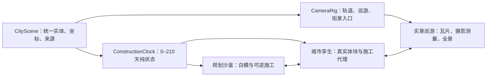

# city.md — 城市推演台路线图（City Sandbox → Urban Twin → Scenic City）

> **状态**：CITY-P1 实施中；`cityview.html` 已于 2026-08-15 经产品负责人明确授权升为公开 `active` 页面并进入 Labs 导航，生产地址为 `https://feida.au/cityview.html`。自动化浏览器、四 profile、Axe、预算、Lighthouse、短稳与上海长稳证据已闭环；实体设备人工签署与真实 GIS/许可证据仍未闭环。
> **整理基线**：2026-08-15
> **发布决策**：本次公开上线覆盖了本文件较早的“真机签署前保持 prototype + noindex”建议；旧条目保留为决策历史，不再代表当前路由状态。公开版本仍必须标注 `generated concept—not GIS`，且不得因此绕过真实数据许可闸门。
> **实施记录**：2026-08-15 已完成确定性 8×8 plan、可逆 0–210 天状态机、白模场景、可取消的单方向巡游、单面幕墙/住宅双条/稀疏背面阳台的实例批次、圆柱塔椭圆环线与母线、状态派生指标、共享渲染预算/WebGL 生命周期、静态 poster、双语 DOM 控件与原型路由；页面现可切换 Sandbox / 上海概念 / 墨尔本概念 / 香港概念，四者共用生成器与场景控制器，并明确标注 `generated-concept—not GIS`。香港增量采用左侧通行、横向维港、向水岸偏移的高密核心、更紧街区、26 辆计划车辆、三个英雄轮廓与一条确定性低面数山脊；它仍是规划语法，不是地形或 GIS。规则资产、因果图表、场景图层、fallback、动态线缓冲、实例热路径、英雄施工代理、道路—车辆关联、巡游面板恢复、RM Build、候选质量门、统一 Sandbox 语义 adapter 和仅由 `?device-audit=1` 开启的本地真机证据导出均已落地。四 profile 自动候选矩阵与香港 2 分钟短稳现已成为发布证据；上海 30 分钟长稳仍是完整资产长稳基线，实体真机尚待签署，真实数据继续被许可闸门禁止加载。
> **范围**：Project Afflatus 的新城市网页专项路线图；只排列 City 项目内部优先级，不改写全站 backlog。
> **上位约束**：技术冲突以 [`tech.md`](./tech.md) 为准，视觉与 UX 冲突以 [`design.md`](./design.md) 为准，实施纪律以 [`CLAUDE.md`](./CLAUDE.md) 为准。
> **审查结论**：确定性生成、可逆施工、三座概念城市、因果指标和共享 Three.js 治理方向成立；香港证明第三座城市无需分叉 renderer，但也暴露出平地正交网格不足以表达山海都市。连续山脊和水岸密度已进入概念层，更真实的海岸折线、高程道路、裙楼/塔楼复合实体与多层交通仍属于后续模型扩展。四 profile 候选浏览器矩阵、逐 profile Axe、完整/RM 视觉、90 帧预算、香港短稳、三轮 Lighthouse 与上海 30 分钟长稳已通过；实体真机和真实 GIS 仍未闭环。
> **优先级命名**：使用 `CITY-P0/P1/P2/P3`，避免与 [`urgent.md`](./urgent.md) 的全站优先级混淆。

---

## 0. 结论先行

这个项目不应被定义成“一次性的灰白城市 Demo”，也不应一开始就试图复制完整 Google Earth。建议把它做成共享同一城市语义、施工时间轴和相机系统的三层产品：

| 模式 | 主要价值 | 数据与视觉 | 建设施工 | 长期角色 |
| --- | --- | --- | --- | --- |
| **规划沙盒 / Sandbox** | 最清楚地表达城市生成、编辑和建设过程 | 程序化 8×8 街区、白模、灰色结构线 | 完整可逆：骨架 → 楼板 → 外壳 → 屋顶 | 默认编辑/讲解模式、测试基准、低端降级 |
| **城市孪生 / Twin** | 让上海、墨尔本、香港拥有真实空间关系和辨识度 | 真实路网、水岸/海岸、地形、建筑轮廓/高度，自制语义地标和程序化立面 | 用可拆解施工代理；完成后切到真实体块 | 真实数据分析与方案对比模式 |
| **实景巡游 / Scenic** | 提供接近 Google Earth 的真实、梦幻、电影化体验 | 授权卫星/航片、地形、摄影测量 3D Tiles 或全景 API | 只表现完成态，或与施工代理交叉淡入 | 高画质展示模式；不是唯一主模式 |



### 我的主张

1. **白模不是以后要删除的临时皮肤。** 它是最适合施工解释、资源编辑、视觉调试、回归截图和弱设备降级的长期模式。
2. **“真实卫星 3D”和“街景”是两种媒介。** 前者依赖地形、航片/卫星影像与分块 3D 网格，后者依赖全景图、朝向、导航节点、隐私处理；不能用一个需求和一个验收项混在一起。
3. **上海先做品牌首屏，墨尔本先做真实数据工程样板。** 上海承担天际线、黄浦江与建造叙事；墨尔本凭更完整的开放 footprint、高程、树木、街具和人流数据先验证 GIS 管线。两条线并行，不矛盾。
4. **城市辨识度不能只靠东方明珠或一辆电车。** 水岸形态、街区尺度、道路语法、建筑高度分布、植被、交通方式、街道密度和气候共同决定“这是哪座城”。
5. **梦幻感应来自空气和时间，不来自重滤镜。** 克制的太阳、薄雾、云影、湿润地面反射、夜景、声音与镜头节奏，比过曝、重 bloom 和高饱和更高级，也更符合本站既有审美。
6. **先定数据权利与性能预算，再堆细节。** 没有明确许可的地图、影像、点云、全景和模型默认只能参考，不能进入仓库或生产链。
7. **香港默认不是赛博朋克。** 山海断面、垂直密度、裙楼/细塔、多层交通与港湾运动先建立真实身份；霓虹只属于可关闭的 `Harbour Nocturne`，不能拿青紫调色掩盖空间模型不足。

---

## 1. 产品目标、假设与边界

### 1.1 产品一句话

目标是一个可在 210 天时间轴上观察城市从路网到天际线生长、当前可切换四种程序化白模 profile（Sandbox + 上海 / 墨尔本 / 香港）、未来再切换授权真实城市，并以电影化镜头游览三座城市代表区域的浏览器城市推演台。

### 1.2 当前假设

- City 是一条新的独立页面路线，不替换首页，也不改变现有深空舰长日志人格。
- 第一版先以 `prototype + noindex` 发布验证；通过性能、可访问性、双语、真机和视觉门禁后才进入导航与 sitemap。
- “单文件 HTML”只允许作为可丢弃的技术 spike；正式版本必须适配现有 Vite 8 MPA、vanilla ES modules、原生 CSS 和 Three.js 架构。
- 第一批不是整座城市，而是三块有明确边界的英雄区域。默认候选：
  - 上海：陆家嘴—黄浦江—外滩—北外滩的有界展示窗；
  - 墨尔本：Hoddle Grid—Flinders Street—Federation Square—Yarra/Southbank 的有界展示窗。
  - 香港：中环—金钟—湾仔岛岸为交互核心，维港、尖沙咀与山脊为中远景；精确范围仍待独立许可与控制点裁决。
- 精确 bounds、数据版本和许可必须在 GIS spike 后冻结；本文的地名是范围方向，不是已批准的数据裁切边界。
- City 内部的 `CITY-P0` 不会自动高于 `tech.md §10` 的全站最高优先级；是否开工仍由全站排期决定。

### 1.3 成功标准

首个公开候选版必须同时证明五件事：

1. 同一 seed 可稳定复现同一座程序化城市、排期和巡游；
2. 任意日期正向、倒向、跳转都能得到正确施工状态；
3. 上海、墨尔本和香港即使去掉城市名，也能凭城市结构而非单一地标被区分；
4. 外部地图或瓦片失败时，白模和核心 DOM 控件仍完整可用；
5. 所有数值明确标注为“模拟 / 官方延迟 / 实时 / 风格化”，不把随机波动包装成真实城市状态。

### 1.4 明确不做

- P0 不做整座城市、全球地球、自由飞行游戏、多人协作、WebXR 或真实施工档案系统。
- P0 不接实时人口、就业、能源或空气质量接口；先做由模拟状态推导且明确标注的情景指标。
- 不下载、抓取、缓存、逆向提取或烘焙 Google、百度、天地图、量子城市 A 星、Digital Twin Victoria 中没有明确再利用授权的内容。
- 不用摄影测量网格假装逐层施工；它通常没有钢筋、楼板、幕墙、屋顶等可拆分语义。
- 不因 City 单页需求迁移 React/Vue/Next/Astro/Tailwind，也不无证据升级全站 Three.js。
- 不把文本、来源、控件和数据语义只画进 Canvas；可访问的 DOM 层必须保留。

---

## 2. 体验蓝图

### 2.1 默认访问路径

1. 首屏先出现静态海报、真实 DOM 标题和一句说明；3D 代码按可见性/意图懒加载。
2. 进入默认“规划沙盒”：固定 seed 的 8×8 城市停在第 0 天或用户上次状态，不强迫自动播放。
3. 用户点击“建设”后，约 23 秒走完 0–210 天；也可拖动、键盘微调、暂停、倒回。
4. “巡游”接管镜头但不接管时间轴真相；取消、Esc、减少动态效果和用户拖拽都能安全退出并交还控制。
5. “上海 / 墨尔本 / 香港”切换 `CityProfile`；“白模 / 孪生 / 实景”切换表现层，不重建核心状态。
6. 数据面板与资源面板互斥；巡游时临时折叠，巡游结束后恢复原状态。

原需求里“常驻数据卡片”和“数据面板默认不打开”存在冲突，本路线图明确为：**默认折叠；用户打开后作为两侧常驻卡片，直到主动关闭或巡游临时折叠。**

### 2.2 三种模式的职责边界

| 能力 | 规划沙盒 | 城市孪生 | 实景巡游 |
| --- | --- | --- | --- |
| 0–210 天可逆施工 | 完整 | 施工代理完整 | 完工态或代理转场 |
| 资产显示/隐藏 | 完整 | 分类级 | 仅自有 overlay |
| 数据拾取 | 实体语义完整 | 实体/地块级 | 视 provider 能力，不能假定可拾取 |
| 离线/外部失败 | 可完整运行 | 本地体块可运行 | 回退到孪生或白模 |
| 视觉真实性 | 抽象、清晰 | 空间真实、材质适度 | 摄影测量/影像级 |
| 性能档 | 最低成本 | 中等 | 最高成本、桌面优先 |

### 2.3 “真实且梦幻”的正确拆法

接近 Google Earth 的观感不是“把 MeshBasicMaterial 换成照片”这一件事，而是六层共同作用：

1. 可信坐标、地形、水体、道路和建筑比例；
2. 可流式加载的多级细节与无明显爆跳的瓦片过渡；
3. 真实太阳方位、天空、大气散射、距离雾与接触关系；
4. 城市远/中/近景有不同的细节密度；
5. 稳定、连续、有叙事目标的相机运动；
6. 可关闭的电影化时间、天气、色调与声音预设。

“梦幻”层必须是可关闭的表现层，不能改变真实地理、遮掉建筑轮廓或让数据无法阅读。

---

## 3. 生产架构裁决

### 3.1 不采用生产级单文件 HTML

原提示词可以继续作为视觉需求总纲，但生产实现建议落为：

```text
cityview.html                     Vite MPA 入口；真实 DOM shell、no-WebGL fallback
src/pages/cityViewEntry.js       页面启动与共享 i18n/transition 装配
src/pages/cityView.js            UI、懒加载、指标与 teardown
src/city/model.ts                CityScene / CityEntity / CityProfile 契约
src/city/generate.ts             确定性街区、分区与资产生成
src/city/schedule.ts             0–210 天排期与纯施工状态
src/city/facades.ts              等距单面幕墙、住宅双条与稀疏背面阳台 plan
src/city/outlines.ts             硬表面结构边与曲面等参线纯数据生成器
src/city/landmarks.ts            三城英雄轮廓 → 四类共享渲染原语编译器
src/city/camera.ts               确定性巡游路径、默认机位与连续性测试入口
src/city/budget.ts               City P0 draw-call / triangle / p95 合同
src/city/deviceAudit.ts          真机样本归一化、失败关闭检查与 JSON 证据 schema
src/city/profiles.ts             上海 / 墨尔本 / 香港候选空间 profile 与许可闸门
src/city/ridge.ts                确定性概念山脊带；不是 GIS 高程模型
src/city/projection.ts           WGS84 / source CRS → 局部 ENU（P2）
src/city/profiles/               经许可的数据 adapters（P1/P2，尚未创建）
src/scene/citySandbox.js         renderer、scene、camera、白模与生命周期适配
src/pages/cityDeviceAudit.js     仅 opt-in 的设备动作记录与本地分享/下载控制器
src/scene/cityStyleTwin.ts       真实体块/PBR 表现层（P2）
public/styles/cityview.css       City 独立页面样式
public/assets/city/              仅存明确许可、带 attribution 的资产
scripts/city/                    GIS 预处理、切片、校验（P2）
tests/cityModel.test.js          seed、排期与数据契约测试
tests/cityFacades.test.js        立面单面/等距/实例数量合同
tests/cityOutlines.test.js       方盒结构边、椭圆环线/母线与密度合同
tests/cityLandmarks.test.js      英雄街区预留、六种轮廓与构件编译合同
tests/cityDeviceAudit.test.js    真机报告完整/失败/无 heap 支持合同
e2e/cityview.spec.js             页面、回放、RM 与响应式浏览器门禁
```

正式加入路由时，`src/config/siteManifest.js` 仍是 build、nav、sitemap、locale、metadata 和 capabilities 的唯一真源。原型建议对齐 `boot.html`：`status: 'prototype'`、`sitemap: false`、`nav: null`、`capabilities: ['noindex', 'webgl', 'prototype']`。通过发布门后才升为 `active`。

### 3.2 统一城市语义模型

渲染对象不能成为数据本体。最低契约应包含：

```ts
type CityEntity = {
  id: string;
  kind: 'road' | 'building' | 'landmark' | 'tree' | 'vehicle' | 'crane' | 'amenity';
  transform: { x: number; y: number; z: number; rotationY: number };
  bounds: { width: number; height: number; depth: number };
  zone: string;
  assetId: string;
  schedule?: { startDay: number; endDay: number };
  lodProfile: string;
  source?: Provenance;
};

type Provenance = {
  sourceUrl: string;
  provider: string;
  capturedAt?: string;
  datasetVersion?: string;
  sourceCrs?: string;
  verticalDatum?: string;
  licence: string;
  attribution: string;
  cacheable: boolean;
  redistributable: boolean;
  commercialUse: 'yes' | 'no' | 'review';
  truthClass: 'generated' | 'official-static' | 'official-live' | 'licensed-imagery';
};
```

关键约束：

- 坐标单位统一为米；白模使用局部坐标，真实城市使用 WGS84 锚点转换到局部 ENU。
- 每个实体有稳定 ID，时间轴、拾取、数据卡、编辑器与截图测试共用它。
- 默认 seed 可复制；“重建”明确换 seed，“重新播放”不得换 seed。
- 复用 `src/bootengine/seed.ts` 的确定性随机思想，禁止在生成、排期或镜头锚点里散落 `Math.random()`。
- `src/lib/cities.js` 中上海/墨尔本坐标只服务出生城市选择器，精度不足，不能成为 GIS 锚点或数据源。
- `public/*.json` 已有全注册校验纪律；未来 City 静态数据也必须有 schema、来源和 freshness/版本验证，不能放一个未登记大 JSON 绕过门禁。

### 3.3 施工状态必须由“当前天数”纯计算

不要把建设实现成只能向前累积的动画。任何一帧都应由 `day + entity.schedule` 直接得到：

```text
stateAt(entity, day)
  → hidden
  → skeleton(progress)
  → slabs(progress)
  → shell(progress)
  → roof(progress)
  → complete
```

因此在第 147 天 → 第 30 天 → 第 210 天之间来回跳转，不会残留幕墙、塔吊、屋顶或错误缩放。道路也采用同一原则，按中心距离和稳定抖动算出铺设窗口。

- 先确定完工日，再反推开工日；CBD 地标保持 135–165 天长工期。
- CBD 封顶的叙事锚点默认落在约第 147 天（总进度 70%），巡游时间映射到建设进度而不是另起独立计时器。
- 建筑与结构线从地面 pivot 生长，禁止围绕几何中心缩放导致“漂浮施工”。
- 塔吊退场是由完成进度计算出的平滑下落，不是一次性的 `visible=false`。
- 所有边界日、零工期、倒放、快速拖动和页面恢复都进入纯函数测试。

当前 `CITY-P1-04` 基线优先为中央主塔与三个英雄工地生成稳定 ID 塔吊，再按建筑高度为普通大体量建筑提出最多八个候选。调度器用完整施工区间加退场区间做事件扫描，只接受不会让任意时刻超过六座活动塔吊的候选，因此不会在运行时为腾名额突然切换工地。位置由 `seed + ownerId` 决定并留出建筑 footprint 安全距离；塔身高度跟随各自建设进度，完工后继续显示 `10–14` 天并使用 smoothstep 整机降到地面以下，而不是瞬间消失。高档由四柱格构塔身、横撑/斜撑、双轨吊臂、配重臂、平台、回转柱、驾驶室、前后/侧窗、挑檐顶板、移动小车、双吊索与吊钩组成；medium 减少格构与窗件，silhouette 只保留塔身、吊臂和配重。全部塔吊被编译成橙/白/深色三个 `InstancedMesh` 与一条合并线 buffer，因此增加普通工地后仍是固定批次数。

### 3.4 白模与结构线的性能裁决

原提示词“每个 mesh 自动挂一个 EdgesGeometry 子对象”在小样板可用，但直接扩到数千幕墙条、窗台、楼板、树木会制造大量 draw call、对象和内存开销。生产方案应分三类：

1. **唯一硬表面**：缓存共享的 `EdgesGeometry`，阈值从约 1° 起调；模型和结构线共享 transform。
2. **高重复构件**：幕墙条、柱、树、车、灯具用 `InstancedMesh`；重复线合并成分区级 `LineSegments` buffer，而不是一条一个对象。
3. **曲面与薄板**：球、圆环、车削体用手写等参线；楼板默认省线，只有近景/编辑选择态补结构边。

结构线放独立 layer，并关闭其 raycast；拾取只命中语义实体。先做 batching/instancing，再增加幕墙和城市小件，顺序不可反过来。

`LineBasicMaterial` 在常见 WebGL 实现中通常不能可靠提供大于 1px 的线宽，因此 P0 不把“可变粗线”写进视觉合同；若近景确需粗线，再以受控 spike 评估屏幕空间线方案，不能为了线宽先引入全场景高成本几何。

当前 `CITY-P1-01` 基线已将普通建筑立面先编译成纯数据 plan，再由两组 `InstancedMesh` 与一条合并 `LineSegments` 批次消费：

- 每栋普通建筑通过稳定 ID 选择且只选择一个主立面，不能四面铺满伪细节；
- 幕墙 bay 中心严格使用 `面宽 ÷ (bay 数+1)`，因此首尾和 bay 间距一致；
- 写字楼/住宅/商场/圆柱条宽分别为 `0.21 / 0.13 / 0.35 / 0.25`；住宅每个 bay 生成一对双条；
- 少量住宅在主立面的反面生成 2–3 块阳台，地标暂不套普通立面，留给独立英雄资产；
- 幕墙和阳台只在 shell 到达对应高度后出现，随任意日期正逆 scrub 重算；silhouette 档整体关闭，不留下幽灵线。
- 圆柱塔不再错误复用方盒轮廓：曲面由闭合椭圆高度环和竖向母线生成；high 档为 `12 radial / 8 vertical / 5 rings`，medium 为 `8 / 4 / 3`，LOD 变化只触发一次结构线缓存重建。

该基线让数百个立面构件只增加固定绘制批次，硬表面与圆柱曲面也共用可测试的纯数据线生成器；但尚未完成分区级静态 buffer 和地标专用曲线，因此 `CITY-P1-01` 仍保持“进行中”。

### 3.5 相机与巡游

- 轨道控制保留阻尼、最近 25、最远 1250；白模默认机位 `(180,160,220)` 只是局部 profile 参数，不用于真实城市。
- 复用 `src/bootengine/catmullRom.ts`、`src/combat/cameraMath.js` 的曲线与 `smoothDamp` 思路；禁止另引 GSAP 或写生硬线性 tween。
- P0 先交付一条短巡游证明接管/取消/交还；P1 才补完整三个半圈：远绕 → CBD 近环 → 拉远俯视。
- 真实城市的半径和高度从 precinct bounds、最高建筑与安全包围体计算，不能硬套 `r650/y360`。
- 巡游全程单方向、roll 限幅、视线焦点连续；曲线位置与一阶速度必须连续，无停顿、回摆或穿楼。
- 用户一旦拖拽、按 Esc 或点击“退出巡游”，相机立即平滑交还；焦点回到触发按钮。
- `prefers-reduced-motion` 下不自动巡游、不自动播放 23 秒建设，默认直出稳定终态并提供手动日期控制。

当前相机基线不再把 `(180,160,220)` 强塞给所有 profile：`createCityCameraRig(plan)` 从城市 extent、最高建筑和三个英雄实体生成 home、hero views、外/内圈半径与高度。上海采用更高更远的总览，墨尔本贴近低层街廓，香港从维港侧拉开英雄距离以容纳高密塔群和山脊。巡游使用一条位置 Catmull-Rom 与一条注视 Catmull-Rom；因此“移动方向连续”和“视线目标连续”可以分别测试。页面的“英雄视角”依次查看当前 profile 的地标，明确不修改 day、seed 或 construction state。

三段巡游节奏已由纯函数固化：第一段保持远景 90° 后在后 90° 收进 CBD，第二段保持内圈，第三段拉高拉远；总计仍是单方向 540°。施工进度不再直接等同镜头曲线进度：`createCityTourTimeline(plan)` 读取中央地标的真实 `endDay`，`constructionProgressToTourProgress()` 把该封顶日精确映射到第二段结束点，再把剩余工期映射到拉远段。FOV 在 `38.2°–43°` 内平滑收放，roll 限制在 `±2.5°` 内且首尾回零；这些参数和三段状态均可脱离 WebGL 单测。取消、回位、手动 scrub 与 reduced-motion 会恢复中性 FOV/roll，不把镜头状态泄漏到自由轨道控制。

近景接管增加了独立的安全高度场：`createCityTourSafetyField(plan)` 把普通建筑与英雄地标的旋转 footprint 转为带 `7` 单位水平余量、`12` 单位屋顶余量的保守包围体，并在外围 `22` 单位内 smoothstep 羽化。每帧只对镜头 `Y` 轴做必要抬升，不改 `X/Z`、巡游角度或注视曲线；从用户当前低机位开始时，前 6% 巡游进度逐步启用，因此起始帧保持原位置又能平滑脱离建筑范围。上海/墨尔本/香港全部包围体、低机位接管、连续性和幂等性均由纯函数测试覆盖。

环境运动先加入一架可解释、可降级的巡检直升机：机体、驾驶舱、尾梁、垂尾、主旋翼、尾桨和双滑橇均由共享低多边形几何与基础材质组成；轨道半径从 precinct extent 计算，高度始终大于最高建筑 `24` 个场景单位。`cityHelicopterPoseAt()` 只由时间与 rig 决定，保证可复现；high 档显示尾桨与滑橇，较低 LOD 自动省略细件。reduced-motion 下直升机、主旋翼、尾桨和车辆全部固定在 `t=0` 的稳定姿态。

车辆、树木与直升机现在共用确定性环境密度合同：high 保留 `100% / 100%` 车辆与树木；medium 保留约 `62% / 72%`；silhouette 保留约 `22% / 38%` 并隐藏直升机。抽样先用 `seed + entityId` 稳定排序再截取前缀，因此低档集合严格是高档子集，不会在 LOD 切换时随机换车或换树。场景会压紧实例到 buffer 前段并同步降低 `InstancedMesh.count`，是真正减少顶点处理，不是把全部对象缩到零仍交给 GPU。该合同只影响渲染；交通、人口、就业与能耗仍从完整 `CityPlan` 推导。

### 3.6 数据卡不能随机“装实时”

P1 的卡片先是**可解释的模拟情景**：

| 指标 | 第一版来源 | 显示要求 |
| --- | --- | --- |
| 人口容量 | 已完工住宅面积/户型容量模型 | 标“模拟容量”，不是实际人口 |
| 就业容量 | 已完工商办面积 × 入驻曲线 | 标“模拟就业容量” |
| 能耗 | 施工设备负载 + 已投用资产基准 | 标“情景能耗”并公开口径 |
| 交通 | 已通道路、车辆密度、路段容量 | 标“沙盒交通指数” |
| 空气质量 | 没有可信因果模型时先不显示；有模型后标“情景 AQ” | 禁止随机数冒充官方 AQI |

图表从 `CityState` 派生，未建时为 0，暂停时只保留有意义的低频情景波动；面板隐藏后停止全部 DOM 更新。P2 接官方数据时，必须同时显示范围、年份/时间、时区、刷新状态、来源和 `实时 / 延迟 / 静态` 标签。

### 3.7 复用仓库已有治理能力

| 已有能力 | City 用法 |
| --- | --- |
| `src/lib/renderBudget.js` + `renderBudgetCoordinator.js` | 统一 DPR、p95 帧时、hidden/offscreen pause、质量降档；不另写孤立的 1.5→1.25→1.0 governor |
| `src/lib/webglLifecycle.js` | context 租约、丢失恢复、第二次失败静态 poster、AbortSignal 与 dispose |
| `src/lib/proceduralLod.js` | 建筑、树、车、地标 high/medium/silhouette 三档及滞回 |
| `src/bootengine/seed.ts` | 可复现城市、排期、巡游和视觉截图 |
| `src/bootengine/catmullRom.ts` / `src/combat/cameraMath.js` | 无人机曲线、相机平滑、roll/FOV 连续性 |
| `src/scene/sectorsStarfield.js` | 全屏 Three 舞台、指针/触摸、fly-to、RM、DOM 兜底参考 |
| `src/scene/combatAssetLoader.js` + Basis/Meshopt | 少数高细节自有地标的 glTF/KTX2/Meshopt 管线参考 |
| `THIRD_PARTY_NOTICES.md` / 资产 attribution 目录 | 地图、地标、声音、影像、点云来源登记模式 |

WebGPU 只能作为后续增强路径；白模、时间轴和基础孪生必须在 WebGL2 工作，并有静态 poster 降级。

---

## 4. 上海、墨尔本与香港首批样板

### 4.1 三城分工

| 维度 | 上海样板 | 墨尔本样板 | 香港样板 |
| --- | --- | --- | --- |
| 产品角色 | **品牌首屏优先**；高空天际线与建造叙事 | **真实数据工程优先**；街道和人尺度细节 | **山海垂直都市验证**；宏观天际线与多层城市 |
| 默认区域 | 陆家嘴—黄浦江—外滩—北外滩有界窗 | Hoddle Grid—Flinders—Fed Square—Yarra/Southbank 有界窗 | 中环—金钟—湾仔岛岸；维港、尖沙咀与山脊作中远景 |
| 城市骨架 | 黄浦江宽水面、两岸反差、超高层簇与外滩低层连续立面 | Hoddle Grid、Yarra 河、CBD/Southbank 高度变化、细密巷道 | 维港横向切面、山体压迫、填海台地、细塔群与连续裙楼 |
| 核心地标 | 东方明珠、上海中心、金茂、环球金融中心、外滩轮廓 | Flinders Street、Federation Square、Arts Centre 尖塔、Southbank 天际线 | 金融折面塔、阶梯冠顶、临海文化裙楼；真实名称待授权模型阶段 |
| 交通语法 | 滨水道路、轮渡、密集车流、桥梁/隧道入口暗示 | 电车、轨道与架空线、自行车、步行网络、左侧行驶 | 左侧行驶、双层电车/巴士、渡轮、天桥、坡道、楼梯与层级道路 |
| 近景细节 | 滨水栏杆、轮渡、历史立面节奏、局部夜景与潮湿路面 | 蓝石铺装、巷道、街树、座椅/护柱、站台、电车线与多变天气 | 海堤、招牌、冷气机、屋顶机电、MTR 入口、湿路与高密行人 |
| 梦幻预设 | 银雾清晨、金色黄昏、雨后夜航 | 冷调清晨、快速云影、雨后蓝时刻 | 港湾蓝时刻、湿润夜航、局部霓虹记忆层 |

上海负责回答“这座城市能否让人一眼惊艳”，墨尔本负责回答“多源真实数据能否被可靠地清洗、对齐、流送并变成细节”，香港负责回答“山海、极端密度和垂直交通能否进入同一城市语义”。三城必须使用同一 `CityProfile` 契约，不能成为三套特制 renderer。

### 4.2 辨识度验收

每城至少有：

- 3 个稳定英雄机位：高空总览、河岸/街区中景、近地人尺度；
- 1 条无穿模巡游路径；
- 8–12 个经过许可审查的重点地标或轮廓资产；
- 2–3 条高细节代表街段；
- 一套道路、水岸、地块、高度、植被、交通、街具和天气 profile。

盲测分两轮：

1. 隐藏城市名，保留地标；
2. 再隐藏最著名的单一地标，只看城市语法。

第二轮仍能被明显区分，才说明不是“随机城市换皮”。

### 4.3 数据与许可优先表

| 城市/用途 | 首选来源 | 可用方向 | 进入生产前的门 |
| --- | --- | --- | --- |
| 上海底图/影像 | [天地图·上海](https://shanghai.tianditu.gov.cn/) | 经授权的矢量、影像、地名与地图服务 | API 授权、审图号、归属、缓存/商用条款；禁止抓瓦片 |
| 上海开放指标 | [上海市公共数据开放平台](https://data.sh.gov.cn/view/) | 交通、公共设施、统计与专题数据 | 逐数据集核对开放等级、来源、下载日与使用条款 |
| 上海官方三维参考 | [量子城市 A 星](https://qucity.shanghai-map.net/AStar/index.html) | 城市白模、三维结构与历史影像的权威参考/潜在合作 | 公开浏览不等于可下载；先询问 API、模型服务与商用授权，禁止逆向提取 |
| 上海地图合规 | [《上海市地图管理办法》](https://www.shanghai.gov.cn/xxzfgzwj/20210713/0fbc6abe525e458eaa4cf8b921cc0767.html) | 互联网地图、审核与数据安全要求 | 正式上线前做中国地图与数据合规审查 |
| 墨尔本建筑 | [2023 Building Footprints](https://data.melbourne.vic.gov.au/explore/dataset/2023-building-footprints/) | 分层 footprint、podium、setback、roof、高程/AHD | 固化许可证与元数据快照；转换流程记录 AHD 与采集日 |
| 墨尔本精度验证 | [City of Melbourne 3D Point Cloud 2018](https://data.melbourne.vic.gov.au/explore/dataset/city-of-melbourne-3d-point-cloud-2018/) | 建筑、树、地形的点云核验；MGA55/AHD | 静态历史数据，不能冒充当前状态；先核对许可与发布体量 |
| 墨尔本城市细节 | [城市树木](https://data.melbourne.vic.gov.au/explore/dataset/trees-with-species-and-dimensions-urban-forest/)、[街道设施](https://data.melbourne.vic.gov.au/explore/dataset/street-furniture-including-bollards-bicycle-rails-bins-drinking-fountains-horse-/)、[行人计数](https://data.melbourne.vic.gov.au/explore/dataset/pedestrian-counting-system-past-hour-counts-per-minute/) | 树种/尺寸、座椅/护柱/垃圾桶、真实人流 | 保存字段定义、时间、许可和 attribution；人流必须标刷新状态 |
| 墨尔本州级三维 | [Digital Twin Victoria 数据与条款](https://www.land.vic.gov.au/maps-and-spatial/digital-twin-victoria/dtv-platform/data-and-terms) | Vicmap、terrain、photomesh 和多源数据发现 | 每个 custodian/数据集许可不同；可浏览不代表可下载，GDA2020 对齐单独处理 |
| 香港 GIS / 影像 / 地标 | `CITY-HK-GIS-01` 尚未完成来源裁决 | 先调查有界维港片区的地形、海岸、footprint、高程、交通与授权地标 | 当前全部保持 `review`；不得因可在线浏览而抓取、描摹、缓存或进入构建 |
| 实景 3D（优先墨尔本评估） | [Google Photorealistic 3D Tiles](https://developers.google.com/maps/documentation/tile/3d-tiles-overview) | 快速得到接近 Google Earth 的摄影测量巡游 | 先核对精确区域覆盖、费用和条款；动态显示归属，禁止抓取、提取、离线缓存或机器分析 |
| 跨城兜底 | [OpenStreetMap 版权与许可](https://www.openstreetmap.org/copyright) | 路网、footprint、POI 的统一缺口填充 | ODbL 署名与衍生数据库义务评估，不与闭源数据未经审查地打包 |
| 跨城高空远景 | [Copernicus Data Space 条款](https://dataspace.copernicus.eu/terms-and-conditions) | 季节、城市边界和远景底色 | Sentinel 级分辨率只用于远景，不承担街道级真实性 |

Google 官方覆盖表目前显示澳大利亚支持 2D/3D 地图图块，而中国不具备同等 3D 覆盖；因此两座城市不能假定使用同一家实景 provider。覆盖会变，P2 开工时还要按精确 bounds 重新验证：[Google Maps Platform Coverage](https://developers.google.com/maps/coverage)。Google Map Tiles 还要求动态 attribution，并限制预取、缓存、提取和离线使用，详见 [Map Tiles API Policies](https://developers.google.com/maps/documentation/tile/policies)。

### 4.4 数据合规红线

- 每项资源都必须记录 `sourceUrl / provider / capturedAt / licence / attribution / CRS / verticalDatum / cacheable / redistributable / commercialUse / truthClass`。
- 没有明确许可的资源默认 `review`，不进仓库、不进构建、不做训练数据、不制作衍生纹理。
- 中国版与国际版允许使用独立 provider、密钥、缓存策略和数据仓；统一的是渲染 adapter，不是原始地图数据。
- 上海地图坐标不能靠肉眼平移，也不能混淆 WGS84、GCJ-02、BD-09 或来源自有 CRS；以授权接口的说明和控制点为准。
- Google Photorealistic Tiles 只能作为视觉底座；自有 3D overlay 不得从 Google 内容追踪、手工描摹或机器提取。
- 全景必须由 provider API 独立展示，不下载、不烘焙进建筑材质、不混合成无来源场景。
- 自采街景、航拍或点云在 P3 前不启动；先完成飞行许可、测绘资质、保险、数据驻留、人脸/车牌模糊和隐私评估。

### 4.5 香港视觉裁决：白模为默认，夜景为可选层

当前 `hong-kong-concept-v0` 已在同一生成器里加入左侧通行、横向水面、向维港偏移的高密 core、较紧街区、三个英雄街区与一条确定性低面数山脊。浏览器第一轮实画曾把山体做成重复绿色尖锥，也把英文 profile 名截断；现已改为单 draw-call 的连续地形带，并把 profile 标签改为上下布局。这个过程说明：香港不能只靠“更高楼 + 霓虹”换皮，地形、海岸、密度和镜头构图必须先成立。

长期视觉层固定为：

1. **White Massing**：现在的默认分析真相层；施工、编辑、数据比较、回归与低端降级都使用它。
2. **Material Twin**：未来香港默认展示层；低饱和玻璃、石材/混凝土、绿色山体、蓝灰港水、接触阴影与克制太阳，不靠霓虹证明“这是香港”。
3. **Harbour Nocturne**：用户主动开启的港湾蓝时刻；窗光、路灯、渡轮、湿路、港面反射和局部招牌，状态切换不得改变 day、seed、施工或指标。
4. **Neon Memory**：若需要更电影化或历史记忆感，只能作为实验预设。避免全景洋红/青色调色、常驻大雨、全楼霓虹和重 bloom。

建议夜景保持约 `85%` 可信城市照明、`15%` 表现性光色。实现上不创建成百上千个动态灯：窗光使用 emissive atlas，招牌批处理，远景合并，动态点光目标为 `0`；Nocturne 相对 Twin 的预算增量先限制为 `≤6 draw calls / ≤3 ms p95 / ≤16 MB`，再由实体真机收紧。香港的下一轮真实性优先级是：**真实山体/海岸 → 高度与裙楼分布 → 多层交通 → 代表街段 → 材料窗格 → 局部霓虹**。

---

## 5. 严格工程优先级

> 排序原则：**真相与许可 → 可复现状态 → 可玩垂直切片 → 性能架构 → 视觉细节 → 真实数据 → 实景与街景**。原提示词的 1→13 是需求分类，不是最佳施工顺序。

| 顺序 | 工作项 | 依赖 | 完成出口 |
| ---: | --- | --- | --- |
| 1 | `CITY-P0-00` 冻结产品模式、英雄区域、数据分类和许可模板 | 本文 | 每个数据源有 owner/许可/缓存/商用结论；三城 bounds 有候选 |
| 2 | `CITY-P0-01` noindex 路由 shell、静态 poster、DOM 标题/摘要/控件 | P0-00 | 无 WebGL、JS 失败和 RM 下都能理解并操作基本页面 |
| 3 | `CITY-P0-02` `CityScene/Entity/Profile` 契约、seed 与稳定 ID | P0-00 | 相同输入产出逐字节稳定的 plan；schema 测试通过 |
| 4 | `CITY-P0-03` 可逆 0–210 天施工状态机与确定性排期 | P0-02 | 任意正/逆 scrub 幂等；边界日和 CBD 锚点通过纯函数测试 |
| 5 | `CITY-P0-04` 8×8 路网、3–4 类建筑、1 个地标、少量树/车/吊车 | P0-03 | 可玩白模垂直切片；同 seed 截图稳定 |
| 6 | `CITY-P0-05` 基础轨道相机、短巡游、播放/暂停/回位/日期控制 | P0-04 | 相机无 NaN/跳变/穿楼；接管、取消、交还完整 |
| 7 | `CITY-P0-06` 接入 render budget、LOD、WebGL 生命周期与 provider 失败回退 | P0-04 | hidden 零活跃循环；context loss 能恢复/降 poster；预算记录入文档 |
| 8 | `CITY-P1-00` `CityProfile` 与三城辨识度测试框架 | P0 完成 | 上海/墨尔本/香港共用契约，不能用分叉场景控制器作弊 |
| 9 | `CITY-P1-01` 批量结构线、实例化和分区合并 | P0-06 | 在加幕墙前达到 draw-call/内存预算 |
| 10 | `CITY-P1-02A` 上海品牌白模；`P1-02B` 墨尔本真实数据；`P1-02C` 香港山海白模（并行） | P1-00/01 | 上海英雄首屏；墨尔本 footprint/height；香港港湾/山脊/密度成立 |
| 11 | `CITY-P1-03` 完整普通建筑、地标、幕墙、背面、屋顶资产库 | P1-01/02 | 资产多样但规则可解释；重复件全部共享/实例化 |
| 12 | `CITY-P1-04` 完整施工阶段、塔吊细节与下落退场 | P1-03 | 0/70/147/210 日和任意日期无残留、闪烁或漂浮 |
| 13 | `CITY-P1-05` 三个半圈巡游、直升机、车辆、树木与城市环境运动 | P1-04 | 巡游与 CBD 封顶同步，且不影响 scrub 真相 |
| 14 | `CITY-P1-06` 因果数据卡、资源分类/显隐编辑器、双语与 a11y | P1-03/04 | 面板互斥，隐藏零更新，所有指标标“模拟”并可解释 |
| 15 | `CITY-P1-07` 四 profile 视觉回归、移动/真机、Lighthouse；原型升 active 的发布门 | P1 全部 | 通过站点既有全部门禁后才进导航和 sitemap |
| 16 | `CITY-P2-00` GIS/3D Tiles 渲染边界 RFC 与 provider 成本/许可决策 | P1 基线 | 决定 Three 局部孪生或 Cesium 地球外壳；无悬而未决的密钥/许可 |
| 17 | `CITY-P2-01` 离线 GIS 预处理、坐标/高程、切片、来源清单 | P2-00 | 控制点对齐，产物有 schema/version/attribution，可重复构建 |
| 18 | `CITY-P2-02` 墨尔本真实孪生 → `P2-03` 上海授权孪生 → `P2-03H` 香港授权孪生 | P2-01 | 三城真实体块渐进加载；每城外部服务失败能回退 |
| 19 | `CITY-P2-04` PBR、真实太阳/天空/水、大气与梦幻预设 | P2-02/03 | 三套预设可关闭、不过曝、不吞轮廓，真实模式 ≥30 FPS 目标 |
| 20 | `CITY-P2-05` 施工代理 → 真实完成态交叉淡入；官方数据卡接入 | P2-04 | 不伪拆摄影测量；真实/模拟/延迟状态清楚 |
| 21 | `CITY-P3-00` 鸟瞰 → 街景入口；三城各一条授权示范走廊 | P2 完成 | 朝向/位置连续、无黑屏、归属/隐私完整 |
| 22 | `CITY-P3-01` Gaussian Splat/NeRF 英雄点实验、完整编辑与更多城市 | P3-00 | 只作可关闭增强，有 WebGL/白模降级，不成为核心依赖 |

### 5.1 当前执行进度（2026-08-15）

| 工作项 | 状态 | 已有证据 | 下一出口 |
| --- | --- | --- | --- |
| `CITY-P0-00` | 进行中 | 三层模式、数据/许可模板与上海/墨尔本/香港三个 `candidate-unverified` 空间 profile 已写入；代码明确禁止加载外部真实数据 | 用控制点冻结精确 bounds，并逐城逐源完成商用与缓存裁决 |
| `CITY-P0-01` | 自动化候选闭环 | `cityview.html` 为 noindex prototype；页面层持有 day；no-JS、模块失败、首次 context restore 与第二次 loss 降 poster 已在真实浏览器通过，fallback 下 range/指标继续工作 | 保持候选回归；升 active 前补完整 metadata/nav/OG/schema，不能只改状态字段 |
| `CITY-P0-02` | 已完成（Sandbox 语义基线） | `src/city/sceneModel.ts` 已定义 `CityScene/CityEntity/Provenance`、稳定 `assetId`、LOD 与 fail-closed 来源；现有 `CityPlan` 可确定性转换为 Sandbox scene | P2 再实现带许可、CRS 与版本的 Melbourne/Shanghai 真实 adapter；当前 adapter 只声明 `generated` |
| `CITY-P0-03` | 已完成 | 施工阶段由当前 day 纯计算；边界与正逆 scrub 单测通过 | 增补随机属性测试与完整关键日截图 |
| `CITY-P0-04` | 已完成（基线） | 64 街区、18 道路、建筑/地标/树/车/简化吊车已可玩 | P1 继续补立面、屋顶与曲面线 |
| `CITY-P0-05` | 桌面浏览器签署，真机待补 | OrbitControls、播放/暂停/回位；巡游从当前机位连续接管，严格单方向 1.5 圈；运行中聚焦 range 会暂停并保持同一 day；Esc 交还焦点且恢复原面板，浏览器回归已通过 | 补实体触控、长时间手势、动态 RM 偏好切换和文案可理解性人工检查 |
| `CITY-P0-06` | 本地自动化/长稳/真机采集工具闭环，实体签署待补 | coordinator、DPR/LOD/lifecycle/poster、固定 line buffer、实例 scratch、初始暂停和事务回滚成立；恢复/repeated loss、初始 hidden/offscreen 均通过；当前完整质量已通过四 profile 90 帧预算门、香港 2 分钟短稳与上海完整资产版 30 分钟 scrub；opt-in 采集器会导出本地、失败关闭的设备报告 | 在参考实体设备运行报告并补浏览器工具的 CPU/GPU 与物理热状态；启动预热和持续帧预算分开记录 |
| `CITY-P1-00` | 已完成（概念层） | 上海/墨尔本/香港共用 `CityExperienceProfile`、`CityConceptGenerationProfile`、生成器和 renderer；候选 bounds、交通侧、core offset、水岸/山脊/密度语法和许可闸门均为数据；页面可访问切换 | 精确坐标/许可通过后再逐城接 adapter 与本地 fixture；概念参数不能作为真实数据层证据 |
| `CITY-P1-01` | 进行中（本地批次基线） | 普通建筑单面幕墙、住宅双条与稀疏背面阳台由确定性 plan 生成；实例网格 + 合并线批次随施工和 LOD 更新；动态全城批次禁用不可靠的缓存包围体裁剪；直升机旋翼/滑橇/橙色件已实例化，地标已有扭转、玉米曲线、阶梯冠顶、明珠与折面等专用轮廓 | 下一步只做分区级静态 buffer 与更明确的近中远裁剪；新细节必须继续守住四 profile 完整档预算 |
| `CITY-P1-02A` | 进行中（上海概念白模） | 纵向水岸、更高天际线、更多圆塔、扭转主塔，以及明珠塔体、阶梯冠顶和玉米形曲线塔；英雄四阶段代理已补齐；三个英雄机位具有完成态建筑包围体与视线避障；完整线框关键日已人工查看；明确不是 GIS | 优化早期施工构图与资产辨识度；授权真实数据仍属于 P2 |
| `CITY-P1-02B` | 未开始真实 slice；概念白模已有 | 横向水岸、低疏街廓、左侧通行，以及长站房/城市折面/艺术尖塔；明确不是 GIS | 先完成墨尔本许可、控制点、CRS/高程与本地 footprint/height fixture；概念 profile 不能作为真实 slice 的完成证据 |
| `CITY-P1-02C` | 香港概念白模候选闭环，真机/真实语义待补 | 左侧通行、横向维港、向水岸偏移的高密 core、紧街区、26 辆计划车辆、金融折面/阶梯冠顶/文化裙楼三个英雄轮廓，以及确定性连续山脊；中英文实画、四 profile 90 帧预算、完整/RM 关键日、三个英雄截图、逐 profile Axe 与香港短稳已通过，明确不是 GIS | 进入私有真机签署；通过后再做真实海岸、高程道路、裙楼/塔楼复合语义 |
| `CITY-P1-03` | 已完成（本地规则资产基线） | 已有 office/residential/mall/cylinder、单面幕墙/稀疏阳台；确定性设备层/风机、停机坪、草坪/花槽/棚架、退台冠顶/天线、公园长椅/桌台/路灯/自行车架及玉米形曲线塔均已批处理并随日期生长；小品扩充复用既有实例/线框批次，没有新增 draw call；上海完整资产版 30 分钟签署通过 | 不再继续堆几何；转入因果图表与近中远裁剪，真实地标留给授权数据阶段 |
| `CITY-P1-04` | 四 profile 关键日桌面签署，真机待补 | 普通楼四阶段与塔吊合同成立；现有九个城市英雄地标都复用骨架、楼板、外壳、独立屋顶代理；完整档 `4 × 4`、RM `4` 张固定截图及香港三个英雄截图和语义计数通过 | 实体移动构图仍待签署；新增资产后必须重跑同一矩阵 |
| `CITY-P1-05` | 桌面交互/预算签署，真机待补 | 相机双样条、540° 巡游、安全高度、直升机与环境 LOD 成立；英雄静态机位会确定性搜索最近的完成态无遮挡候选，并逐机位输出 0 遮挡合同；车辆只有自身日期和对应道路均完成才可见；巡游/道路/车辆浏览器回归与帧预算通过 | 补实体设备手势、GPU/CPU 帧时和热状态 |
| `CITY-P1-06` | 本地桌面闭环，真机待补 | 五项因果文本卡及环形、竖条、横条、折线和分段条图均由同一 `CityMetricSnapshot` 确定性投影；图形 `aria-hidden`，数值与因果文字仍是语义真相；面板隐藏时数值和图表均零 DOM 写入。互斥面板、焦点、AA、RM、三状态 Axe 与中英文桌面实画已通过 | 现在进入私有真机预览；完成中文人工流程、实体触摸、热状态与后台恢复签署 |
| `CITY-P1-07` | 四 profile 本地候选与真机采集出口通过；active/实体签署待补 | `release-candidate + noindex` 下四 profile Playwright/Axe/预算/完整与 RM 视觉、香港英雄截图与短稳、三轮 Lighthouse 及上海 30 分钟长稳均通过；opt-in 真机面板另通过双语、导出、完整检查和 Axe；首次四 profile 实跑发现并修复非香港 profile 空山脊占用一条 draw call | 把私有预览跑在实体 iPhone/Samsung 并审查两份 JSON；之后才补 active metadata/nav/sitemap |

### 5.2 代码审查与诊断（2026-08-15）

#### 总体评估

`cityview.html` 已经证明白模产品主循环可行：生成和排期确定、施工可逆，上海/墨尔本/香港概念 profile 共用控制器，指标由状态推导而非随机伪实时，外部真实数据默认 fail closed。它现在应被称为**可信的程序化白模原型**，而不是完成的 P1 展示版，更不是城市孪生或实景产品。

本轮审查范围是 City 源码、静态页面、单元/E2E 用例、共享渲染治理与发布清单。候选浏览器自动化、Axe、完整/RM 视觉截图、人工桌面截图审查和 Lighthouse 已实际执行；移动仿真仍不等同于实体真机。当前 City 新增文件仍处于未跟踪状态；进入提交/CI 前必须纳入版本控制并复核差异。

#### 本轮验证记录

- City 定向 Vitest：21 个测试文件、109 项测试通过。
- 全量 Vitest：174 个测试文件、1764 项测试通过。
- `npm run typecheck`：通过。
- `npm run build`：通过；其前置 data/site/header/CSS/combat asset/i18n/OG 检查全部通过。真机采集器加入后的产物快照为 `cityview.html 26.48 kB（gzip 8.08 kB）`、入口 JS `27.76 kB（gzip 10.12 kB）`、仅审核模式按需加载的采集器 `13.41 kB（gzip 5.05 kB）`、懒加载场景 JS `51.81 kB（gzip 17.65 kB）`；共享 Three vendor 仍为 `722.76 kB（gzip 185.71 kB）`。
- 四 profile desktop Chromium 候选复跑：`29 passed / 0 failed`；覆盖逐 profile Axe 的默认/Data/Layers 共 `12` 个状态、完整档 `4 × 4` 关键日、RM day 210 `4` 张、香港三个英雄截图、90 帧预算与 active-route 回归。Cityview desktop/iPhone/Samsung 模拟组合另为 `15 passed / 24 intentionally skipped / 0 failed`（39 个 project 结果）；skip 是明确只运行一次的 desktop-only 恢复、视觉和诊断门，不代表失败。no-JS、模块失败、首次恢复/第二次 loss poster、初始 hidden/offscreen、forced-colors、动态 RM、短视口、时间轴聚焦、巡游返焦、面板恢复和三城切换均通过。
- 真机采集器加入后的 desktop Chromium `cityview + quality-gates` 为 `39 passed / 0 failed`；审核面板在默认 URL 保持隐藏，只有 `device-audit=1` 才按需加载。自动流程完成设备标签、横竖屏、触摸/双指、时间轴、Build、Tour、中英文、RM on/off、前后台、矮屏纵向恢复、预算与无 fallback 检查，导出的 `city-device-audit-v1` 报告为 `readyForReview:true`；审核面板独立 Axe 为零 serious/critical。Cityview 三项目复跑为 `14 passed / 22 intentional skips / 0 failed`；iPhone/Samsung 模拟各自的确定性可逆主流程继续通过。
- 资产收口后的最终构建另复跑 Cityview desktop Chromium 候选：`11 passed / 0 failed`；其中上海三个英雄机位按顺序验证为阶梯冠顶、玉米形曲线塔、明珠塔体，逐个 `currentHeroOcclusions=0`。
- `CITY-P1-06A` 图表收口后，Cityview desktop Chromium 再次 `11 passed / 0 failed`，打开数据状态的独立 Axe 为 `1 passed / 0 failed`；浏览器实画在 `1280×720`、day 210 下复核中英文标题、因果说明与五类图形，页面横向溢出为 `0`，数据面板以自身滚动容纳完整内容。隐藏面板后 scrub 的数值与图表 render count 均不增长。
- 香港增量的应用内浏览器实画已复核 day `0/70/147/210`、约 23 秒完整 Build、三个完成态英雄镜头，以及互斥的 Data/Layers 披露；真实 Build 后进入英雄视角仍保持 day 210。页面横向溢出为 `0`，英文 profile select `clientWidth=scrollWidth=225`，中文标题和 profile 文案同步，控制台 `0` error。第一轮重复尖锥山体与长标签截断没有被单元测试发现，肉眼审查后分别改为连续低面数山脊带和纵向 profile label；本轮又把桌面侧栏最大高度与底部控制台之间的重叠收成可见间隙。自动候选首次执行还发现 `applyAssetVisibility()` 会把无数据的空山脊重新显示，使上海 day 147 占用 `41` draw calls；现已把山脊从通用 landscape 批次移出，并用 `ridgePeakCount > 0` 守卫，复跑恢复为上海 `40`、香港 `39`。
- 四 profile day 147 完整质量 90 帧预算实测分别为：Sandbox `27 calls / 43,210 tris / p95 0.6 ms`，上海 `40 / 38,702 / 0.4 ms`，墨尔本 `33 / 33,358 / 0.4 ms`，香港 `39 / 41,914 / 0.4 ms`；全部为 `high` LOD/quality，均通过 `40 / 100k / 18 ms` 合同。
- 香港 2 分钟短稳：`120,360 ms / 414` 次正逆 scrub / `105` 个 heap 样本；稳态窗口中位数 `16.63 → 19.04 MiB`（`+2.41 MiB`），短窗拟合斜率约 `+1.04 MiB/min`；全程峰值 `39 draw calls / 43,082 triangles / p95 1.8 ms`，稳态 p95 `1.7 ms`；最终 `39` 个完整窗口、`39 / 41,582 / 1.2 ms`、thermal `nominal`、无 fallback。两分钟结果关闭 `CITY-HK-01` 的短稳出口，但不能替代上海 30 分钟正式长稳或实体 GPU/热签署。
- 真机采集器加入后重新执行 Lighthouse 12.6.1 默认移动模拟三轮，断言全部通过；中位数为 performance `0.96`、FCP `1885 ms`、LCP `2582 ms`、Speed Index `1885 ms`、TBT `29 ms`、CLS `0`、script `231,830 B`、total `255,318 B`。审核模块在普通 URL 不加载，但静态双语面板与入口判断仍增加少量传输；LCP 通过回归门，却比 `2500 ms` 产品目标慢约 `82 ms`，不能视为目标达成。升 active 前应在真机结果之后重录正式 baseline，而不是现在放宽目标。
- 修复动态实例裁剪后的 Sandbox 30 分钟正式 soak：`1,800,706 ms / 3,365` 次 scrub / `1,474` 个精确 heap 样本；稳态窗口中位数 `15.02 → 24.63 MiB`（`+9.60 MiB`），拟合斜率 `+0.43 MiB/min`，均低于 `32 MiB / 4 MiB/min` 门；全程峰值 `25 draw calls / 46,074 triangles / p95 1.5 ms`，去预热后 p95 `1.2 ms`；最终 `540` 个完整窗口、`22 / 42,362 / 0.9 ms`、thermal `nominal`、无 fallback。该结果保留为完整建筑正确性基线；现行资产阶段签署见下条。
- 历史 Sandbox 30 分钟 soak 曾记录更低的 `14 calls / 15,394 triangles`，但随后人工视觉发现当时建筑批次被错误视锥裁掉；该记录仅保留为测试盲点复盘，不再参与当前版本签署。修复后 Sandbox 结果只作为正确性基线，现行完整资产基线以下条上海签署为准。
- 历史上海/墨尔本短稳数据同样只用于说明 `evaluatedWindows` 方法学演进，不再代表当前几何负载。当前候选在 `no-preference` 完整质量下逐 profile 等待完整 90 帧窗口；四者都低于或等于 `40 draw calls` 且低于 `100k triangles / p95 18 ms`，没有靠放宽阈值通过。
- 完整规则资产加入后，完整/RM 的 `4 × 4 + 4` 关键帧、香港三个英雄截图及四 profile 90 帧预算通过；day 0 明确要求屋顶/休闲细节为零，day 210 明确要求渲染数等于确定性计划数。P1-03A 最终上海完整资产版 30 分钟签署为 `1,800,191 ms / 6,562` 次正逆 scrub / `1,635` 个不同 heap 样本；稳态窗口中位数 `17.57 → 27.04 MiB`（`+9.47 MiB`），拟合斜率 `+0.55 MiB/min`，均低于 `32 MiB / 4 MiB/min` 门；全程峰值 `40 draw calls / 38,954 triangles / p95 2.1 ms`，去预热后 p95 `2.0 ms`；最终 `610` 个完整窗口、`26 / 31,094 / 1.1 ms`、thermal `nominal`、无 fallback，所有采样点预算合格。这是当前规则资产版本的现行长稳基线。
- 初始 hidden/offscreen 保持零 draw calls 并在恢复后启动、forced-colors 焦点可见性、运行中 RM 切换完成建设/退出巡游/恢复面板也已通过 desktop Chromium。桌面关键日人工视觉和当前负载 30 分钟长稳已完成；尚未完成的是实体 iPhone/Samsung，这仍是发布证据空白。

#### 候选浏览器实测后的诊断补充

真实浏览器首次执行发现并关闭了四个单元测试没有暴露的问题：生命周期恢复回调拿不到块级 `resize` 绑定；Three r160 在 context loss 事件派发前一帧可能读取空 shader log；播放中聚焦 range 会在 DOM day 与场景 day 之间产生竞态；profile 属性名同时命中 stage 和 select。整改后恢复改为双 `requestAnimationFrame` 分阶段、渲染前检查 `isContextLost()`、时间轴聚焦立即暂停，并把 stage profile 状态改为独立属性。后续候选矩阵与修复后 30 分钟 soak 均未再出现 page error。

第二轮人工视觉又发现了一个更重要的测试盲点：旧视觉用例只校验 PNG 签名和字节数，`day 210` 即使只剩地面/树木也会“通过”。根因是全城 `InstancedMesh` 在 day 0 以地下隐藏矩阵首次生成缓存 bounding sphere，后续建筑矩阵长高时 Three 不会自动刷新该包围体，整批成品因此被视锥裁掉。现在所有跨全城、逐日改矩阵的实例批次都显式 `frustumCulled=false`；测试同时校验道路/外壳/屋顶/英雄构件实际写入数、结构线段数、三角面、完整档与 RM LOD。最初的三 profile `3 × 4 + 3` 截图曾作为修复证据；香港加入后，现行签署已经升级为四 profile `4 × 4 + 4`，另加香港三个英雄镜头。这个事件也证明：截图“存在”不是视觉回归，测试必须绑定渲染语义。

屋顶批次没有把设备房、风机、草坪、花槽、棚架、退台冠顶、天线和停机坪逐件挂进 scene graph。`createCityRooftopPlan()` 只从稳定 building ID 派生资产；渲染端把所有盒状细节压进一个有 instance color 的 `InstancedMesh`，轮廓追加到现有结构线 buffer，并按 roof phase 逐件长出。花园基础板保持白色，绿色只属于内缩草坪，白色花槽形成可见边界；设备与停机坪按实际屋顶 footprint 约束，不允许伸进道路或悬在退台之外。为抵消新增的一次绘制，英雄骨架/楼板/屋顶代理按可见数量紧密打包，空阶段 `count=0`；随后又把材质相同的平屋顶与花园底座合并成一个 `plateRoofs` 批次，为公园家具的填充/线框各腾出一次绘制。公园长椅、桌台、路灯与自行车架同样共用一个彩色实例批次和一条合并线框，低 LOD 整批退出。完整规则资产加入后上海峰值仍守在 `40` calls。这一取舍比“给每栋楼或每件小品加一个独立 Group”更适合持续扩展。

内置浏览器的实际 1280×720 画面检查还发现：原 flex 控制栏会在固定 940px 面板内把 `Build / Tour / Data` 等英文单词压成两行，原有无横溢测试对此不敏感。控制栏现在改为一个 profile 列加七个明确比例的 action 列，按钮标签强制单行；复核结果为七个标签各 `1` 个文本 fragment、actions overflow `0`、上海 profile 选择框 `clientWidth=scrollWidth=161`。三种 Playwright 视口随后为 `13 passed / 20 intentional skips / 0 failed`。这说明“页面不横向溢出”并不等价于控件内容没有被压坏，后者必须有独立断言和肉眼检查。

玉米形曲线塔加入后，第二英雄视角的实际浏览器截图又暴露出一个纯帧预算无法发现的问题：相机虽然离目标地标足够远，却落入邻楼的完成态包围体，画面只剩贴脸白墙。现在 `cameraSafety.ts` 会用全城完成态保守 AABB 同时检查相机点与相机—目标视线，并按固定角度、距离和高度序列选择离原提案最近的无遮挡机位；上海/墨尔本各三个英雄视角均以 `currentHeroOcclusions=0` 进入浏览器门。复查时还发现可访问城市摘要仍称旧地标为“开槽翼冠”，现已改为“玉米形曲线塔”并加静态契约。这两件事的共同教训是：数值预算、镜头数学连续性和画面语义一致性是三套不同的质量门，任何一套都不能代替另外两套。

资产阶段长稳也反向审计了测试工具本身。第一次完整运行虽然取得 33.8 分钟健康样本，却因全程 Playwright trace 在收尾压缩时超过 timeout、生成截断 zip，最终用例为红，不能签署；随后 60 秒自检又证明 wall-clock `Date.now()` 会受主机休眠/校时跳变影响。稳定性用例现关闭长稳专用 trace，只保留 JSON telemetry，并统一使用 Node 单调时钟 `performance.now()`、预留五分钟报告收尾窗口；清理旧浏览器/预览会话后的 60 秒自检为绿色。测试工具也必须可复现、可收尾，不能因为采样数值好看就忽略红色用例。

#### 发布阻断与高优先问题（整改前快照）

| ID | 严重度 | 诊断 | 证据与影响 | 关闭出口 |
| --- | --- | --- | --- | --- |
| `CITY-AUD-001` | 发布阻断 | poster/fallback 下时间轴不可操作 | [`citySandbox.js`](./src/scene/citySandbox.js) 的不可用对象把 `setDay` 设为 no-op，而 [`cityView.js`](./src/pages/cityView.js) 的 range 只委托 scene；滑块、日期输出和可纯计算指标会分叉。初始化异常时也可能缺少 `data-renderer=poster`，3D-only 按钮保持可聚焦却静默失效 | 页面层持有 day 真相并先更新 DOM/指标，再把 day 传给可选 renderer；失败时设置明确状态并禁用/解释不可用控制；覆盖 no-WebGL、module error、repeated loss |
| `CITY-AUD-002` | 发布阻断 | 动态结构线存在 GPU buffer 增长风险 | 四组 line geometry 在每个施工日用新 `BufferAttribute` 替换 `position`；Three r160 不会自动释放被替换的旧 attribute buffer。反复播放、倒放和 scrub 可能持续增长 GL 内存 | 预分配 `DynamicDrawUsage` buffer，使用 draw range/update range；验证 0↔210 循环 scrub 和 30 分钟曲线无持续爬升 |
| `CITY-AUD-003` | 发布阻断 | 初始 hidden/offscreen 可能绕过共享暂停裁决 | coordinator 注册时场景尚未 `initialized`，随后又无条件 `start()`；若初始 surface inactive，RAF 仍可能运行，违背 hidden/offscreen 零循环合同 | 只允许 coordinator `onResume` 启动；补初始 hidden、初始 offscreen、恢复首帧测试 |
| `CITY-AUD-004` | 高 | 预算合同没有成为自动门，移动目标相互矛盾 | [`budget.ts`](./src/city/budget.ts) 的评估函数只被单测调用；场景恒以 60 FPS 注册，而移动合同写 30 FPS；当前没有超预算失败、参考设备或长期记录 | 统一设备 target FPS；把 draw calls/triangles/p95 评估接入候选 E2E/遥测并留存测试条件；超限不得继续堆资产 |
| `CITY-AUD-005` | 高 | 热路径产生多余 GC/上传 | `setInstance()` 每次创建 Matrix/Quaternion/Euler/Vector；车辆每帧更新，即使 RM 时间不变或 mobility 图层隐藏；telemetry 的 visible 数也未反映最终图层可见性 | 复用 scratch 对象；用 dirty/time key 跳过静止帧；隐藏图层零更新、恢复时单次同步；telemetry 区分 planned/density-selected/render-visible |
| `CITY-AUD-006` | 高 | WebGL 初始化和 repeated-loss 生命周期未闭环 | lifecycle 在 renderer 创建前取得 lease；后续构造抛错时页面拿不到半初始化对象释放。第二次 loss 后 API 仍固定 `available:true`，按钮可进入假的播放/巡游状态 | 用初始化事务和 `try/finally` 回滚；availability 动态化；fallback 时停止播放/巡游并同步按钮；覆盖构造失败与第二次 loss |
| `CITY-AUD-007` | 高 | active 候选没有可执行的完整发布门 | City 是 prototype，active-only 全站 Axe/Lighthouse 不会覆盖它；直接升 active 又会因 description/canonical/nav/OG/schema 缺失而失败 | 新增 prototype/release-candidate 专用 axe、Lighthouse、视觉和预算矩阵；全部通过后再补 metadata/nav/sitemap 并升 active |
| `CITY-AUD-008` | 高 | 可访问性存在确定性缺陷 | 绿色小字/焦点环对比不足；播放时聚焦 range 会保留陈旧 value；Layers 打开后自然 Tab 不进入面板；短视口 canvas 的 `touch-action:none` 可能阻断纵向滚动；`dl` 的因果说明未与值程序化关联 | 调整 token 至 AA/焦点 3:1；播放聚焦时暂停或持续同步；修复 panel 焦点策略；实测触摸与 200% zoom；用合法 `dd`/`aria-describedby` 关联证据 |

#### 功能真实性与范围差距（整改前快照）

| ID | 优先级 | 尚未完成或不一致 | 决策 |
| --- | --- | --- | --- |
| `CITY-AUD-009` | P1 | 英雄地标排期进入骨架/楼板时本体不可见，roof 阶段又直接使用完整 shell；与“所有建筑严格四阶段”不一致 | 在 P1-04 补英雄施工代理，不用指标或塔吊掩盖视觉缺阶段 |
| `CITY-AUD-010` | P1 | 车辆只有独立 `availableDay`，没有 `roadId`，不能证明道路完工前不出现 | 把路段关联写入模型和生成器，渲染可见性同时满足 road complete 与 available day |
| `CITY-AUD-011` | P1 | 巡游开始会永久关闭 Data/Layers，而路线图要求临时折叠后恢复；“Exit tour”也不会停止同步启动的建设播放 | 保存 pre-tour UI state；分别定义“退出镜头”和“停止建设”，文案、按钮状态和测试保持一致 |
| `CITY-AUD-012` | P1 | P1-03 资产库未完成；当前只有四种屋顶与有限构件，数据面板也还是文本数值卡而非折线/环形/条形图 | 先修正确性和性能，再补规则库与图表；图表仍必须保持因果说明、隐藏零时驱 DOM 更新和 RM |
| `CITY-AUD-013` | P1/P2 | 只有 `CityPlan` 分类型数组和概念 profile，没有统一来源语义；双城均为 `candidate-unverified` 且 `externalDataAllowed:false` | 先完成 `Provenance`/schema/许可与本地 fixture；墨尔本真实 footprint/height 成功后才称 Twin slice，上海继续走独立授权链 |
| `CITY-AUD-014` | P2 | RM 会冻结巡游和环境运动，但用户点击 Build 仍播放约 23 秒；是否属于 essential motion 尚未裁决 | 明确产品决策；推荐 RM 下提供离散步进或“立即完成”，并测试运行中偏好变化 |

#### 复盘后的工程裁决

1. 冻结新增视觉资产，先关闭 `CITY-AUD-001` 至 `008`；否则更漂亮的幕墙和地标只会放大内存、可访问性与发布风险。
2. `CITY-P0-00` 数据许可工作可与白模修复并行，但许可通过前不下载、不接远程 provider、不把候选 bounds 称为测绘范围。
3. 完成英雄施工、道路—车辆真相和巡游 UI 状态后，再补 P1-03 资产与图表；每批新增资产都以自动预算门为前提。
4. 先把墨尔本做成可重复的本地 GIS fixture，用它验证坐标/高程/许可链；上海继续承担概念品牌展示，等授权数据链成立后再进入真实孪生。
5. P2/P3 仍全部未开始。梦幻大气、摄影测量、卫星底图和街景不能用白模概念 profile 的完成度抵扣。

### 5.3 审查整改进度（2026-08-15）

| 审查项 | 当前状态 | 本轮落地 | 仍需证据 / 工作 |
| --- | --- | --- | --- |
| `CITY-AUD-001` fallback 真相 | 自动化关闭 | 页面层持有 `currentDay`；poster 下 range、日期、指标仍更新；模块未启动时全部互动控件默认禁用，WebGL 成功后才启用 3D-only 控件；no-JS、模块失败、restore/repeated-loss 浏览器通过 | 保留候选回归；补实体浏览器/驱动差异观察 |
| `CITY-AUD-002` 动态线内存 | 本地关闭 | 四组 line geometry 使用固定 `DynamicDrawUsage`/update range/draw range；上海完整资产版 30 分钟/6,562 次 scrub 的 heap 增长与斜率均在门内 | 实体 GPU 内存另测；后续加资产须重跑 |
| `CITY-AUD-003` 初始暂停 | 浏览器自动化关闭 | 删除无条件初始 RAF；初始 hidden/offscreen 时 `active:false` 且 draw calls 为 0，恢复可见/相交后才渲染 | 实体浏览器后台/前台切换与恢复首帧观察 |
| `CITY-AUD-004` 预算门 | 四 profile 本地自动门与真机采样出口关闭；实体数据待补 | 设备宽度/粗指针选择 desktop/mobile 合同；telemetry 输出 `evaluatedWindows` 与预算裁决；四 profile 在完整质量、day 147 下分别等待完整 90 帧窗口并通过；首次实跑以失败门捕获空山脊额外 draw call，修复后上海 `40`、香港 `39`；上海完整资产版 30 分钟所有样本预算合格；真机报告逐样本保存同一裁决；Lighthouse 已是本地基线 | 在参考实体设备生成报告并补启动预热；保持 LCP 2500 ms 产品目标 |
| `CITY-AUD-005` 热路径 GC/上传 | 本地长稳/香港短稳/可用 heap 采样关闭；真机待补 | 实例 scratch、隐藏 mobility 零数量、RM/静止 dirty key 和可见量 telemetry 成立；四 profile 90 帧 p95 通过；上海 30 分钟 heap 斜率 `+0.55 MiB/min`，香港 2 分钟短窗约 `+1.04 MiB/min`、中位增长 `+2.41 MiB`；真机报告会记录浏览器可提供的 heap，Safari 缺失时明确 unsupported | 启动预热和实体 GPU upload 另验；香港若继续扩资产再重跑 30 分钟 |
| `CITY-AUD-006` WebGL 生命周期 | 浏览器自动化关闭 | `available` 动态化；首次 loss 分阶段恢复，第二次 loss 停止播放/巡游并降 poster；渲染前 guard 消除 Three 的异步 loss 竞态；初始化异常统一释放 | 补不同实体 GPU/浏览器；构造失败继续由源码契约守护 |
| `CITY-AUD-007` 候选发布门 | 四 profile 本地候选与证据导出关闭；active/真机待补 | City 保持 `prototype + release-candidate + noindex`；四 profile Axe、完整/RM 视觉、英雄截图、运行时预算、香港短稳、三轮 Lighthouse 与上海完整资产版 30 分钟长稳已实际通过；审核模式另生成本地、不上传、失败关闭的 JSON | 两份实体报告审查后才进入 active metadata/nav/sitemap 清单 |
| `CITY-AUD-008` 可访问性 | 桌面自动门与审核面板 Axe 主要关闭 | AA token、range 聚焦暂停、Layers 自然焦点、短屏 `pan-y`、合法 `dl`、移动字号、中文标题与 RM Build 成立；Axe 三状态及 opt-in 审核面板、自然 Tab、forced-colors、动态 RM、200% 等效短视口、no-JS/module-failure 均通过 | 实体触摸和中文流程人工签署 |
| `CITY-AUD-009` 英雄施工 | 四 profile 桌面视觉关闭；真机待补 | 上海/墨尔本/香港英雄地标拥有骨架、楼板、shell 与独立 roof 代理；固定 seed 完整档四日期、RM 成品、香港三个无遮挡英雄镜头与语义计数均通过 | 移动构图留到实体设备签署；新增英雄资产后重跑 |
| `CITY-AUD-010` 道路—车辆 | 自动化关闭 | `CityVehicle.roadId` 稳定关联生成路段；可见性同时检查车辆日期与道路完成度；浏览器关键日/场景回归通过 | 后续变更道路调度时保留边界回归 |
| `CITY-AUD-011` 巡游 UI | 桌面浏览器关闭 | 进入巡游保存已开面板，Esc 退出恢复面板与焦点；“退出镜头”不再暗示会停止建设 | 实体指针/触摸取消手势签署 |
| `CITY-AUD-012` 资产/图表 | 本地关闭 | 规则资产已确定性规划并复用既有实例/线框批次；五项图表只投影施工状态，不引入随机漂移、图表依赖或伪实时数据；数字/因果文字保留为可访问真相，图形只作辅助编码；隐藏面板零图表 DOM 更新 | 实体设备检查图表滚动、字号与触摸；不再扩大白模几何或指标范围 |
| `CITY-AUD-013` 统一语义 | Sandbox 基线已完成 | 新增 `CityScene/CityEntity/Provenance` 与 fail-closed schema；`CityPlan` 有确定性 adapter | 真实 GIS adapter、授权 fixture、CRS/vertical datum 与来源版本 |
| `CITY-AUD-014` RM Build | 浏览器自动化关闭 | RM 下 Build 直接到 day 210；共享协调器监听 MediaQueryList；运行中切为 reduce 会完成建设、退出巡游、恢复面板并冻结环境 | 实体系统偏好切换观察 |
| `CITY-AUD-015` 动态实例裁剪 | 桌面浏览器/人工关闭 | 人工截图捕获 day 210 空城；根因是动态 `InstancedMesh` 复用 day-0 stale bounds。跨全城动态批次现禁用批次级 frustum culling，视觉门校验实际道路/外壳/屋顶/英雄计数和成品三角面 | 若未来拆成空间分区批次，可恢复“每分区重算 bounds”的有意义裁剪；不得回到全城 stale bounds |

### 5.4 真机部署与真实 GIS / 许可时机（2026-08-15 裁决）

#### 实体真机

**现在适合部署到私有、带访问控制或不可索引的预览环境，开始实体真机签署；现在还不适合升为公开 active 页面。** 本地候选、桌面浏览器、Axe、构建、预算、视觉矩阵与长稳均已有证据，继续只做模拟器的边际收益已经低于实体设备。预览仍须保持 `prototype + noindex`，不进主导航和 sitemap，也不在这一阶段补生产 SEO 来制造“已经发布”的错觉。

真机签署至少覆盖一台当前 iPhone / Safari 与一台 Samsung / Chrome，并记录设备、系统、浏览器、物理分辨率和质量档。必须完成：横竖屏与安全区、城市区起手的页面纵向恢复、orbit / pinch / 时间轴 scrub、中文全流程、reduced-motion、后台/前台与 WebGL 恢复、连续 10–15 分钟施工/巡游的 CPU/GPU p95、内存和热降频。只有这些结果进入证据表且没有发布阻断，才执行 `active metadata → nav/sitemap → OG/schema → active 全站门`。

私有预览用以下查询参数开启证据面板；普通访问不会加载采集器：

```text
/cityview.html?profile=hong-kong&seed=hk-device-001&device-audit=1
```

输入“设备 / 系统 / 浏览器”后开始审核，依次完成面板列出的横竖屏、触摸/双指、时间轴、Build、Tour、中英文、RM 和前后台动作，至少运行 10 分钟，再点“结束并分享 JSON”。报告只在当前页面内存中生成，通过 Web Share 或文件下载交给评审，不存在自动上传端点。生产报告必须显示 `targetDurationMs:600000`、`readyForReview:true` 且全部 checks 通过；自动浏览器仅在 `__AFFLATUS_E2E__` 下把目标缩为 250 ms，报告会如实写出该目标，不能当成实体证据。

采集器的 `p95Ms` 是页面总帧时，`thermalState` 是共享协调器的帧压力启发式，不是操作系统温度传感器；Safari 不提供 `performance.memory` 时，报告会明确标记 heap unsupported 而不会伪造数值。因此正式签署仍须附 Safari Web Inspector / Chrome Performance 的 CPU/GPU 观察和人工热状态记录，不能只凭 JSON 宣称硬件认证。

#### 真实 GIS 与许可

**来源与许可尽调现在就适合并行启动；真实 GIS 数据接入和对外部署仍不合适。** 先完成 `CITY-GIS-001`：冻结一个有界墨尔本 precinct 的精确 bounds、控制点、source CRS、vertical datum、数据版本，以及逐数据集的归属、商用、缓存、再分发、衍生物与成本结论。香港另开 `CITY-HK-GIS-01`，不能把墨尔本或上海的数据结论外推。任何字段仍为 `review` 时，都不得下载进生产资产、接远程 provider 或把概念 profile 改称 Twin。

`CITY-GIS-001` 书面签署后，才适合用墨尔本 footprint / height 做版本化本地 fixture 和离线转换；`CITY-GIS-002` 证明 source CRS → 局部 ENU、来源追踪、provider 失败回退和实体真机预算后，才适合部署受控 GIS preview。公开 GIS 必须再经过 data owner / 法务许可签署、动态 attribution、第三方 notices、客户端无秘密密钥、离线 fallback 和费用上限检查。上海与香港继续各走独立授权链；不能用墨尔本开放数据的结论外推，也不能抓取 Google Earth / Street View 作为生产资产。

卫星/摄影测量、PBR 天气与街景属于 `CITY-SCENIC-001`。它们只能在目标城市的有界 GIS slice、许可、成本、故障回退和实体性能全部成立后启动；街景全景与俯视卫星效果必须作为两个独立产品验收项。

---

## 6. 分阶段路线图与验收

### CITY-P0 — 可玩的白模垂直切片

**目标**：先证明“生成 → 施工 → 回放 → 镜头”主循环，不追求把 13 类需求一次堆完。

#### 范围

- 8×8 街区、9×9 道路；`block=46 / road=10 / pitch=56 / R=4` 作为 `sandbox-v1` profile。
- 3–4 类普通建筑、1 个复杂地标、有限树木/车辆、一套简化塔吊。
- 白色 `MeshBasicMaterial`、浅灰地面网格、缓存/批量结构线。
- 0–210 天可拖拽时间轴，9 天/秒是普通动效预设。
- 基础轨道控制和一段连续巡游。
- 真实 DOM 控件、状态说明、静态 poster 与键盘操作。
- 从第一天接共享性能协调器、LOD、context loss 与 dispose。

#### 验收

- day `0 / 1 / 69 / 70 / 146 / 147 / 209 / 210` 与随机日期反复跳转结果稳定；倒放没有遗留对象。
- 相同 seed 的道路、建筑、排期、相机锚点与关键帧截图完全可复现。
- 道路不越界，建筑不进入道路/水体，所有实体 ID 唯一。
- 参考桌面 1080p 目标 60 FPS；中低端集显至少稳定 30 FPS；具体设备与 p95 数字在 P0 测量后冻结。
- 首屏 shell 立即可读，3D 渐进出现；外部资源失败不阻塞页面。
- 键盘、鼠标和触控均可完成日期选择、播放、暂停、回位与退出巡游。
- reduced motion 直出静止、可操作状态；不会自动播放 23 秒或强制 roll。

#### P0 不包含

完整幕墙库、三圈半巡游、直升机细节、五种图表、完整编辑器、真实 GIS、PBR、卫星/摄影测量、街景。

### CITY-P1 — 完整白模展示版 + 上海/墨尔本/香港样板

**目标**：完成原提示词最核心的白模观感，并证明三座城市不是换皮。

当前上海/墨尔本/香港切换只是“辨识度语法”验证：同一确定性生成器改变水岸方向、core offset、街区尺度、高度/密度、交通侧、山脊和英雄形式。它不使用外部瓦片、footprint、地标模型或批准坐标，页面均明确标为 `generated-concept`。这一步只证明 `CityProfile` 能表达差异，不能抵扣任何真实 slice。

#### 范围

- 参数化写字楼、住宅、商场、小楼、圆柱塔及扭转/曲线/金融中心式地标。
- 幕墙只集中于一面，背面少量窗台/阳台；条距由可用面宽等分，边缘间距一致。
- 尖塔、设备层、退台皇冠、停机坪、整块屋顶花园等可复现屋顶分布。
- 骨架、楼板、外壳、屋顶、塔吊完整施工表现；塔吊平滑下落。
- 三个半圈无人机巡游；巡游期间折叠文字卡片，结束恢复。
- 低多边形直升机、车辆、树木、绿化和休闲设施；道路未完成前交通不出现。
- 折线、环形、横/竖条图，但全部从模拟状态派生并标明口径。
- 资源面板仅先做分类显隐与重建 seed；精细拖拽编辑留到 P3。
- 上海品牌白模、墨尔本真实 footprint slice、香港山海白模，以及三城 profile 的水岸/道路/高度/地形/植被/交通语法。

这里的墨尔本 footprint slice 只是一块经过许可、体量受控的本地 fixture，用来验证 profile、坐标和体块契约；正式的可重复 GIS 预处理、切片和流式生产链仍属于 CITY-P2。

#### 验收

- 三城各 3 个英雄机位、1 条无穿模巡游、8–12 个重点轮廓资产、2–3 条代表街段。
- 去掉城市名后仍能识别；隐藏单一著名地标后仍有明显差异。
- 210 天全过程可正放、倒放和任意拖动；数据卡、塔吊、车辆与道路状态同步。
- 数据面板隐藏时停止 DOM 写入；暂停且同一天时建筑/道路/塔吊零重复属性写入。
- 三城 + Sandbox × 白模模式 × 4 个关键日期 × 桌面/移动视口进入自动视觉回归。
- 运行 30 分钟无持续内存爬升；切城市、切模式、退出页面后资源释放。
- 320–440 CSS px 无横向溢出；触控热区 ≥44px；200% zoom 可用。

### CITY-P2 — 真实、梦幻的三城模式

**目标**：在可信地理底座上做电影化城市，而不是为白模换一套贴图。

#### 渲染边界决策

- **只做两块 2–4 km² 级英雄区域**：优先保留现有 Three.js，用局部 ENU、floating origin、分块自有资产和经验证的 3D Tiles adapter。
- **要从全球地球连续缩放到城市**：评估 CesiumJS/3D Tiles 作为 City 页独立地理外壳；施工、状态、UI、profile 仍复用。
- 不在纯 Three.js 中从零重造全球椭球、高精坐标、terrain/imagery/3D Tiles 调度。
- 3D Tiles 是面向大规模三维地理内容流送的 OGC 标准：[OGC 3D Tiles 1.1](https://www.ogc.org/standard/3dtiles/)。Three 路线可评估 [NASA-AMMOS 3DTilesRendererJS](https://github.com/NASA-AMMOS/3DTilesRendererJS)，但其当前版本与 Three 版本兼容性必须单独 spike；若要求高于本站 `three@0.160`，不得为单页直接升级全站，必须开 RFC。

#### 真实细节分层

| 距离 | 必须优先成立的细节 | 典型技术 |
| --- | --- | --- |
| 远景 | 地形、水体、天际线、主要道路、城市边界 | terrain/imagery tiles、HLOD、雾化远裁 |
| 中景 | 屋顶设备、立面节奏、桥梁、树阵、车流、轨道 | 程序化 facade、instancing、共享材质 |
| 近景 | 路缘、车道线、信号灯、电车线、招牌、站台、街具 | decal/atlas、少量 hero glTF、局部阴影 |
| 街道级 | 行人、污渍、积水、店铺灯、声音与不规则性 | 有界 hero 区；不全城铺满高成本资产 |

真实感主要来自正确比例、密度、接触、运动和“不完全整齐”，而不是盲目增加多边形。

#### 梦幻表现层

- 上海：银雾清晨 / 金色黄昏 / 雨后夜航。
- 墨尔本：冷调清晨 / 快速云影 / 雨后蓝时刻。
- 香港：港湾蓝时刻 / 潮湿夜航 / 可选 `Harbour Nocturne`；默认 Material Twin 不做泛赛博朋克。
- PBR、真实太阳方位、天空/大气、距离雾、水面、轻微湿润反射、克制 ACES、极低强度 bloom。
- bloom、景深、体积雾、反射、云影、植被和人群密度都必须可独立降级。
- 环境音只在用户激活后播放：河流、风、电车、远处交通和直升机；常驻 mute，离屏/隐藏即停。
- 本站曾对过浓 bloom/冲击波效果做过回退，因此 T3 梦幻层先走 opt-in flag 和真机签署，不能直接成为所有设备默认。

#### 施工与真实模型共存

摄影测量网格不具备施工语义，采用“双模型”而非伪拆解：

1. 建设阶段渲染可拆分程序化代理；
2. 封顶后代理与真实建筑体块/瓦片在短窗口交叉淡入；
3. 重点地标拥有独立语义模型；
4. 白模可随时覆盖真实层做规划对比；
5. attribution 在任何转场和 UI 状态下都不可被遮挡。

#### 验收

- 已知控制点在数据精度许可范围内对齐；道路、河岸、建筑无肉眼可见系统性漂移。
- 三城各自的首块真实区域渐进加载；快速飞行无大面积空洞、严重 LOD 爆跳或纹理反复闪烁。
- 真实模式目标桌面 ≥30 FPS，60 FPS 为增强目标；白模切回后性能明显恢复。
- provider 超时、拒绝、超额或离线时，自动回落到孪生/白模并解释状态。
- 每个地图、影像、模型、点云和数据层在产品内显示正确归属，并能追溯到许可清单。
- 梦幻预设可关闭，不改变地理真相；雾、泛光、暗部均不吞掉建筑和 UI 可读性。

### CITY-P3 — 街景、神经渲染与创作扩展

**目标**：真实底座稳定后，再进入街道级沉浸和创作工具。

#### 范围

- 三城各一条合法授权的街景示范走廊；先节点导航，再追求连续过渡。
- 鸟瞰 → 倾斜 → 地面全景的有向转场；保留位置、朝向、城市、天气语义。
- 上海使用经授权的境内全景 provider；墨尔本可评估 Google Street View，均作为独立容器，不抽图。
- Gaussian Splatting/NeRF 只试验少量英雄点；评估显存、流量、WebGPU、移动兼容、动态物体伪影和授权。
- 编辑器再从“分类显隐”升级到地块/资产放置、方案保存、对比与导出。
- 最后才评估更多城市、多人协作、WebXR、真实交通/天气事件和自采数据。

#### 验收

- 三城各有一条可连续导航且权利清楚的示范路线。
- 鸟瞰进入街景时位置和朝向连续，无长黑屏；可随时返回原 3D 相机。
- 人脸、车牌、住宅入口和精确敏感位置经过 provider 或自有流程处理。
- 减少动态效果用户可关闭 roll、景深和连续转场。
- 不支持全景/神经渲染的设备仍能完整使用孪生与白模。

---

## 7. 原提示词 13 模块的归宿

| 原模块 | 路线图位置 | 裁决/调整 |
| --- | --- | --- |
| 1. 白模视觉 | CITY-P0 | 默认规划模式，长期保留；真实模式另用 PBR，不混材质逻辑 |
| 2. 轮廓线 | P0 基础、P1 完整 | 唯一体缓存 Edges；重复体 instancing/merged lines；先预算后细节 |
| 3. 程序化城市 | CITY-P0 | seed 确定性；8×8 是 sandbox/profile 语法，不代表真实上海/墨尔本/香港 |
| 4. 建筑与地标 | CITY-P1 | 先 3–4 类 + 1 地标，后补完整资产；三城真实地标必须带来源/权利 |
| 5. 幕墙与立面 | CITY-P1 | 一面幕墙规则保留；近/中/远 LOD，不为每条线建对象 |
| 6. 建造时间轴 | CITY-P0 核心 | 纯 `stateAt(day)`，不得做单向累积动画；CBD 70% 是叙事锚点 |
| 7. 数据监看 | CITY-P1 模拟、P2 真实 | 第一版从状态推导并标“模拟”；无可信模型的 AQI 不显示 |
| 8. 无人机巡游 | P0 短版、P1 完整 | 复用 Catmull-Rom/smoothDamp；RM 不自动；真实城市按 bounds 重算 |
| 9. 直升机 | CITY-P1 | 属于氛围 polish，不阻塞核心施工闭环 |
| 10. 车辆与绿化 | P0 少量、P1 完整、P2 真实 | adaptive density + instancing；真实模式使用城市 profile |
| 11. 塔吊 | P0 简版、P1 完整 | 先验证状态与退场，再补驾驶室等细节 |
| 12. 界面与交互 | P0 核心、P1 面板 | 数据/编辑器互斥；巡游临时折叠并恢复；DOM/a11y 不进 Canvas |
| 13. 性能优化 | CITY-P0 前置 | 直接接全站 coordinator、LOD、lifecycle；不是最后再补的第 13 项 |

---

## 8. 原关键数值的处理

原数值是优秀的白模调参起点，但不能全部升级为跨模式硬编码：

| 数值 | 新裁决 |
| --- | --- |
| 210 天、9 天/秒、约 23 秒 | `sandbox-v1` 默认叙事 preset；RM 不自动播放，真实工程数据未来可换排期 |
| 8×8、街区 46、路宽 10、间距 56 | 程序化白模 profile；真实城市从 GIS 道路/地块生成 |
| `(180,160,220)` | 白模局部初始机位；真实城市按 bounds/最高点计算 |
| 巡游 `r650/y360 → r150/y280 → r480/y600` | 白模调参起点；真实城市按安全包围体等比例生成 |
| CBD 封顶约 70% | 保留为叙事锚点，默认约 day 147；不伪称真实施工纪录 |
| 直升机 `r185/y175` | 白模起点；必须高于动态最高点与安全 margin |
| 约 40 辆车 | 高画质白模上限，不是所有设备固定数量；随质量档和已通道路缩放 |
| 车辆 `4.3×1.85×8.6` | 原比例更像加长车辆且轴序不清；真实 profile 改为约长 4.3m、宽 1.85m、高 1.5m，白模若刻意夸张需单独标注 |
| 树冠 2.8、树干 0.95×高 3.3 | 只保留为风格化白模；真实模式按树种/胸径/高度数据生成 |
| 屏幕 DPR 1.5→1.25→1.0 | 不单独实现；映射到现有 pixel-budget 和 quality coordinator |

---

## 9. 性能、降级与成本预算

### 9.1 初始技术预算

全站既有上限继续作为警戒线；City P0 另设更严格的场景合同，真机基线会决定是否收紧而不是默认放宽：

- `src/city/budget.ts`：桌面 `≤40 draw calls / ≤100k triangles / p95≤18ms`；移动 `≤36 / ≤80k / p95≤34ms`。阈值已接入运行时只读 `budgetEvaluation` 与 release-candidate E2E 失败门；本地 desktop Chromium 候选与修复后 30 分钟 scrub 已低于桌面阈值，但移动仿真没有替代实体设备成绩，移动阈值仍待真机校准。
- 全站警戒线仍为移动约 `120 draw calls / 300k triangles`、桌面约 `250 / 1M`；City 不得借全站上限给后续细节透支。
- 纹理显存：移动约 64 MB、桌面约 256 MB 的上限方向；实景瓦片另设 LRU，不与自有资产无限叠加。
- 白模目标：桌面 p95 帧时接近 16.7ms；真实模式桌面先守 30 FPS，再追 60 FPS。
- 页面 hidden、frozen、offscreen 时持续帧循环为 0；恢复首帧 `dt` 必须夹断。
- 数据面板隐藏时 DOM 写入为 0；暂停且 day 未变时施工属性写入为 0。

页面仅在 E2E 或显式 `?debug` 下暴露只读 `window.__AFFLATUS_CITYVIEW__.getTelemetry()`，返回质量档、LOD、施工批次可见计数、draw calls、triangles、p95、热状态与 WebGL 生命周期；生产默认不暴露控制方法。当前完整质量已通过四 profile 90 帧预算门、香港 2 分钟短稳与上海完整资产版 30 分钟长稳；现行长稳基线为峰值 `40 calls / 38,954 triangles / p95 2.1 ms`，heap 斜率 `+0.55 MiB/min`，香港 day 147 候选点为 `39 calls / 41,914 triangles / p95 0.4 ms`。P0 仍须记录实体参考设备、分辨率、质量档、纹理、GPU/CPU p95、首次可交互时间和热状态，才能把移动合同升级成真机实测基线。

### 9.2 质量与失败链

```text
T3 真实孪生 + 大气/反射/梦幻层
  ↓ 低帧/低内存/省流量
T2 完整白模 + 全资产 + 结构线
  ↓
T1 白模 silhouette + 降密树/车 + 无后处理
  ↓ WebGL/context/provider 失败
T0 静态 poster + DOM 城市摘要 + 完整时间轴说明
```

- 降档可以降低 DPR、阴影、反射、雾步数、资产密度、LOD、线密度；不能删除核心按钮、来源或数据真相。
- 远程 provider 不得成为 LCP 的前置条件；测试环境对外网全阻断时仍要通过核心 E2E。
- 公开 API key 只能使用 provider 允许的域名限制与配额；需要保密 proxy 时属于后端/成本扩张，必须单独 RFC，不能把 secret 塞进静态 bundle。
- 真实模式上线前设每日/每月费用上限、告警和超额回退；“效果好看”不是无预算调用地图 API 的理由。

---

## 10. 测试、发布与 Definition of Done

### 10.1 纯逻辑测试

- 相同 seed、profile、版本 → 相同 city plan、排期、实体 ID 和镜头锚点。
- day 0、阶段边界、day 210、负数、超 210、任意正逆 scrub 幂等。
- 分区、道路、水体、地块不越界；碰撞与安全高度无 NaN。
- Catmull-Rom 各段位置和速度连续，roll/FOV 限幅，退出后相机状态可恢复。
- profile/source schema 拒绝未知 CRS、缺 attribution、无 license 或重复 ID。
- 模拟数据卡只依赖显式 `CityState` 和固定 seed，不依赖墙钟随机漂移。

### 10.2 渲染与视觉回归

- 城市：sandbox / 上海 / 墨尔本 / 香港；新增城市不能继承旧 profile 的性能或视觉签署。
- 日期：0 / 70 / 147 / 210。
- 模式：白模；P2 后加入孪生与实景 fallback。
- 视口：桌面、平板、iPhone、Galaxy；RM on/off；英文/中文。
- 截图必须固定 seed、时间、天气、相机、DPR 与字体加载；外部 tiles 用稳定本地 fixture/poster，不把线上影像写入 golden。

### 10.3 UX 与可访问性

- 时间轴是可聚焦的原生/等价控制，有当前日文本；播放、暂停、回位、巡游、退出、数据和编辑器均可键盘操作。
- 模态/面板有焦点管理、Esc 与恢复；巡游不制造键盘陷阱。
- 结构、数据、当前建设状态和来源有 DOM 摘要；颜色不是唯一状态通道。
- RM、200% zoom、320px 宽、触摸滚动/缩放、横竖屏安全区全部验证。
- UI 在亮卫星/夜景背景上使用不透明 scrim 和合格对比度，不能靠半透明浅字硬扛动态背景。

### 10.4 发布门

原型升为 active route 前至少运行并通过：

```text
npm run site:generate
npm run site:check
npm run header:check
npm run css:check
npm run lint:i18n
npm run typecheck
npm test
npm run build
npm run test:e2e
npm run test:lighthouse
CITY_STABILITY_MS=1800000 npx playwright test e2e/cityview.stability.spec.js --project=desktop-chromium
```

候选阶段可用 `LIGHTHOUSE_ROUTE_IDS=cityview npm run test:lighthouse` 单独重录 City 三轮基线；该过滤器只缩短本地诊断，不替代升 active 前的全路由 Lighthouse。

同时补齐：

- `siteManifest` 双语 metadata、schema、capabilities、导航顺序；
- sitemap、生成的 nav/performance/lighthouse 投影；
- City EN/ZH OG 图与 alt；
- Lighthouse baseline；
- Playwright 的 console、axe、overflow、provider failure、context loss 与 RM 路径；
- iPhone 与 Samsung 真机的安全区、热降频、触摸、120 Hz/60 Hz 和 WebGL 恢复签署；
- 数据许可清单、动态 attribution 与第三方 notices。

### 10.5 阶段完成定义

一个阶段只有在“功能 + 测试 + 性能 + 降级 + 来源 + 双语 + 真机”都满足时才关闭。截图好看但无法倒放、外网断开即白屏、数字没有来源、或移动端发热掉帧，都不算完成。

---

## 11. 关键风险与止损条件

| 风险 | 早期信号 | 缓解 / 止损 |
| --- | --- | --- |
| 范围膨胀成“重做 Google Earth” | 需求开始承诺整城/全球/全街景 | 两个有界英雄窗；每扩范围先测流量、许可、维护成本 |
| 上海模型/影像无再利用授权 | 只能在线浏览，拿不到明确许可 | 继续自制地标 + 程序化体块；绝不抓取；实景模式延后但不阻塞白模 |
| 三城坐标/高程漂移 | 河岸、道路、建筑有系统性偏移 | 控制点、CRS/vertical datum 明示、离线重投影；禁止肉眼 offset |
| 摄影测量无法施工拆解 | 网格是整块、无楼层语义 | 程序化施工代理 + 完成态交叉淡入 |
| 细节把性能拖垮 | 幕墙/树/窗每个对象，draw calls 激增 | batching/instancing 是 P1-01，细节资产不得越过该门 |
| 梦幻层压过真实 | bloom、雾、暗部吞轮廓和文字 | opt-in T3、可逐项关、真机签署；白模保持默认逃生门 |
| 地图费用不可控 | 瓦片请求随巡游暴涨 | 配额/预算/告警、域名限制、LOD 请求策略、超额回退 |
| provider 区域差异 | 上海与墨尔本同方案无法覆盖 | provider adapter 分离；中国/国际数据链分治 |
| 模拟数据被误认实时 | 卡片只有数字没有口径 | truth badge + 来源/模型/时间；没有可信模型就不显示 |
| 单文件原型形成债务 | UI、生成、渲染、时间轴耦合 | 原型只 noindex；P0 正式模块化后才扩资产 |
| Three/3D Tiles 版本冲突 | adapter 要求高于 r160 | 隔离 spike；不能兼容则评估 Cesium 独立 shell 或开全站升级 RFC |
| 外部资源导致测试不稳定 | E2E 依赖线上瓦片/影像 | 本地 poster/fixture；核心 DOM 与白模完全不依赖外网 |

**止损条件**：如果真实模式在目标桌面经过 LOD、动态分辨率和效果降级后仍无法稳定 30 FPS，或数据权利/费用无法确定，则它保持 opt-in 展示实验；不拖延白模与城市孪生发布。

---

## 12. 审查后的当前 tickets（严格顺序）

旧 `CITY-001`–`008` 中的大部分白模基线已经实现，但当时要求“稳定性门先于完整视觉细节”，实际执行顺序被打乱。现在不回滚已有成果；应停止继续加视觉范围，先偿还已经识别的正确性和性能债务。

1. `CITY-STABILITY-001` — **当前完整资产版本关闭**：上海完整资产版 30 分钟/6,562 次 scrub/1,635 个不同 heap 样本通过；heap 中位增长 `+9.47 MiB`、斜率 `+0.55 MiB/min`，峰值 `40 calls / 38,954 triangles / p95 2.1 ms`，thermal `nominal`、无 fallback。Sandbox 修复后长稳保留为历史正确性基线，旧空城低负载记录不再作签署证据。
2. `CITY-RC-001` — **四 profile 本地候选门通过**：`prototype/release-candidate` 独立逐 profile Axe、Lighthouse、固定 seed 完整/RM 视觉矩阵、香港英雄截图、人工桌面截图审查、四 profile 预算失败门、香港短稳和上海完整资产版 30 分钟长稳已实际运行；保持 noindex，直到真机完成。
3. `CITY-FALLBACK-001` — **浏览器自动化关闭**：页面层持有 day；no-JS/module-error/首次恢复/repeated-loss poster 均同步日期、指标、renderer 状态和 3D-only 控件语义。
4. `CITY-PERF-001` — **浏览器/长稳关闭**：四组动态 line buffer 和实例 scratch 已复用；跨全城动态 instance batch 不再使用 stale bounds 裁剪；RM/隐藏图层避免重复写入；初始 hidden/offscreen、恢复、动态 RM 与上海完整资产版 30 分钟稳定性均通过。实体 GPU/后台切换仍属真机门。
5. `CITY-PERF-002` — **四 profile 本地完整档预算通过，实体设备待办**：移动/桌面 target FPS、运行时预算评估、候选门与初始化回滚已统一；day 147 的 Sandbox/上海/墨尔本/香港均通过完整 90 帧窗口与 `40/100k/18ms` 合同，分别为 `27/43,210/0.6`、`40/38,702/0.4`、`33/33,358/0.4`、`39/41,914/0.4`；仍需实体 iPhone/Samsung 的 p95、GPU/CPU、热状态和内存。
6. `CITY-A11Y-001` — **桌面自动门主要通过**：文字/焦点、range、自然 Tab、矮屏、指标语义、移动字号、RM Build、no-JS、Axe、forced-colors、动态 RM 和 200% 等效视口已验；下一步中文人工流程与实体触摸。
7. `CITY-CON-001` — **四 profile 桌面浏览器与人工视觉通过**：英雄四阶段、道路—车辆约束、巡游面板/焦点恢复成立；完整质量 `4 × 4`、RM day 210 `4` 张及香港三个英雄固定 seed 截图已通过。早期施工仍刻意稀疏，后续资产改动需重签，移动构图留到真机。
8. `CITY-MODEL-001` — **Sandbox 基线完成**：统一 `CityEntity/CityScene/Provenance`、来源/许可、LOD/asset ID 和 fail-closed schema 已落地，现有 `CityPlan` 已成为 Sandbox adapter；真实 adapter 留给 GIS 阶段。
9. `CITY-P1-03A` — **关闭**：设备层/风机、停机坪、草坪/白色花槽/棚架、退台冠顶/天线、公园长椅/桌台/路灯/自行车架，以及玉米形曲线塔已用稳定 ID、既有实例批次、合并线框和阶段 reveal 落地；完成态英雄机位另有“相机不入楼、视线不穿楼”的纯函数与浏览器合同。完整/RM 关键帧、语义数量、四 profile 预算、实际画面与上海完整资产版 30 分钟签署全部通过。后续不再扩大白模几何范围。
10. `CITY-P1-06A` — **本地关闭**：环形、竖条、横条、折线和分段条图均由现有 `CityMetricSnapshot` 确定性投影；保留每项指标的数值与因果文字，图形只作 `aria-hidden` 辅助编码；隐藏面板时数值/图表零 DOM 更新。纯函数、页面契约、desktop Chromium、打开数据状态 Axe 与中英文实画均通过。
11. `CITY-HK-00` — **概念基线本地关闭**：香港加入统一 profile/生成器/相机/直升机/双语页面；确定性滨水 core、紧街区、26 辆计划车辆、三个英雄轮廓与连续低面数山脊已落地。当前 City 21 文件/109 项、全量 174 文件/1764 项、typecheck/build 与应用内浏览器中英文实画通过；仍明确 `generated-concept—not GIS`。
12. `CITY-HK-01` — **本地候选关闭，真机待办**：四 profile 的 0/70/147/210 + RM 视觉、90 帧预算、逐 profile 默认/Data/Layers Axe、香港 day 210 山脊/车辆/三种 hero form 语义、三个无遮挡英雄截图和 2 分钟短稳均已实际通过。首次自动门以失败状态捕获无山脊城市的空 mesh draw call，修复后四 profile 峰值重新守住合同；香港短稳为 `39 calls / 43,082 tris / p95 1.8 ms`、heap 中位增长 `+2.41 MiB`、thermal `nominal`、无 fallback。下一步是私有实体真机签署；通过后再做海岸折线、带高程道路、裙楼+塔楼复合实体与多层交通。
13. `CITY-DEVICE-001` — **本地采集工具关闭，实体签署待执行**：`?device-audit=1` 按需加载双语审核面板；报告以 `city-device-audit-v1` 记录设备标签、环境、横竖屏、触摸/双指、时间轴、Build/Tour、双语、RM、前后台、纵向恢复、逐样本预算、fallback、frame-pressure 与可用 heap，并以失败关闭 checks 生成本地 JSON，不自动上传。纯逻辑、页面契约、导出流程、独立 Axe、desktop 完整门和 iPhone/Samsung 默认布局回归均通过。下一步部署私有 `prototype + noindex` 预览，在实体 iPhone / Safari 与 Samsung / Chrome 各生成一份 10–15 分钟 `readyForReview:true` 报告，并另附 CPU/GPU 与物理热状态；未通过前不得升 active。
14. `CITY-GIS-001`：冻结墨尔本精确 bounds、控制点、CRS/vertical datum、许可/归属/缓存/商用结论；先制作 footprint/height 本地 fixture。许可尽调可现在并行，但在书面裁决前不得接真实数据。
15. `CITY-HK-GIS-01`：独立冻结香港有界维港片区、地形/海岸/建筑/交通来源、CRS/vertical datum、许可与归属；全部保持 `review`，直到逐数据集书面裁决。
16. `CITY-GIS-002`：实现 source CRS → 局部 ENU、离线预处理和可重复版本产物；墨尔本 Twin 在私有 GIS preview 与实体设备验收后，上海和香港再各走独立授权链。
17. `CITY-SCENIC-001`：只有 P2 数据、许可、成本、故障回退和实体性能全部通过后，才启动 Material Twin / PBR / 空气天气 / 摄影测量 / 卫星底图 / 独立街景；香港 Nocturne 仍须独立真机预算。

可并行的只有两条线：`CITY-DEVICE-001` 关闭实体真机白模发布质量；`CITY-GIS-001 + CITY-HK-GIS-01` 只读裁决来源与许可。后者在闸门通过前不得加载真实数据。

---

## 13. 最终反思

原提示词已经非常完整地描述了“看起来应该有什么”，但它把视觉需求、工程顺序和生产架构放在了一起。真正实施时，最容易出现的错误是先做漂亮的线框、幕墙、直升机和三圈巡游，最后才发现时间轴不可逆、对象数爆炸、城市无法复现、上海数据不能合法使用、墨尔本 AHD 与 WGS84 高程没对齐。

我认为最有价值的产品不是一个永远停在白色模型的沙盒，也不是一个只能被动观看的 Google Earth 仿制品，而是：**用户先在清晰的白模中理解一座城如何生长，再切到真实的城市骨架验证空间，最后进入有空气、天气、声音和时间感的梦幻实景。** 三层之间共享同一真相，才会同时拥有工程价值和作品气质。

因此本路线图坚持两件事：

- 对内，优先构建可复现、可逆、可测、可降级的城市系统；
- 对外，优先让上海令人记住、让墨尔本证明真实数据链、让香港证明山海垂直都市不是霓虹换皮，然后再扩大世界。

这比直接把所有需求塞进一个单文件 HTML 慢半步，但会让后面的每一步少返工很多。
