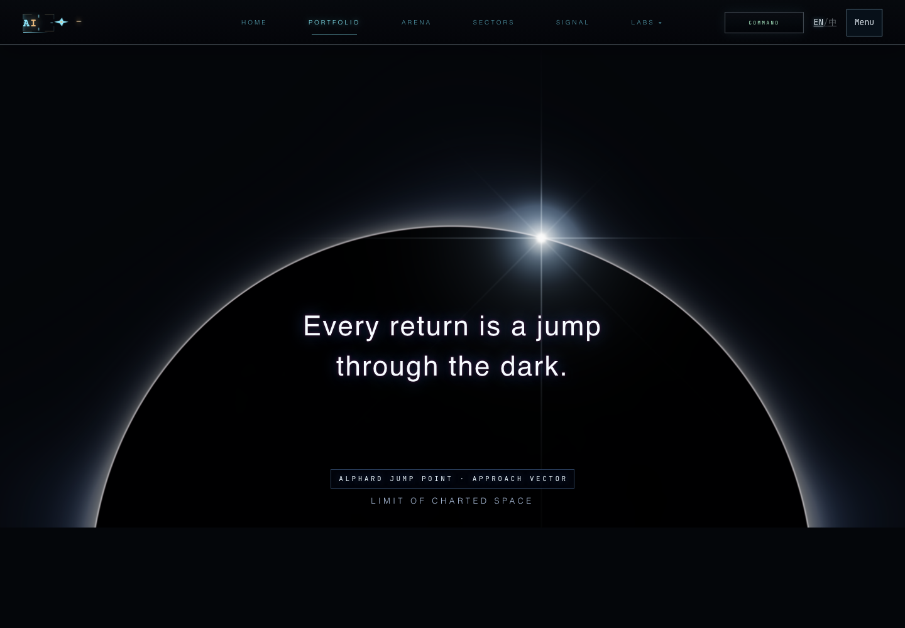

# M05 · Portfolio 有限滚动叙事

本轮增强现有 `#stardrive / src/scene/alphardForge.js`，沿用 M03 星场、M04 开屏、M00 调度与 M07 降级。只实施 Portfolio，没有改 Sectors 五幕、数据、路由、小说或生产资源；保留工作区已有未提交改动。未发布、推送或添加依赖。

## 所有权与滚动纪律

已核对根 `design.md`、`tech.md`、`CLAUDE.md` 和 `docs/astra-motion-design.md`；未发现适用的 `AGENTS.md`。根技术约束要求普通装饰优先 CSS timeline/IO，连续 Canvas 使用既有采样 owner，单次几何读取、单 rAF、离屏停止，移动几何使用 svh，验收使用真实滚轮。

- **唯一 sticky 舞台**仍是 `.stardrive-stage`。外层 `.stardrive-runway` 只是预留高度的普通容器，没有第二个 sticky、固定覆盖层或 nested pin。
- **唯一连续采样 owner**仍是 Alphard Forge 的现有 rAF。每次绘制只读取一次 runway `getBoundingClientRect()`，不新增 scroll/wheel listener；尺寸读取仅走现有 coordinator resize/quality 回调。
- **唯一日食 renderer**保留现有 Three.js 单平面 shader、Baily 珠与钻石环主体。没有增添全屏星空、后处理或第二套预算。
- Hero Canvas 的轻微缩退使用 `@supports (animation-timeline: view())` 下的 CSS view timeline。正文、指标和标语保持静态，不做滚动透明度揭示。
- Forge 接手时继续通知 M03 停绘，同时隐藏 hero 容器的亮 poster 背景；没有再向已停用的黑洞层写透明度。离屏/页面冻结时停绘，返回时直接采样当前位置。

## 本站参数与三段状态

| 阶段 | 状态 | 内容保证 |
| --- | --- | --- |
| Hero → 建立场景 | 既有星场开屏与操作不变；Forge 0–30% 从珠光形成日食钻石环 | 标语从 HTML 起完整存在，CTA 可直接跳过舞台进入财年记录 |
| 缩退让出文字 | 30–78%：背景 scale 1 → .62，上移最多自身高度 12%；标语固定在舞台 62% 高度处 | 去掉旧的逐字切片、游标和文字缩放；高亮点与文字分开 |
| 稳定进入数据 | 76–100%：只把日食背景亮度退到 0；后续指标在文流中接续 | strip 不在裁剪容器中，opacity 恒为 1，真实值/模型估算标签/日期完整保留 |

桌面 runway 为 **180svh**，舞台高 `min(80svh, 760px)`，sticky top 80px。几何不再依赖脚本添加 `has-motion-shell`，WebGL 成败不改变预留高度。进度按当前 runway 顶部、实际高度和舞台高度直接计算，不对进度做惯性追赶；反向、快滚和 resize 无须补播。

≤860px、coarse pointer、reduced-motion 使用普通文流，舞台高 `min(65svh, 540px)`，无 pin/缩放/渐隐。首次静态访问不加载 Forge，CSS 日食轮廓是装饰 fallback；动态切换减少动态后保留终态单帧。相同尺寸/策略通知不会重复清空或重绘 Canvas；尺寸确实变化时允许必要的一次重绘。无 wheel 劫持、强制 snap、锁滚、业务状态重置。

这些数值和进度映射是本站设计，不是参考页内部算法或性能数据。

## 本轮变更文件

| 文件 | 修改 |
| --- | --- |
| `portfolio.html` | 在已有舞台外预留 runway；装饰 poster/Canvas 与完整标语分离；指标保留在舞台外 |
| `src/scene/alphardForge.js` | 单采样进度、缩退/曝光、接手/停止、静态帧去重、尺寸去重、统一生命周期；所有档位使用现有 DPR 预算，上限 1.5，低档 1 |
| `src/main.js` | 保留 near-stage 动态导入；移除成功/失败时改变几何的 class 切换 |
| `src/performance-dossier.css` | 本页 owner 管理预留高度、唯一 sticky、文字安全区、静态 fallback 与移动/RM 文流 |
| `src/home-visual-upgrade.css` | CSS hero 装饰缩退与 Forge 接手时的亮 poster 处理 |
| `src/styles.css` | 移除被本轮替代的旧 pin/fx-stage 和逐字游标规则；保留既有页面转场 |
| `tests/homeStardriveLayout.test.js` | 更新舞台、自然文流、单采样、预算和主体保留合同 |
| `e2e/astra-scroll-story.spec.js` | 6 个真实浏览器验收用例，输出截图、滚轮状态和绘制记录 |
| 本报告及 `astra-m05-evidence/` | 实测证据 |

## 预览与截图

本地构建预览：[EN Portfolio](http://127.0.0.1:4179/en/portfolio.html)、[ZH Portfolio](http://127.0.0.1:4179/zh/portfolio.html)、[直达财年记录](http://127.0.0.1:4179/en/portfolio.html#fy2026Performance)。需要本机预览进程保持运行。

桌面截图均为 1440×1000，resize 为 1440×820，手机为 390×844。修改前后属于舞台附近的对照，不是相同页面滚动高度的像素差分。

| 状态 | 截图 |
| --- | --- |
| 修改前 | [00-before.png](astra-m05-evidence/00-before.png) |
| 开始 / 25% / 50% | [开始](astra-m05-evidence/01-start.png) · [成形](astra-m05-evidence/02-quarter.png) · [缩退](astra-m05-evidence/03-half.png) |
| 结束 / 反向 / 快滚 | [结束](astra-m05-evidence/04-end.png) · [反向](astra-m05-evidence/05-reverse.png) · [快滚](astra-m05-evidence/06-fast.png) |
| 财年数据 / 高度变化 / 锚点直达 | [数据](astra-m05-evidence/07-data.png) · [resize](astra-m05-evidence/08-resize.png) · [锚点](astra-m05-evidence/09-anchor.png) |
| 减少动态 / 中文手机 / WebGL 失败 | [静态](astra-m05-evidence/10-reduced.png) · [手机](astra-m05-evidence/11-mobile.png) · [fallback](astra-m05-evidence/12-webgl-failure.png) |

## 检查与实测

- **M05：6/6 浏览器用例通过**。真实 `mouse.wheel` 验证 0/.25/.5/1、反向 .5、快滚 .96；进度与当前几何误差 <.015；同位置缩放一致。无 `window.scrollTo()` 代替滚轮验收。
- **M03：8/8 回归通过**（开发预览 5174，包含源码模块拦截）；**M04：7/7 回归通过**（构建预览 4179，包含真实前进/后退与 BFCache）。
- Forge 离屏后和静态尺寸到位后，400ms 观察窗内实际 WebGL draw 次数不增加；Forge 活跃时 hero draw 不增加。上下文丢失显示 fallback，恢复后按当前位置继续。
- reduced-motion 的一次测试最初把 760→540px 的必要 resize 重绘误算为动画：调用记录确认只有尺寸变化时多一帧；最终用例等待缓冲尺寸到位再验证停绘，已通过。实现同时去重相同尺寸的 Canvas 设置，避免清空保留帧。
- 手机使用 Chromium 的真实合成触摸手势，纵向滚动超过 100px，中文页面无横向溢出。不是物理真机测试。
- **36/36 相关单测通过**：stardrive layout、starfield model、render coordinator、home black-hole/presentation、combat presentation。`typecheck`、`prebuild` 全部检查、直接 Vite 构建与 `git diff --check` 通过。
- 检查时另运行了旧 `homeLoadingContract`：3/6 通过；3 项仍断言 M00/M03 前的 idle 自动加载、旧 observatory loader、旧语言按钮 class。它们与本轮开始时的实现已不一致，本轮未扩大修改这些旧契约，也未把它们报告为通过。生产构建仍提示部分 chunk >500kB。

[滚轮状态 JSON](astra-m05-evidence/wheel-states.json)记录 0/.25/.5/1/.5/.96 的实际值与显示状态。[绘制采样](astra-m05-evidence/draw-cadence.json)记录本机 headless Chromium 的约 2.54 秒短窗口：113 次绘制，约 **44.5 fps**，间隔中位数 **22.4ms**、P95 **23.3ms**；DPR **1**、缓冲 **1440×760**。这是本机短时 draw cadence，不是 GPU 执行耗时、稳定 60fps 或真机长时间性能承诺。高 DPI 的 1.5 上限由源码预算约束，本次设备实际 DPR 为 1。

构建直接使用 `npx vite build --outDir /tmp/afflatus-astra-m05`，只调用既有本地化导出函数处理 active 页面；没有运行会生成小说文档的完整 build hook。临时产物不作为可发布包使用。

## 待验证边界

Safari/Firefox 的 CSS view timeline、不支持 timeline 的真实浏览器、iOS/Android 地址栏收缩、物理触屏、120Hz 与长时间热降档仍需实机验证。此次高度变化以浏览器 viewport resize 代测；不把它等同于手机地址栏行为。不支持 CSS timeline 时 hero 装饰保持静态，正文与数据没有动画依赖。Sectors 本轮保持不变。
