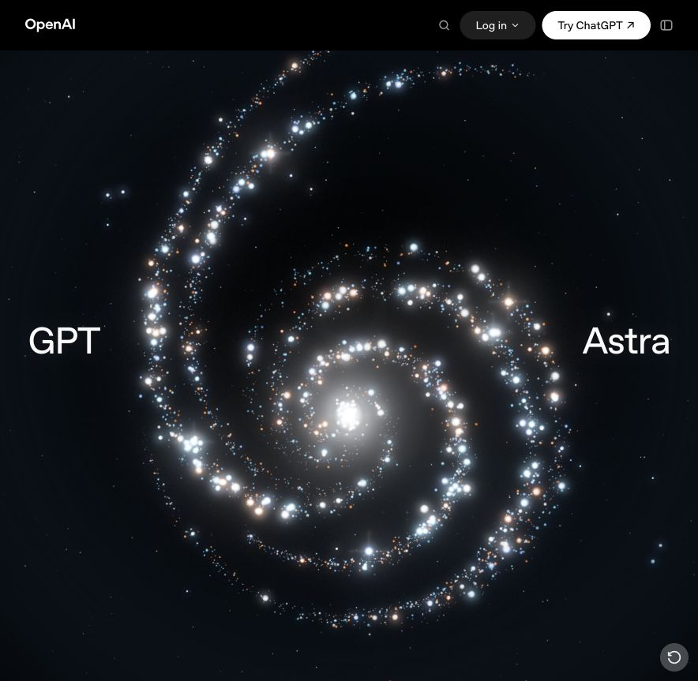
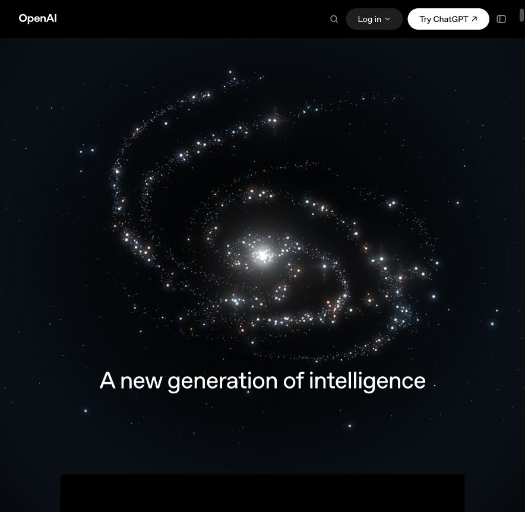
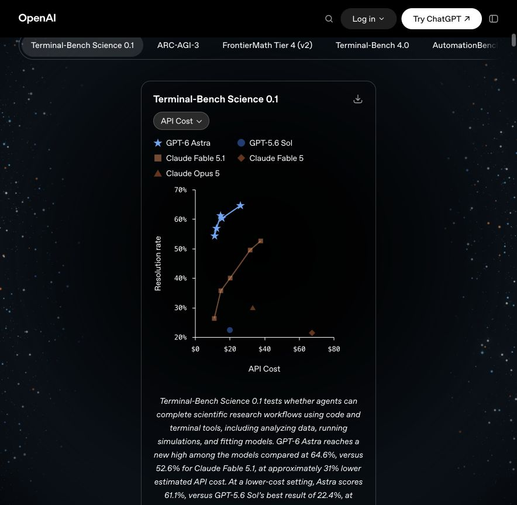
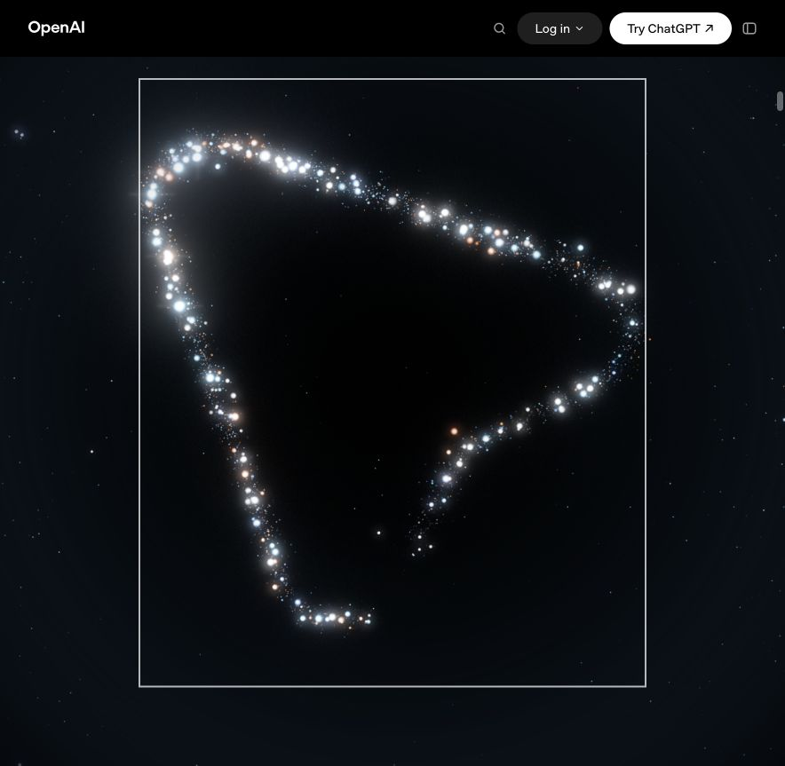
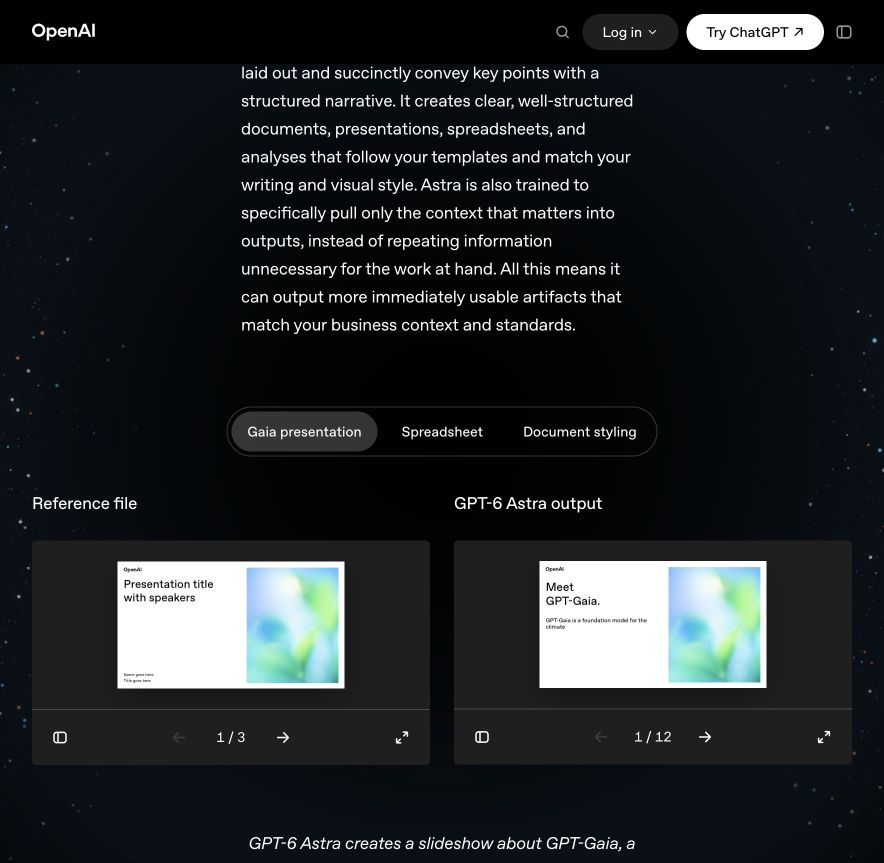
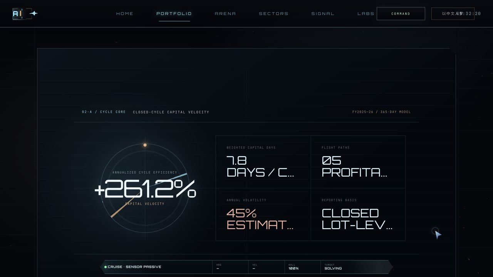
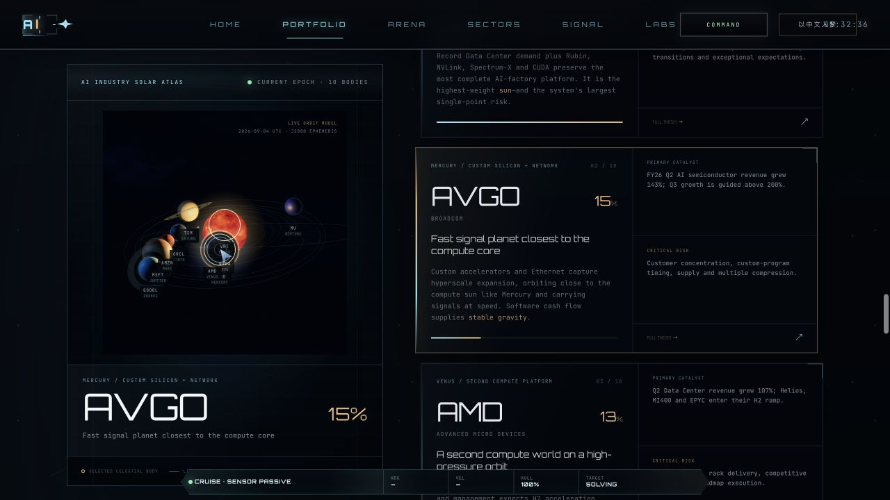
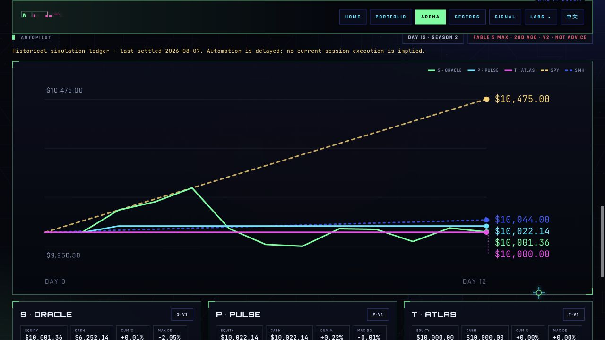
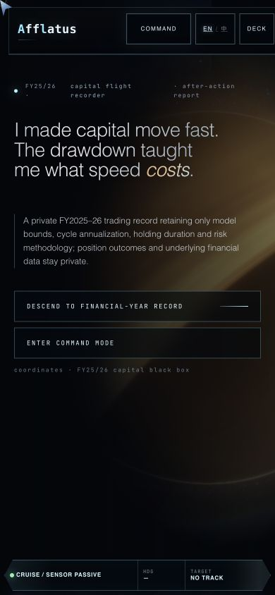

# Astra → Afflatus：前端动效、图表与交互设计拆解及 Codex Prompt 手册

> 调研日期：2026-09-05（Australia/Melbourne）。交付性质：设计研究与实施说明；尚未修改或部署网页。
>
> 参考：[GPT-6 Astra 发布页](https://openai.com/index/gpt-6-astra/)。目标：[Portfolio](https://feida.au/en/portfolio.html) 及当前站点导航中的全部页面、小说书籍与章节页面模板。
>
> 推荐路线：先解决阅读与操作问题，再将“星点聚合、受控旋转、滚动退场、安静正文、可解释图表”迁移到 Afflatus。保留每页已有的人格和配色，避免所有页面变成同一种星空。

## 1. 如何把这份文件交给 Codex

1. 将本文件放在实际项目仓库的 `docs/astra-motion-design.md`。附带 `astra-design-evidence/` 截图目录更便于视觉核对；缺少截图时可从本文原始 URL 重新观察。
2. 首先复制 **Prompt S0**，让 Codex 检查实际代码和当前上线页面。
3. 按 §4 的优先级，每次执行一个模块，或使用 §7 的单页组合 prompt。推荐首轮：`M00 → M01 → M02 → M03 → M04 → M05 → M06`。
4. 每个模块 prompt 默认继承 S0 的合同。全新 Codex 会话先贴 S0，再贴所需模块；不要只贴“做成 OpenAI 那样”。
5. 执行完使用 **Prompt QA** 验收。P2 模块是可选设计库，不需要全部上线。

### Prompt S0 — 项目总合同与首轮执行

```text
你正在改进 Project Afflatus。请先读取 docs/astra-motion-design.md、根目录 design.md、tech.md、CLAUDE.md，以及实际存在且适用的 AGENTS.md。检查工作区差异，保留已有未提交改动。

目标：借鉴 https://openai.com/index/gpt-6-astra/ 的星点聚合开屏、可控空间交互、滚动叙事和图表阅读体验，改进 https://feida.au/en/portfolio.html 及站内页面。本文的浏览观察不等于源站算法，本文参数是本站建议值。

先从 src/config/siteManifest.js、Vite 构建入口、导航和小说路由生成逻辑生成当前路由清单。区分 active、prototype、system、历史残留和已发布小说章节。不要用 dist_* 历史目录作为源代码，不要把本地未公开小说稿件变成新公开路由，不要复活 games/league 等未列入 active 的页面。EN/ZH 按现有发布规则处理；小说维持中文发布规则。

沿用 Vite、多页 HTML、现有原生 JS/局部 React/Three.js 架构。不整体迁移到 Next.js，不新增第二套渲染预算、游标或页面转场系统。优先复用 renderBudgetCoordinator、webglLifecycle、viz、nav、i18n、已有图表和各页面样式 owner；依赖确有必要才添加。

保留实际内容、来源、日期、模型/估算/模拟标记、金融数据隐私边界、小说正文、课程进度和合法资源署名。图表不能虚构数据或把缺失当零。保留各页配色和字体身份；必要的字号、对比度、行距改进由布局证据支持。

首轮仅执行 M00、M01、M02：盘点动效所有权，修复正文可读性/数据标签截断，确保导航与必要操作优先。完成后给出变更文件、可查看预览、前后截图、已运行的相关检查和待验证限制。不要顺手实施所有 P2 效果。后续按我指定的模块继续。

页面应在 JS/WebGL 失败时仍可阅读和导航；reduced-motion 直接提供稳定终态；触屏保留纵向滚动；离屏停止渲染。动画不可成为访问内容的前提。只改实现该模块所需文件，不发布、不推送、不改生产数据。
```

## 2. 调研证据与边界

### 2.1 证据等级

- **O（已观察）**：本轮浏览器截图、真实滚轮、点击、拖动或键盘操作。
- **D（DOM 证据）**：本轮页面标签、语义、Canvas 标记、遮罩样式、链接与控件状态。
- **C（代码证据）**：当前 Afflatus 工作区中的源码；可能与线上版本存在差异。
- **P（设计提案）**：借鉴后的实现方案；不是 OpenAI 官方实现、性能测试或源码复刻结论。
- **U（未验证）**：不能据截图推断的帧率、完整动画曲线、低功耗表现、真实触摸、跨浏览器及读屏完整行为。

本轮使用 Codex 内置浏览器。参考页主要视口为 884×863，目标页桌面为 1280×720；两站另检查了 390×844 窄屏。不同桌面截图只用于分析层级，不用于像素级比较。390px 检查是视口缩窄，不代表真机触控、Safari 或系统 reduced-motion 已测。

已执行：参考页首屏重播、星场拖拽、方向键旋转、滚动至正文/指针/页尾、图表标签切换与导出菜单、媒体及幻灯对照标签；Portfolio 滚动和 AVGO 星体选择；Course 地图锚点；Horoscope 空表单提交；小说章节深链接。未逐一播放每个视频、运行嵌入游戏、下载图表或完成所有业务表单。

参考页 DOM 显示 `data-engine="three.js r180"` 和一个 `data-astra-canvas`；正文期间该 Canvas 出现中央透明、两侧保留的 `mask-image`。这支持“共享视觉载体 + 阅读区遮罩”的判断，但不足以确定其着色器、粒子数、力学模型、后处理或完整渲染架构。无按帧计时，因此下文毫秒数均为建议值。

### 2.2 参考页的观察流程

| 步骤 | 观察位置 / 操作 | 结论与状态 | 证据 |
| --- | --- | --- | --- |
| R01 | 首屏重播 → 等待成形 | 星点从散布状态聚合为有深度的“6”；GPT/Astra 分列。开屏可重播，主题识别强。 | 37、38 |
| R02 | 拖拽星场、方向键 | 控件支持旋转；键盘操作出现可见焦点框。被动悬停吸引力与阻尼公式未测。 | 01、02、36 |
| R03 | 首次向下滚动 | 大主体缩退、标题更替，逐步进入正文。原生滚动能继续推进。 | 03 |
| R04 | 正文与基准组 | 星场退到两翼，文字/图表中心安静；标签组减少纵向重复。 | 04、06 |
| R05 | 切 ARC-AGI-3 / 打开图表菜单 | 观察到带数值柱图、横向查看按钮、PNG/SVG 下载及复制链接菜单。窄容器中图表部分横向隐藏，需保留发现线索。 | 05、35 + DOM |
| R06 | 中段指针 → 方向键 | 星点构成空间指针，延续首屏材质；大焦点框清楚但可进一步精致。 | 07、08 |
| R07 | 演示与输入/输出对照 | 标签切换演示；两列幻灯片各有页码、前后按钮和全屏入口。 | 30、31 |
| R08 | 页尾品牌图形与总表 | 星点品牌图形呼应首屏；完整表格/脚注提供细查路径。 | 34、35 |
| R09 | 390px 首屏 | 品牌文字调整位置、导航收纳；首屏未发现整页横向溢出。真机手势仍待验。 | 41 |

关键帧（截图属于研究证据，不作为本站生产素材）：











### 2.3 当前站点全覆盖范围

“所有子页面”按**当前有效路由 + 可复用详情模板**覆盖。8 个 active 页面全部做了桌面与窄屏观察；书籍和章节按共享阅读器模板审查，未宣称逐章截图。子页各自是完整内容产品，不能套一个通用首页模板。

| 页面 | 已观察现状 / 值得保留 | 最应改进 | 模块组合 | 证据 |
| --- | --- | --- | --- | --- |
| [首页](https://feida.au/en/) | 黑洞、简洁标题、三个内容方向，较克制 | 首屏价值与内容入口衔接；手机首屏占高；背景与字的分区 | M01/03/04/06/08 | 33、49 |
| [Portfolio](https://feida.au/en/portfolio.html) | 黑洞 hero、stardrive、周期指标、资产太阳系；选星体后关联论点卡 | 正文偏暗、小字与省略号；持续 HUD；巨型数据卡；星体标签拥挤 | M00–07、M09–13 | 10–14、40、42 |
| [Arena](https://feida.au/en/arena.html) | 量化控件、TA 搜索、模拟净值线、明确历史状态 | 第一任务入口距离；曲线筛选与键盘读数；数值/来源解释 | M01/02/08–11/13 | 20、21、43 |
| [Sectors](https://feida.au/en/sectors.html) | 两阵营配色、成本对照、五幕星图、来源账本 | 长篇导航、章节叙事稳定、图表比较条件、星图静态替代 | M01/05/06/08–12 | 22、23、44 + C |
| [Signal](https://feida.au/en/signal.html) | 档案纸感、章节导航、收益率/事件/来源状态 | 阅读噪声、长段落、图表与事件展开保持定位 | M01/02/06/08–11/13 | 24、25、45 |
| [Horoscope](https://feida.au/en/horoscope.html) | 温暖植物色、原生表单、本地计算说明；空提交聚焦日期 | 手机标题区拥挤、首个表单较靠下；结果展开稳定 | M01/02/06/12/13 | 26、46 + D |
| [小说书架](https://feida.au/zh/serial.html) | 独立中文阅读、主题/字号/目录/翻页、横向书架 | 阅读工具发现性；深链接落点；正文不受装饰动画影响 | M01/02/08/12/15 | 27、28、47、50 |
| [Course](https://feida.au/en/course.html) | 36 节点/52 周课程、现场手册风格、地图缩放与章节锚点 | 主路径突出、节点详情回退、清楚的学习状态 | M01/02/05/06/08/12/14 | 29、32、48 |

小说路由族：`/zh/novels/{book}/` 与 `/zh/novels/{book}/{chapter}/`，另有既存无语言前缀路径及英文重定向。三本书为 `wanjie-zhongchun`、`changye-qingjian`、`yuxi-gongci`。实测深链接：[万界种春第 1 章](https://feida.au/zh/novels/wanjie-zhongchun/1/)。其余书籍/章节继承阅读器模块，实施时必须从**当前公开清单**枚举检查，不能把本地 JSON 中 200 条记录视为全部可发布。

Portfolio 的 10 个星体/论点属于同页选择与详情状态；Course 的 36 节点属于同页内容/详情状态；Signal 的事件和 Arena 的标的面板也要纳入交互验收，不凭设计方案新增独立 URL。

`boot.html` 在 manifest 中是 prototype，`404` 是 system；对它们仅要求导航与降级一致。`games.html`、`league.html` 是工作区残留文件，本轮未发现它们属于当前 active 导航；不纳入视觉重做。线上与本地文档不完全同步时，先确认实际入口，不依据旧设计说明覆盖线上内容。

## 3. 可学习效果的完整模式清单

这里的“完整”指本轮能识别的**不同模式**，不是把每一个相同图表标签都算一个新动画。

| 模式 | 源站证据 | 可迁移原理 | 去向 |
| --- | --- | --- | --- |
| 散点 → 可识别主体的开屏 | O：重播前后 | 让品牌由材质与运动形成，结构仍是可读 DOM | M04 |
| 深度星场、远近粒子和辉光 | O + D：Three.js Canvas | 层次来自深度、密度、亮度差，少量亮点承载焦点 | M03 |
| 拖拽/键盘旋转 | O + D：具名按钮 | 场景可玩，同时给非鼠标操作通道 | M03 |
| 平滑指针跟随/回弹 | U：未精确测定被动 hover | 作为可选低幅增强，不冒充源站原理 | M03 |
| 主体随滚动缩退、标题接棒 | O | 一次只让一个内容层级占据舞台 | M05 |
| 正文中央留净、侧翼延续氛围 | O + D：mask-image | 沉浸与可读性可以共存 | M01 |
| 标题/内容进入视口的节奏 | O：滚动可见状态；具体触发 U | 小幅 reveal，以立即可读为底线 | M06 |
| 粒子“6 / 指针 / 品牌图形”复用 | O | 同一材质用于少数章节转折 | M16 |
| 精简首屏导航、滚动期间导航可达 | O | 随页面任务收纳次要入口 | M02/M08 |
| 横向胶囊标签、激活状态 | O + D | 同一问题的多种证据集中展示 | M09 |
| 成本—能力散点/折线 | O + D：SVG marks | 二维权衡、真实坐标、标记形状区分系列 | M10 |
| 带最终数值的柱图 | O | 少类别比较、从零基线起、数值常驻 | M10 |
| 图表模式控件、下载/深链接菜单 | O + D | 让图可读、可引用、可带走 | M11 |
| 图表旁说明、文末完整表格和脚注回链 | O + D | 先解释结论，允许查原始依据 | M10/M11 |
| 媒体演示标签与简短说明 | O + D | 看结果，再进入复杂体验 | M14 |
| 输入/输出并排、幻灯页码/翻页/全屏 | O | 用户能直接比较成果 | M14 |
| 可交互游戏 iframe | D，未运行全流程 | 只在明确启动后加载重体验 | M14 |
| 反馈引语穿插长文 | D，未逐个视觉抽检 | 真实证据块打断长文节奏，不伪造背书 | M06 |
| 390px 的导航收纳和标题重排 | O | 改构图，不把桌面整体等比缩小 | M02/M07 |
| 减少动态、暂停、触屏替代与错误恢复 | 以 P 为主 | 源站截图不能证明全面合规，本站必须单独完成 | M00/M07/M13 |
| 页间共享元素/短转场 | P；源站跨页效果未审查 | 本站已有功能可优化，不能写成“源站使用了它” | M15 |

参考页中的 14 个标签组可归为三类：6 组基准图（总览、计算机、专业、编程、科学、网络安全）+ 1 组边界行为图；6 组演示/作品（计算机演示、日常任务、文档对照、空间作品、游戏、科研流程）；1 组对话比较。它们多数应复用同一 tabs 组件，而不是建立 14 套状态逻辑。

## 4. 按落地顺序排序

P0 = 内容/操作/性能的底线；P1 = 首轮视觉和数据体验；P2 = 主路径稳定后按页面需要选择。工作量为单模块相对量：S 小、M 中、L 大；不是工期承诺。

| 顺序 | 模块 | 优先级 | 价值 | 量级 | 前置 |
| --- | --- | --- | --- | --- | --- |
| 1 | M00 动效所有权与降级底座 | P0 | 防重复渲染、失效仍可读 | M | S0 |
| 2 | M01 阅读分区、数据标签、排版 | P0 | 立即改善目前可见问题 | M | 无 |
| 3 | M02 操作优先与安静阅读模式 | P0 | 控件可发现、HUD 不遮挡 | M | M00 |
| 4 | M03 可控指针星场 | P1 | 核心识别性与互动 | L | M00/01/02 |
| 5 | M04 非阻塞开屏编排 | P1 | 高质量第一印象 | M | M03 |
| 6 | M05 有限滚动叙事 | P1 | 连接首屏与内容 | L | M00/01/03 |
| 7 | M06 轻量内容入场 | P1 | 统一长页面节奏 | S | M00/01 |
| 8 | M07 手机、键盘、减少动态适配 | P0，贯穿实施 | 不能事后补的操作合同 | M | 与 M03–06 同交付 |
| 9 | M08 章节导航与阅读定位 | P1 | 快速直达长页面内容 | M | M01/02 |
| 10 | M09 可访问标签切换 | P1 | 降低比较成本 | M | M00/01 |
| 11 | M10 图表几何与可信动画 | P1 | 让数据先可理解 | L | M01/09 |
| 12 | M11 图表探查、数据表、引用 | P1 | 可核验、可分享 | M | M10 |
| 13 | M12 详情展开与选择联动 | P1 | 避免迷路和误触 | M | M02/08 |
| 14 | M13 加载、陈旧、空态和微反馈 | P0，随相关模块交付 | 数据与操作的真实反馈 | M | M00 |
| 15 | M14 媒体演示、成果对照 | P2 | 适合案例/课程，不必全站加 | M | M09/12/13 |
| 16 | M15 克制页间/阅读器转场 | P2 | 清理已有等待与重复过渡 | M | M02/07/12 |
| 17 | M16 粒子章节符号 | P2 | 少量章节的品牌呼应 | L | M03/05/07 |

最小可交付版本：M00/01/02 + Portfolio 的 M03/04/05 + M07。图表页随后做 M09/10/11。M13 随每轮落地，不应因为表中靠后而延期。

## 5. 共用设计与工程合同

### 5.1 建议动效参数（P，非源站测量值）

| 动作 | 默认建议 | 降级 |
| --- | --- | --- |
| hover / focus 状态 | 120–180ms；颜色、边线、2px 以内位移 | 保留即时状态，去位移 |
| tabs / 抽屉 | 180–280ms；内容交叉淡入，不延迟操作 | 即时切换 |
| 普通段落 reveal | 320–480ms；Y 12–20px；组内错开 40–60ms，最多 4 个 | 正文直接显示 |
| 开屏 | 最多约 1.2s；文字与 CTA 无需等场景成形 | 静态 poster + 内容 |
| 指针跟随 | 水平 ±3°、垂直 ±2°起调；时间相关阻尼 | 无被动视差 |
| 拖拽 | 移动超过约 6px 才判拖动；限制俯仰 | 点击 DOM 列表/方向键 |
| 滚动舞台 | Desktop 总高约 160–200svh；Mobile 普通文流或 ≤120svh | 无 pin、无镜头推拉 |
| 图表首次呈现 | 400–650ms；一次；最终标签一直可读 | 直接最终图 |
| 首轮渲染预算 | 中档从 4k 粒子起，高档约 8k；DPR 上限起点 1.5 | 1–2k 或 poster；以实测选档 |

空间插值应基于帧间时间，例如 `alpha = 1 - exp(-dt / tau)`，避免固定每帧 lerp 在 60Hz/120Hz 手感不同。建议 `tau=0.12–0.2s` 起调。场景参数不要通过 React state 每帧更新。粒子采用批量几何/实例而非上千 DOM 元素。仅视口内的必要场景渲染，GPU 资源显式管理。这些是本站技术建议，参考 [MDN WebGL 实践](https://developer.mozilla.org/en-US/docs/Web/API/WebGL_API/WebGL_best_practices)。

### 5.2 现有代码优先复用地图（C）

| 责任 | 已存在位置 | 实施纪律 |
| --- | --- | --- |
| 路由与本地化 | `src/config/siteManifest.js`、`scripts/localize-site.mjs`、`vercel.json` | 编辑源文件；不手改构建产物 |
| 新首页 | `src/showcase/App.jsx`、`src/showcase/showcase.css`、`src/showcase-main.jsx` | 首页与 Portfolio 不是同一个入口 |
| Portfolio 入口 | `portfolio.html`、`src/main.js`、`src/homeExperience.js` | 找准实际挂载点，避免双初始化 |
| 黑洞背景 | `public/vendor/black-hole/`、页面实际引用处 | 新星场上线时做选择/替换，不默认叠加 |
| 星门舞台 | `src/scene/alphardForge.js` | 保留结构高度与降级，调整已有舞台 |
| 资产太阳系 | `src/ui/portfolioSolarSystem.js`、`src/portfolio-convoy.css` | 数据可视化不能被装饰性星场代替 |
| 渲染/上下文 | `src/lib/renderBudgetCoordinator.js`、`renderBudget.js`、`webglLifecycle.js` | 复用暂停/恢复/释放协议 |
| 数字动画 | `src/ui/homeScrollTelemetry.js`、`src/ui/viz.js` | 前者目前先写 0 再入场计数；避免伪零状态 |
| 游标/转场 | `src/ui/cursor.ts`、`src/lib/transition.js`、`public/page-turn.css` | 唯一 owner；普通阅读优先系统游标 |
| 导航/语言 | `src/lib/nav.js`、`src/lib/i18n.js` | 保留路径、query、hash 和键盘语义 |
| 分页阅读 | `src/lib/serialRoutes.js`、`src/lib/pagedBook.js`、`src/pages/serialLibs.js`、`serial.html` | 书/章/主题/位置分别管理 |
| 逐页逻辑 | `src/pages/arena*.js`、`sectors.js`、`horoscope*.js`、`course.js`；`signal.html`/`signalLibs.js` | 先检索真实 owner，文件名不是强制重构目标 |

正文默认显示；仅在增强已成功初始化后启用入场效果。`prefers-reduced-motion` 应改为稳定展示，不只是把连续运动放慢。CSS 滚动动画用 `@supports` 检查，不支持时用静态文流或已有 IntersectionObserver。参考 [减少动态](https://developer.mozilla.org/en-US/docs/Web/CSS/Reference/At-rules/@media/prefers-reduced-motion) 与 [animation-timeline](https://developer.mozilla.org/en-US/docs/Web/CSS/Reference/Properties/animation-timeline)。

### 5.3 不能照搬的部分

- 不复制 OpenAI 的“6”、品牌花结、标志、发布文案及基准成绩；采用自己的舰徽、轨迹或资产主题。
- 不把星场铺到小说正文和 Horoscope 表单下面；各页人格在现有 `design.md` 中已有明确边界。
- 不让所有段落逐字出现、不反复计数、不强迫用户看完开屏。
- 不把整个 document 设 `touch-action:none`，不劫持滚轮，不强迫横屏。
- 不把 3D 轨道距离、大小或旋转速度暗示为真实资产风险/收益比例；数据映射须明确说明。
- 不因源站显示大范围粒子就断言它用了流体模拟、GPGPU、GSAP、Lenis 或某个特定 shader。

## 6. 模块说明与完整实施 Prompts

### M00 · 动效所有权与降级底座 — P0

**学习点**：源站用连贯视觉语言贯穿页面。本站已有渲染协调器，应先落实资源所有权，再加效果。**范围**：所有页面，尤其 Portfolio 同时具有背景、星门、太阳系和战斗模式。

**交付/验收**：每种渲染器有明确启停与释放路径；Tab 离开或模块离屏停止无意义工作；动态导入失败仍有内容；重进页面不重复绑监听。底座不是一次新平台重构。

~~~text
执行 docs/astra-motion-design.md 的 M00，继承 S0。盘点当前 active 页面中 Canvas/WebGL、requestAnimationFrame、scroll/pointer listener、Worker、ResizeObserver、IntersectionObserver 的实际 owner，形成简短表格。
复用 src/lib/renderBudgetCoordinator.js 和 webglLifecycle.js，补齐当前目标页面真正缺失的启停/销毁；不要另建全站调度器。Portfolio 普通阅读、stardrive、solar atlas、command mode 的资源启停要有明确关系；新增主场景时停用被替换的旧背景。
保持关键标题、文本、图表数值与导航在 HTML/DOM 中；WebGL 初始化失败、context lost、JS 分块加载失败时切回静态 poster 或可读列表。保存阅读位置；pagehide/pageshow/BFCache 恢复不得重复初始化。
将减少动态、数据节省提示和低性能选档接入已有机制，不以设备型号白名单判断能力。给出实际重复渲染或缺失清理的证据，修最小必要问题。验证 hidden/offscreen 启停、重新进入、失败回退；不要为了“统一”重写所有 renderer。
~~~

### M01 · 安静阅读区、排版与完整数据标签 — P0

**源站**：R04 的中心文字区不被星点穿过，氛围保留在两侧。**本站问题**：12/42 截图中 DAYS /…、PROFI…、ESTIM…、CLOSED LOT-L… 已影响读数含义；桌面也存在，不是只有手机。

**设计**：标题允许展示字体，解释正文使用本页已有易读字体；计量值、单位、状态分行；指标卡内容决定高度。动态背景后的文字需可靠的不透明阅读底层。桌面正文建议 60–68ch；手机主要正文建议 ≥16px，注释尽量 ≥13–14px，不能用缩到 9px 解决拥挤。

**验收**：320/390/768/1280 宽度完整显示核心标签和单位；200% 缩放可阅读；最亮背景帧仍有稳定对比。数字精度、单位、正负号不变化。

~~~text
执行 M01，先修 portfolio.html 的 hero 解释文字、#stardrive 指标、#fy2026Performance 的 core telemetry，再检查 solar atlas 卡片。对照证据 10、12、14、40、42。
从真实 CSS owner 定位 text-overflow/nowrap/固定高度/字号限制。把“值、单位、方法/状态”拆成语义明确的行，长英文标签正常换行；核心信息不得使用 ellipsis，不能仅靠 title tooltip 补全。卡片允许 grow，网格按内容重排，保留现有科幻字体身份、色板、数据和文案含义。
在正文阅读区使用稳定深色底层，把背景亮点限制到边缘；遮罩跟随内容容器与断点，不写死截图中的像素位置。高对比焦点、选中文本和链接也需要可见。
在 320、390、768、1280px 和 200% zoom 检查标题、四类指标、来源/日期、CTA。对比度使用实际计算/工具验证，不凭截图宣称 AA。交付可复用 token 的最小调整及前后截图，禁止通过 overflow:hidden 掩盖整页溢出。
~~~

### M02 · 主任务优先、导航与安静阅读模式 — P0

**源站**：首屏操作少，内容区保留可达导航。**本站**：Portfolio 的 command 入口、船舰遥测、系统游标外的指针等与金融记录同时出现；Course/研究页和阅读器的任务各不相同。

**设计**：普通浏览以“看记录/查证据”为主 CTA；战斗玩法保留显式入口。正文时 HUD 收纳到小入口，展开可恢复。阅读模式不改业务数据，不自动启用音频。

~~~text
执行 M02。检查 Portfolio 的 COMMAND、heroCommandCta、cicCruiseStrip、自定义 cursor 和现有 cruise/command 状态，沿用同一个状态 owner，避免再造一个竞争的 mode。
默认普通浏览时，财年记录 CTA 为主，command 为次；进入正文后，将非必要遥测收纳成不遮正文的可恢复入口。只有显式进入 command mode 才展示完整战斗控制。通过真实链接/按钮支持键盘和触屏，退出恢复之前滚动位置与焦点。
普通文本、表单、链接区域保留系统游标；自定义准星仅用于明确需要的 command 场景。手机优先保留品牌、菜单、语言三个动作；菜单内清楚列出当前页和所有 active 页面，避免两个同义语言入口或只用难懂的 DECK 作为导航名称。
所有主操作无需看完动画；底部安全区、软键盘和浮动按钮不得遮 CTA。保持 EN/ZH 对应路径与导航顺序。验证菜单打开/关闭、Esc、焦点恢复、Tab、手机单手点击，以及 command 开关不触发重复渲染。
~~~

### M03 · 指针互动星场 — P1，核心视觉模块

**源站已确认**：星点组成有深度的主体，支持拖拽和方向键。**提案**：Afflatus 以“舰徽轨迹/资本航线”取代数字 6；交互分为低幅被动视差、主动拖拽、稳定归位三个层级。若现有黑洞更符合品牌，可只做轻视差与阅读退场，无需替换成另一套宇宙。

**状态合同**：static → entering → idle ↔ interacting → settling；不可见 paused，失效 fallback。拖拽阈值区分 click；按钮链接不被画布接管。桌面被动视差不应移动可点目标。

~~~text
执行 M03，在 Portfolio 的现有场景所有权内实现一个 Afflatus 自有主题的可控星场。优先复用已有 Three.js、几何与材质加载方式；不要同时运行原黑洞、新全屏星场和第二个装饰 renderer。先给出哪个现有模块被增强或替换的明确位置，再实施。
视觉由三层构成：稀疏远尘、主要轨迹星点、极少量高亮近星。使用青白/少量琥珀，保留文字区安全留白。主体应从远景也可识别；禁止直接描摹 OpenAI 数字 6 或花结。生产所需品牌路径使用已有授权 SVG/模型，缺少素材时保留现有主体。
桌面 fine pointer 可选小幅 yaw/pitch 视差；主动拖拽旋转，约 6px 移动后进入 drag，pointerup/cancel 均释放捕获。用与 dt 相关的阻尼和旋转限幅，不通过 React state 每帧提交。链接、按钮、输入框不被全屏拖动层吞掉。
提供清楚的交互提示、重置视角和暂停动态按钮；场景容器可聚焦，方向键旋转，Home 重置，Esc 结束交互。装饰 Canvas aria-hidden，真实信息用 DOM；不要把按钮包在包含其他按钮的按钮里。
按 M00 接入启停与像素预算；从中档 4k 粒子/DPR 1.5 起实测，性能不足逐级减少，手机可以静态。按 M07 完成触屏和 reduced-motion。验收拖拽、键盘、离屏、失败回退和文字点击。报告实测，不宣称达到参考页内部算法。
~~~

### M04 · 非阻塞开屏编排 — P1

**源站**：37 → 38 为“散布星点 → 主题轮廓”的可重播开场。**迁移**：先给可读内容，再让背景成形，避免用户进入页面后等待空白片头。

**建议节奏**：0ms 可读 HTML；0–200ms 静态底图与导航；150–700ms 背景聚合；250–800ms 标题最多一次 8–12px 位移淡入；500–1000ms 辅助说明/方向提示；1.2s 内完全稳定。这是建议编排，不是源站测时。

~~~text
执行 M04，给 Portfolio 主场景加入一次性开屏序列，继承 M03/M07。首个 HTML 帧就有标题、正文和 CTA；静态 poster 与舞台比例先存在，字体和 WebGL 到达后不能造成布局跳动。
开屏仅动背景、可选标题轻位移和方向提示；不要逐字打字、不要遮住页面的 loading screen，不用假百分比。总序列控制在约 1.2s 内。用户一旦滚动、导航、聚焦表单或开启减少动态，立即取消剩余装饰序列并进入可读稳定态。
首次进入可播，浏览器后退/前进和 BFCache 恢复不重播；可用页面级 session 标记辅助判断，但不能覆盖正常浏览器恢复。重播按钮只重播视觉，不重置滚动、语言、业务数据或全站状态。
处理 poster→Canvas 平滑交接与资源失败，reduced-motion 直接显示终态。记录初始、成形、用户提前滚动、后退恢复四种状态截图，确认 CTA 从第一帧可用。
~~~

### M05 · 有限滚动叙事与场景交接 — P1

**源站**：大“6”缩退，下一句承接，再进入安静正文。**本站**：已有 Alphard 星门与 Sectors 五幕，不应再嵌套一层 pin 或引入滚轮平滑库。

**提案分镜**：A 建立主体；B 主体缩退/文字承接；C 到达真实图表与说明。A→C 控制在一个短舞台内。连续滚动负责视觉进度，不决定数据真实值。

~~~text
执行 M05，优先改已有 #stardrive / alphardForge，而不是新建第二个 sticky 舞台。确认根 design.md、tech.md 的滚动纪律，普通内容使用 CSS scroll/view timeline + @supports 或已有 IntersectionObserver；确需 Canvas 连续进度时复用现有采样 owner，单次几何读取与单 rAF 合并，不新增逐组件 scroll listener。
将 Portfolio 的 hero→stardrive→财年记录编成三段：建立场景、缩退让出文字、稳定进入数据。舞台容器事先保留正确高度；桌面约 160–200svh 起调，手机优先普通文流。快滚、反向滚动、地址栏高度改变都应显示与当前进度相符的状态。
核心正文和数值永不以“滚到精确位置”作为出现条件；停止滚动后不能卡在低透明度。离开舞台即停渲染；下一场景接手时不留下叠加亮斑。禁止 preventDefault 劫持 wheel、强制 scroll snap、长时间锁滚、nested pin。
Sectors 如应用本模块，应调整现有五幕和节点/连线的状态表达，不改数据叙事顺序。用真实滚轮验收开始/25%/50%/结束/反向/快滚/锚点直达，并检查 reduced-motion 静态路径。
~~~

### M06 · 内容入场、媒体揭示与长文节奏 — P1

**学习点**：章节标题、图表、演示形成可预测的阅读节奏。**提案**：同级元素使用同一套短 reveal；引语只有真实内容才放；图像外框固定比例，图像内部可以轻微显现，避免整个版面漂浮。

~~~text
执行 M06，为当前指定页面的章节标题、摘要、普通卡片和媒体区统一轻量入场。先查已有 CSS view timeline、IntersectionObserver 和类名，复用 owner。内容默认可见；增强成功才启动。不要对全站所有元素扫描加动画。
正文块采用一次性 opacity + translateY 12–20px，320–480ms；卡片一组最多 4 项错开 40–60ms。标题最多按整行/整个标题处理，不逐字拆分 DOM，不改变复制和读屏顺序。图表的坐标、数据标签和表格不跟随段落错位。
媒体保留明确宽高/aspect-ratio，懒加载只影响资源，不让容器塌陷。揭示完成后移除临时 will-change。长文优先用标题/留白/真实证据块组织，不新增无来源引语。
用户快滚、查找文本、锚点直达、打印、JS 错误和 reduced-motion 时内容完整显示。验证已读部分不会每次滚回来重播，也不会停在半透明状态。
~~~

### M07 · 手机、键盘与减少动态 — P0，与视觉模块一起验收

**源站可学**：具名旋转控件与可见焦点；手机重新排布品牌文字。**源站未证明**：真实触控、全部读屏流程、低端性能及暂停逻辑。不能把“有 aria-label”当作无障碍完成。

**本站基线**：8 个页面在本轮 390px 首屏没有整页横向溢出，但部分局部横向条、字距与数据标签仍需完善。自动持续动态与内容并列时应有暂停/停止途径，不能仅依赖系统设置；参考 [W3C Pause, Stop, Hide](https://www.w3.org/WAI/WCAG22/Understanding/pause-stop-hide.html)。

~~~text
执行 M07，覆盖 M03–06 涉及的每个互动部件。分别处理 fine pointer、coarse pointer、键盘、reduced-motion，不把 390px 视口等同于手机硬件。
装饰背景在 touch 上不抢滚动；普通阅读画布保留 pan-y 和 pinch-zoom。复杂二维/三维拖动需要显式进入互动模式并可退出，默认可用 DOM 列表点选。触点实际点击范围建议至少 44×44px，不通过重叠伪元素遮住邻近按钮。
所有重要 hover 信息也能聚焦/点击获取；Tab 顺序与视觉逻辑一致，Esc 退出覆盖层并回原触发器。场景方向键只在场景获焦时处理，不能全页抢方向键。图表有非视觉文字/表格替代。
减少动态下停掉镜头推拉、被动视差、自动旋转、循环闪动，直接给终态；持续装饰提供可保存的暂停开关，并监听系统设置动态变化。暂停不得停掉必要的加载反馈、数据刷新或用户主动翻页。
检查 320/390/768/1280、200% zoom、横竖屏、软键盘与安全区；随后用真实触摸设备补签。将已测浏览器/设备和未测项目分别记录，不能以桌面窄屏截图宣称全端通过。
~~~

### M08 · 章节目录、阅读进度与定位 — P1

**源站**：长文与脚注提供结构；本文的 sticky 章节目录是给本站的增强提案，不宣称源站已实现同款目录。**重点页面**：Portfolio、Sectors、Signal、Course、Serial。

~~~text
执行 M08，检查指定页面已有章节导航与锚点，不重复添加第二套目录。Portfolio 优先提供“年度记录 / 周期路径 / 资产星图”，沿用真实 section id。Sectors/Signal/Course 使用实际标题生成短标签；小说沿用章节目录。
桌面目录可静静位于侧边，手机收为可横向浏览的章节条或单个目录按钮。当前章节用文字/形状和 aria-current 表达，不能只变色。锚点设置正确 scroll-margin-top；跳转后的标题不被 sticky header 遮挡。
点击更新对应 hash；被动阅读高亮不逐帧写 history。浏览器返回、语言切换保留合理 hash/查询和位置。阅读进度仅用细条辅助，不用巨大百分比挤占正文。
可选增加“跳过互动，阅读数据”入口。保留普通链接、复制地址、新标签打开和 JS 关闭时的锚点能力。验证目录不产生第三层嵌套，焦点与滚动不互相拉扯。
~~~

### M09 · 标签切换与内容容器 — P1

**源站**：多个 benchmark 使用胶囊标签；标签宽度不足时水平滚动，选中背景清楚。**本站去向**：Sectors 对比视角、Arena 不同数据视图、Course 内容类型等确有同一任务的场合。不要把整页所有主要章节藏进 tabs。

**建议**：同组控件保持可见；内容 180–240ms 淡切；为图表预留相近高度。切换若需要网络/重计算，采用手动激活，避免方向键移动即触发昂贵请求。键盘合同参考 [WAI-ARIA Tabs Pattern](https://www.w3.org/WAI/ARIA/apg/patterns/tabs/)。

~~~text
执行 M09，为当前页面实际存在的同类视图建立或改进 tabs。使用 button + tablist/tab/tabpanel 语义，aria-selected/aria-controls 关联唯一 id，roving tabindex，方向键、Home/End 与 Enter/Space 工作正确。
轻量且预加载的面板可自动激活；涉及请求/重算的面板用手动激活。焦点仍留在所操作标签。切换仅淡入内容，预留图表高度，不触发意外纵向跳动，不重置页面滚动或用户其他筛选。
手机横向 tablist 需要边缘提示和被选项自动进入可视区域；保留手指纵向滑动页面的能力，不把所有 tab 压成小字号。活动样式与 focus-visible 分开表达。
inactive panel 不参与焦点、读屏和媒体播放；关闭时停止相关昂贵渲染。JS 未初始化时主要证据能顺序阅读，不能全部 hidden。验证中英文长标签、键盘往返、快速切换和无网状态。
~~~

### M10 · 图表几何、编码与可信动画 — P1

**源站**：成本/得分散点与连线、星形/圆/方/三角等系列标记、直接数字的柱图、简洁坐标和解释。**现有基础**：Arena 净值曲线已有端点数字、不同线色与基准虚线，不应全部换库。

**本站图表选型**：

| 数据问题 | 建议图形 | 为什么 | 不应使用 |
| --- | --- | --- | --- |
| Portfolio 周期效率与持有时间 | 对齐横条 + 天数点图，或两栏共享类别轴 | 分开单位，可比较五条路径 | 把效率%与天数叠成一个无说明仪表 |
| Portfolio 资产权重 | 真实比例横条/表格，与太阳系共用选择 | 3D 负责探索，平面负责精确读取 | 用行星体积假装准确权重 |
| Arena 模拟净值/回撤 | 净值线与独立回撤区，明确时间范围 | 不同量纲分区，保留基准 | 无注明的双轴/平滑补造历史值 |
| Sectors 成本/能力 | 同口径散点或小多图；完整说明测试条件 | 表达权衡；不混合不可比指标 | 把不同榜单分数直接连成一条“能力”曲线 |
| Signal 10Y/30Y/利差 | 同单位收益率线；利差独立面板/标值 | 时间和单位明确 | 通过拉伸纵轴暗示不存在的巨大波动 |
| Course 学习完成度 | 阶段列表 + 少量进度条 | 用户关注下一步与完成证据 | 虚构能力雷达、假熟练度分数 |
| Horoscope 星盘 | 可操作 SVG + 同步文字结果 | 星盘位置与解释对应 | 对娱乐结果发明“科学概率” |

~~~text
执行 M10。先列出当前页面的数据字段、单位、基准、日期、来源和缺失状态，依据本文选型表改图。优先复用现有 SVG/Canvas 图表 owner；不要为视觉更新更换全站图表库。
借鉴参考页的精确坐标、少量轴线、直接数字与形状编码；保留本站语义色和模拟/真实/估算区别。系列同时有名字、线型或点形，不能只有颜色。柱图从零基线起；折线非零轴要清楚标注。缺失值保留缺口和“无数据”，不连线补点，不当作 0。
图表进场最多一次 400–650ms，坐标和最终数值立即可读。线条可用裁切/描边揭示；柱条从基线长出。切换数据以短交叉淡入为主，不对不同单位或不相同的数据点强行 morph。
Portfolio 不再先把完整真实 DOM 数字改成 0 等待滚动。去除无信息的计数，或将装饰动画与最终可读值分离，读屏不逐帧播报。公开展示范围维持原隐私边界。
手机将小图改为横条/小多图/表格；坐标标签不能缩到不可辨认。给每张图一句问题/结论、单位和截至日期，详细依据交给 M11。验收最终值与源数据一致、零值/负值/缺失/单点/极端长标签及 EN/ZH，不把过渡帧当成真实统计。
~~~

### M11 · 图表探查、完整表格、导出与引用 — P1

**源站已观察**：PNG/SVG 下载、复制链接菜单、横向查看箭头、完整数据表与脚注回链。Tooltip 的具体交互没有完整实测，下面为本站提案。

**设计**：悬停/键盘/触摸能取得同样数据；屏幕窄时详情固定在图下，避免浮层被手指遮住。图表下保留表格按钮、来源日期和方法。导出仅在数据和授权允许的范围内。

~~~text
执行 M11，在 M10 的真实数据和现有图表上补齐探查能力。桌面 hover、键盘焦点和手机 tap 获取同一条记录；tooltip 限制在视口内，包含日期、系列、值、单位和状态，Esc/外部点击关闭。不得让数千数据点全进入 Tab 顺序；优先一个图表焦点后用方向键选择点，并提供完整 table 替代。
图例如可过滤系列，用 button + aria-pressed 表达；切换后保留系列身份、坐标口径与明确图例。表格与图来自同一数据源，有 caption、列标题、单位、日期和缺失解释；宽表只在表格区域横滚，首列可固定，不能整页横滚。
增加适用的复制当前图表链接、PNG/SVG 导出菜单。复制在用户点击后进行，成功/失败提供短状态；深链接只保存图表/视图标识，不携带私密数据。无法可靠导出的图表不显示失效按钮。
导出图必须有标题、单位、来源、截至日期、模拟/估算标记，且不包含 tooltip 遮挡、未完成动画或私人持仓字段。非必要不新增大型下载依赖；图下始终可阅读数据。
验证 hover/focus/tap 等价、边缘 tooltip、深链接重开、下载图的完整性、脚注前往/返回及慢数据时不会出现旧标的提示。
~~~

### M12 · 同页详情、选择联动与焦点恢复 — P1

**本站证据**：选 AVGO 后星图和卡片关联（14）；小说已有阅读器；课程地图已有缩放与节点。源站的标签/演示说明“先看摘要，再展开证据”，但抽屉形式是本站设计建议。

**设计**：列表、星图、图表与详情共享 selectedId；避免选择星体时页面又自动滚到陌生位置。深度最多两层；详情中不要再嵌套一套导航迷宫。

~~~text
执行 M12，对当前页面的“摘要→详情”建立统一选择来源，保持现有内容与真实路由。Portfolio 的星体和论点卡、Course 节点和详情、Signal 事件和档案分别复用原组件，不新增跨页全局大状态。
列表与视觉节点使用同一个 selectedId；点击后有立即可见的选中状态。必要时将对应卡片最小距离滚入可视区域，不强制居中或让用户失去上下文。数据标签重叠时用 DOM 列表/清楚的当前项解决，不能随意删节点。
桌面可在原布局展示侧栏，手机用适当高度的抽屉或正常文流。只有实际 modal 才设 aria-modal 并约束焦点；非模态侧栏不锁焦点。Esc/关闭回原触发器，关闭后恢复阅读位置。
已存在的 query/hash/书章 URL 要保留，返回/前进恢复当前选择；没有真实独立路由的详情不要伪造 SEO 页面。点击、Enter/Space 和触屏等价。验证快速连续切项无旧结果闪回、关闭后焦点正确、可复制深链接的内容确实能重新打开。
~~~

### M13 · 加载、陈旧状态与细小反馈 — P0

**已有优势**：Arena 线上会显示历史快照、延迟发布和最后结算日期；Signal 说明档案与收益率分别刷新。应保留并提升可读性。页面初始状态与异步更新后的标签可能不同，不能把首帧 TODAY 当作最终数据状态。

**设计**：点击后 ≤200ms 有反馈；数据不变不闪。loading/ready/partial/stale/gated/error 对应真实请求状态；不做“为了好看”的 loading。

~~~text
执行 M13，沿用当前页面实际数据状态机。Arena 保留 loading/ready/partial/stale/gated/error，Signal 区分档案更新时间与独立实时数据状态；其他页面使用与业务相符的最少状态。
按钮触发后立即显示处理状态，防重复提交但不移动按钮；明确 aria-busy，短文本 status，只有真正错误用 alert。仅在真实等待时显示轻量占位，预留与最终内容相近高度；reduced-motion 使用静止占位。
数据缺失显示“暂无/未公布/加载失败”及可行恢复动作，不显示 0、伪 OK、假实时或假进度。后台刷新保留当前阅读位置，并明确是否在看旧数据；新请求取代旧请求时，旧响应不能覆盖新选择。
hover/focus/active 使用统一 120–180ms 小反馈，不做不断跳动的 CTA。状态不依赖颜色；中英文错误、空态和重试含义一致。小说、课程不得丢失本地进度；Horoscope 不为动画保存或上传个人输入。
验证离线、超时、空数据、部分数据、快速重复操作和恢复；用与真实用户任务相关的最小测试，禁止仅测试某个 class 是否添加。
~~~

### M14 · 媒体演示、输入输出对照与可试玩模块 — P2

**源站**：电路板等短演示 + tabs；幻灯片输入/输出并列，页码、翻页、全屏操作独立。空间模型/游戏属于内容演示，不代表网页本身必须变成游戏。

**适用**：Portfolio 的软件案例、Course 的练习成果、Sectors 的有来源产品演示。无真实素材时不为了装饰添加空壳案例。

~~~text
执行 M14，只在已有真实案例/媒体的页面实施。先列出可用且有使用权的截图、视频、模型或演示链接；没有素材时保留内容版，不制造演示结果或客户背书。
做“问题/输入→输出→解释”组件，桌面可两列，手机分块并标清身份。图片/视频预留比例，使用 poster 和延迟加载；播放控件、字幕/文字说明、全屏与关闭可键盘操作。标签切换和离屏时停止非活动媒体。
幻灯集使用可读页码、上一张/下一张按钮，首末页状态准确；需同步比较时提供明确的同步选择，不假装不同页数天然一一对应。按 M09 支持 tabs；按 M12 恢复焦点。
可试玩 iframe/3D 场景先展示预览与“启动”，明确关闭入口；不在首屏后台启动全部体验，不自动发声，不抢滚轮。外链失败提供可操作链接/说明。
验收视频暂停、慢网占位、键盘全屏退出、移动端比例和累计布局位移。不要把原参考页素材复制到本站生产目录。
~~~

### M15 · 页间与阅读器转场 — P2

**C**：现有 transition.js 在普通模式把导航延迟约 720ms，RM 分支仍有 160ms 延迟；这是可优化的本站实现。**P**：采用短过渡/共享元素增强，不宣称 Astra 源站使用 View Transitions。

~~~text
执行 M15，先检查 src/lib/transition.js、public/page-turn.css、各页语言切换和阅读器已有 View Transition owner。明确只保留一个转场入口，避免浏览器原生 transition、Canvas overlay 和 CSS page-turn 同时覆盖页面。
普通导航不应为了播放 720ms 特效而等待；保留原生链接行为，以 150–220ms 的短淡切或受支持的 View Transition 渐进增强。减少动态直接导航。不要给普通阅读默认播放音效；继续沿用已有声音偏好。
小说书架→阅读器可只过渡封面/标题等小范围共享元素，临时 view-transition-name 完成后清理。正文换章与翻页不造成大幅翻转/镜头运动；主题、字号、书签、曲目和位置保持。
支持 Cmd/Ctrl-click、新标签、下载、外链、hash、语言和浏览器返回，不拦截这些原生意图。旧浏览器即时导航；JS 异常也能前往目标。
验收连续快速点导航、返回恢复、减少动态、语言切换和阅读器换章。无需为了转场迁移多页架构。
~~~

View Transition 是渐进增强，支持情况应由能力检测决定，参考 [MDN View Transition API](https://developer.mozilla.org/en-US/docs/Web/API/View_Transition_API)。

### M16 · 少量粒子章节符号 — P2，最后再做

**源站**：“6 → 指针 → 品牌图形”使用同一星点材质。**提案**：仅 Portfolio 的“航向 / 周期 / 星图”等转折处使用最多 2–3 个自有符号。各符号有语义，不额外插入几屏空白粒子秀。

~~~text
执行 M16，但仅在 M03/M05/M07 验收通过后。以 Afflatus 现有授权舰徽/航迹/星图轮廓构造最多 2–3 个章节形状，直接接入已有粒子场，不新增 WebGL context。
每个形状与该段标题语义对应。预计算等数量点集和稳定对应关系，用少量 uniform 驱动形态插值；不要每帧重建几何、随机换点、从 DOM 排版反复取样。避免剧烈 z 轴飞向视点或频繁闪白。
变形只发生在已有短章节过渡内，正文阶段粒子退到边缘。用户快滚可直接取当前稳定形态，反向滚动也合理。减少动态显示静态符号，低性能降级不影响章节阅读。
与 M03 共用暂停、方向键/重置和生命周期。验证每个符号的剪影识别、正文安全区、快滚/逆滚/离屏与显存回收。若没有可复用品牌素材或实际章节需求，记录跳过原因，不强行新增装饰。
~~~

## 7. 可以直接复制的逐页组合 Prompts

以下均继承 S0。每条按当前页面的真实内容落地，不允许因为复用动画而覆盖另一页面的人格。**先做 Portfolio，再把已验证的交互合同迁移给其他页面。**

### Prompt A1 — Portfolio 主改版

~~~text
按 docs/astra-motion-design.md 改进 Portfolio，继承 S0。范围是 portfolio.html 的实际入口及必要共享组件，包含 /en/portfolio.html、/zh/portfolio.html 和已有无前缀入口。
依次执行 M00/01/02，修复 core telemetry 在桌面和手机的省略号、文字对比与常驻 HUD 遮挡。保留首屏原文、金融数据的公开范围和方法说明。
然后实施 M03/04/05/07：一个可控主场景、一次非阻塞开屏、已有 stardrive 的有限滚动交接；进入数据区后视觉安静，不再同时跑多个装饰世界。
按 M10/11 将周期效率、持有天数、真实比例/模型边界读清楚；按 M12 让 10 个星体与论点卡共享选择，同时保留可用 DOM 列表。星体展示不等同于数值比例，保持解释。加 M08 的三段导航，M13 的真实状态反馈。
先交付可用的完整主路径：首屏→财年记录→周期路径→选星体→论点→返回。不要额外加媒体案例、第三层弹窗或 M16 粒子符号，除非主路径已经验证且另有明确要求。按 QA 检查本页及受影响共享组件。
~~~

### Prompt A2 — 首页与 Portfolio 的入口衔接

~~~text
按本文改进 /en/ 与 /zh/ 首页，先确认 src/showcase/App.jsx 的实际入口，不把 src/main.js 的 Portfolio 结构误当首页。
保留“Systems for uncertain worlds”及 Capital/Software/Intelligence 内容结构和黑洞品牌。应用 M01 的文字安全区、M02 的主动作层级、M04 的非阻塞首屏和 M06 的轻入场。若页面已有满意的背景，仅改善视差/退场，不另加一层星场。
让首屏后明确进入实际内容；移动端不要为装饰占用不必要的空白高度。导航菜单指向 manifest 中当前 active 页面，语言切换保留位置语义。
首屏→Portfolio、Course、Signal/Sectors 的入口清楚可用；刷新、返回、键盘和 reduced-motion 下均无强制片头。只应用适合首页的模块，不把投资仪表或战斗 HUD 搬到首页。
~~~

### Prompt A3 — Arena 图表与任务入口

~~~text
改进 /en/arena.html 及 /zh/arena.html，保留酸绿/青的模拟交易台身份。按 M01/02 提高主要任务入口的可见性：量化实验、查标的、看模拟账本各有清楚入口，搜索不被漫长介绍埋住。
对现有 QF-01 控件保留所有计算和约束逻辑，M13 区分真实运行中/无结果/错误，不用装饰动画冒充计算进度。不要触碰管理员凭据或生产交易数据。
按 M09/10/11 改善已存在的净值图、回撤/技术图：可比较系列、明确基准/模拟/截至日期、可键盘和触屏读取、可展开源数据表。保持真实时间范围与缺口。
历史快照/延迟发布状态必须在最终 UI 清楚可见，不把旧数据包装成 LIVE。不得因视觉需求编造新的投资结论、预测、回报或交易建议。
验证首屏任务跳转、搜索状态、series 筛选和图表数据一致性，包含错误与陈旧数据。不要在操作密集区加入指针粒子或镜头推拉。
~~~

### Prompt A4 — Sectors 叙事与比较

~~~text
改进 /en/sectors.html 及 /zh/sectors.html。保留两阵营配色、章节顺序、真实节点/关系和来源账本。先 M01/08，优化长文阅读区与锚点目录。
用 M05/06 整理已有五幕滚动星图的进入/阅读/退场。沿用已有图渲染器与状态，2D 和可选 3D 互斥运行；手机保持纵向滚动和文字节点列表，不强迫在大画布找信息。
应用 M09/10/11，把成本、能力、产业链等“口径不同”的指标分为可解释视图；每张图列明单位/测试条件/日期/来源，缺失不补零。比较筛选不得改变底层事实或替换现有研究结论。
M12 让节点、论点、来源互相可定位，关闭详情回原位置。可选 M16 只在不增加空白长舞台且有现成素材时考虑。
验证五幕正反滚、快滚、节点键盘/触屏选择、窄屏表格、跳到来源与返回。不能把此页重做成普通首页或引入第二套星图。
~~~

### Prompt A5 — Signal 阅读与证据链

~~~text
改进 /en/signal.html 及 /zh/signal.html。保留档案纸感、SCP 叙事、黄/灰配色和真实金融说明。执行 M01，降低文字背后的连续扫描线/亮点干扰，确保主段落与小标签对比，正文行长合理。
复用已有章节导航，按 M08 处理桌面侧栏和手机章节条，锚点不被 header 遮挡。M06 内容进入后保持完全可读，不能因为 scroll timeline 进度停在低透明度。
用 M10/11 改进收益率、利差、罗盘/矩阵和事件证据的读数能力；不得混淆档案更新时间与实时数据刷新时间。M13 清楚表示 stale/partial/error。
M12 让事件展开、查看来源、关闭档案恢复到同一阅读点。保留必要风险/来源文字，不把装饰审查黑条盖在正文、链接或重要信息上。
验证来源链接、时间状态、事件返回、手机横向导航和减少动态。不要把蓝色太空粒子搬到档案正文。
~~~

### Prompt A6 — Horoscope 表单与结果

~~~text
改进 /en/horoscope.html 及 /zh/horoscope.html。保留奶油/鼠尾草/赤陶的植物手账身份，不改计算算法、娱乐性质或本地数据边界。
M01/02 优先优化手机 header 字距和高度、首个输入表单的可达性、字段标签与说明。表单必填/可选状态清楚；城市和时区加载有真实反馈，用户不必等待装饰动画。
M13 处理空提交、字段错误、处理中和结果；M06/12 让星盘/八字/合盘结果轻展开，不导致页面跳动，不丢失输入。输入发生变更时旧计算结果不能闪回。
可在星盘本身加入低幅交互与同步文字解释，表单和说明背景保持静止。M07 保证键盘、触屏、减少动态可用。
保存/清除/分享继续由明确用户动作触发；视觉改版不得额外上传出生信息或把私密输入写入新 URL。测试使用固定虚构数据，不复用用户个人资料，测试完不覆盖已有本地记录。
~~~

### Prompt A7 — 小说、三本书与全部已发布章节

~~~text
改进 serial.html 的共享阅读器，覆盖 /zh/serial.html、现有 /novels/ 与 /zh/novels/{book}/{chapter}/ 等有效路径，并保持英文小说路径的现有重定向规则。
从当前公开目录读取 wanjie-zhongchun、changye-qingjian、yuxi-gongci 及各自已发布章；不要把本地草稿/占位章节作为公开内容。改共享模板而不是复制数百份样式。
按 M01 保持正文高可读；按 M08/12 优化书架→章节目录→正文→下一章→返回，独立章节链接应让用户方便抵达正文。保留主题、字号、书签、瀑布流、分页和音频偏好。
M15 仅对封面/标题及短切换做轻过渡，正文不逐行飞入、不重复大幅翻转、不自动播放音频。M07 下减少动态可即时翻页；手机目录和翻页按钮不遮正文。
检查每本书首章、末个已发布章、一个中间章，以及跨书返回、刷新、书签、浏览器后退/前进和阅读位置。枚举所有公开 URL 验证有内容/状态，但视觉测试可按共享模板和边界章抽样。不得修改小说正文、发布状态或新增未授权章节。
~~~

### Prompt A8 — Course 地图与学习路径

~~~text
改进 /en/course.html 及 /zh/course.html，保留现有黑白现场手册/投影卡片人格、36 节点、52 周和原课程内容。
按 M01/02/08 让首屏“地图/每周证据”入口与章节导航清楚；地图有稳定的可读列表替代，不能只靠缩放找到课程。手机保持标题、CTA 和实际内容衔接，避免装饰卡片占满全部空间。
M05/06 只整理已有投影/地图的滚动节奏，正文直接可读；M12 节点展开/关闭保留当前节点、缩放状态和阅读位置。一个全局选择来源即可。
按 M13 给真实完成动作短反馈，进度从现有本地记录读取，不能用动画编造学习完成度。M14 仅对已有练习素材提供输入/输出对照，缺少案例就跳过，不新增虚构成果。
验证地图缩放/重置、列表进入节点、关闭与后退、课程进度刷新保持、EN/ZH 和减少动态。不要把此页变成排行榜或把所有知识点藏在 hover 卡里。
~~~

## 8. 验收门槛与回滚

### 8.1 每轮都需要通过的用户路径

| 路径 | 最小验证 | 失败例 |
| --- | --- | --- |
| 首屏 | 冷启动、资源失败、立即点 CTA、立即滚动 | 等开屏才能看内容 |
| 指针场景 | hover/drag/键盘/暂停/重置 | 链接点不到、结束拖拽仍旋转失控 |
| 滚动 | 正向、反向、快滚、锚点直达、后退 | sticky 卡死、正文停在半透明 |
| 图表 | 切系列、负值/零/缺失、长标签、查表 | 初始假零、数值/单位被省略 |
| 导航/详情 | 打开、Esc、返回、语言切换、深链接 | 键盘焦点丢失、回到页顶 |
| 手机 | 320/390px、实际触控、软键盘、安全区 | 画布吞纵滑、浮控挡按钮 |
| 阅读 | 书籍与边界章、字号/主题/书签 | 动效导致丢章或丢阅读位置 |
| 降级 | reduced-motion、WebGL 失败、离线 | 只显示黑屏或无限 spinner |

建议验收目标：同环境下性能不比基线显著倒退；LCP ≤2.5s、INP ≤200ms、CLS ≤0.1 作为目标而非本轮测量结果；新效果不得贡献可见布局跳动。长期 p75 指标需要真实用户数据，单次 Lighthouse 不能替代；标准依据见 [Web Vitals](https://web.dev/articles/vitals)。GPU 重场景首屏之外延迟加载；新增轻量控制 JS 可先设 gzip 约 30KB 的讨论预算，超过时说明价值与实测，不用为满足数字拆出更多请求。

视觉测试应同时保留静态最终态截图和运动录像/关键帧。帧率结论必须说明设备、浏览器、尺寸、DPR 与记录方式；未测 120Hz、低端 Android 或 iOS Safari 就标“未测”。截图无法证明无障碍、流畅度或没有泄漏。

### Prompt QA — 统一验收与最小修复

~~~text
对本轮按 docs/astra-motion-design.md 实施的模块做完整用户路径验证，先列出本轮实际改动的页面/模块及相应路径，不空泛全站重测。
读取 package.json 和当前测试配置。先完成构建所需检查，按变化选择既有测试：导航/双语对应 localized-navigation 与 locale-prepaint；响应式对应 responsive-primitives；图表/键盘对应 visualization-accessibility；场景对应 webgl-lifecycle 与 performance-telemetry；阅读器对应相关 serial 测试。修改核心计算才扩展计算测试；不要为了 CSS 可逆调整写镜像实现的测试。
必要命令以仓库真实脚本为准，例如 npm run build、npm run typecheck，以及相关测试文件。不能只“构建通过”就宣布 UI 完成。启动预览后用浏览器实测首屏→主 CTA→核心内容→详情→返回，分别记录桌面、窄屏、reduced-motion 和失败降级。
真实滚轮验证滚动动画，不用程序化 scrollTo 作为唯一证据。检查静态和最终态的文字/坐标/标签/来源；检查键盘焦点和触屏滚动；对绘图模块验证离屏/hidden 停止与重新进入恢复。
获取与变更前同条件的性能记录；如果只有窄屏桌面测试，明确未完成真机验证。每个未通过项说明复现步骤与影响；在当前范围内修好并重测相关路径。
最后输出：完成模块、文件清单、预览、前后截图、测试结果、性能前后对照、未测限制和回滚方式。没有实际运行的检查写“未运行”，不能写“应该通过”。不部署或推送。
~~~

### Prompt FIX — 验收失败后的定向修复

~~~text
阅读本轮 QA 结果，仅修其中有证据的失败项。先复现并判断属于布局、焦点、状态、资源生命周期、数据绑定还是性能预算。
优先降低动态幅度、去除重复渲染、恢复静态内容和正确原生交互，不靠增加新的全局监听、!important、任意 setTimeout 或屏蔽 overflow 掩盖问题。
保留已通过的模块和页面人格。修完运行直接相关的既有测试和浏览器路径；仅当新改动影响范围扩大时扩展回归。
给出每个失败项的复现、根因、改动、验证结果；真机或外部数据不可用时明确残留边界，不编造通过。
~~~

回滚策略：每轮维持可独立撤销的变更范围；不要把 M03 星场与无关数据重构混在一起。删除增强入口应能恢复既有静态页面与正常链接。生产发布、推送和数据变更由后续明确指令决定。

## 9. 本轮截图索引与阅读重点

截图相对路径便于随 Markdown 一起复制；完整文件位于同目录的 astra-design-evidence。截图中的数字仅是抓取时刻的 UI，不作为更新金融/模型数据的依据。某些图片是指定滚动位置的视口切片，不能据此认定页面其他部分缺失。

| 步骤 | 截图 | 观察与健康状态 |
| --- | --- | --- |
| R01/R02 | [首屏](astra-design-evidence/01-astra-hero.jpg)、[拖拽后](astra-design-evidence/02-astra-hero-drag.jpg) | 主题鲜明；精确运动算法未测 |
| R03 | [首屏滚动交接](astra-design-evidence/03-astra-scroll-transition.jpg) | 标题接续清楚 |
| R04/R05 | [散点图](astra-design-evidence/04-astra-chart.jpg)、[柱图标签](astra-design-evidence/05-astra-chart-tab.jpg) | 比较清楚；窄容器需发现横滚 |
| R04 | [正文遮罩](astra-design-evidence/06-astra-cursor.jpg) | 中央阅读区安静；文件名中的 cursor 不代表该帧出现指针 |
| R06 | [指针场景](astra-design-evidence/07-astra-cursor-scene.jpg)、[键盘焦点](astra-design-evidence/08-astra-cursor-keyboard.jpg) | 可操作，可见焦点 |
| T01 | [Portfolio 首屏](astra-design-evidence/10-feida-portfolio-hero.jpg)、[星门](astra-design-evidence/11-feida-stardrive.jpg) | 主题强；正文偏暗与常驻 HUD 待改 |
| T02 | [数据终态](astra-design-evidence/12-feida-portfolio-data.jpg) | 核心单位/标签出现省略号，P0 |
| T03 | [太阳系入口](astra-design-evidence/13-feida-solar-atlas.jpg)、[选中 AVGO](astra-design-evidence/14-feida-solar-selected.jpg) | 联动有效；点位/标签拥挤 |
| T04 | [Arena](astra-design-evidence/20-feida-arena.jpg)、[净值图](astra-design-evidence/21-feida-arena-charts.jpg) | 数据与历史说明存在；探查入口可改 |
| T05 | [Sectors](astra-design-evidence/22-feida-sectors.jpg)、[内容与成本图](astra-design-evidence/23-feida-sectors-scroll.jpg) | 视觉身份清楚；长文导航需加强 |
| T06 | [Signal](astra-design-evidence/24-feida-signal.jpg)、[章节交接](astra-design-evidence/25-feida-signal-data.jpg) | 纸感鲜明；交接中低透明度需在实施时验证停滚终态 |
| T07 | [Horoscope](astra-design-evidence/26-feida-horoscope.jpg) | 原生输入/说明存在；首屏信息量较多 |
| T08 | [小说书架](astra-design-evidence/27-feida-serial.jpg)、[阅读器](astra-design-evidence/28-feida-serial-reader.jpg) | 阅读工具齐全；与主站动效需隔离 |
| T09 | [Course](astra-design-evidence/29-feida-course.jpg)、[地图锚点](astra-design-evidence/32-feida-course-map.jpg) | 主要动作可达；继续进入节点仍需逐项验证 |
| R07 | [媒体标签](astra-design-evidence/30-astra-demo-tabs.jpg)、[输入输出对照](astra-design-evidence/31-astra-comparison.jpg) | 成果比较直观；媒体全流程未逐一测试 |
| T10 | [首页](astra-design-evidence/33-feida-home.jpg) | 比 Portfolio 更安静，值得保留 |
| R08 | [页尾星点图形](astra-design-evidence/34-astra-blossom.jpg)、[完整表格](astra-design-evidence/35-astra-table.jpg) | 视觉呼应和证据附录有效 |
| R01/R02 | [首屏键盘](astra-design-evidence/36-astra-hero-keyboard.jpg)、[重播起始](astra-design-evidence/37-astra-replay-start.jpg)、[重播完成](astra-design-evidence/38-astra-replay-complete.jpg) | 已验证非静态图；不据此声称准确时长 |
| T11/R09 | [手机 Portfolio](astra-design-evidence/40-mobile-portfolio.jpg)、[手机 Astra](astra-design-evidence/41-mobile-astra.jpg)、[手机数据](astra-design-evidence/42-mobile-portfolio-data.jpg) | 首屏不整页横溢；数据卡仍截断 |
| T12 | [手机 Arena](astra-design-evidence/43-mobile-arena.jpg)、[手机 Sectors](astra-design-evidence/44-mobile-sectors.jpg)、[手机 Signal](astra-design-evidence/45-mobile-signal.jpg) | 已重排；局部控件与首屏信息密度待优化 |
| T13 | [手机 Horoscope](astra-design-evidence/46-mobile-horoscope.jpg)、[手机小说](astra-design-evidence/47-mobile-serial.jpg)、[手机 Course](astra-design-evidence/48-mobile-course.jpg)、[手机首页](astra-design-evidence/49-mobile-home.jpg) | 无整页横溢；页内交互仍需真机 |
| T14 | [独立章节正文](astra-design-evidence/50-novel-deep-link.jpg) | 深链接可达正文；工具栏横向可发现性待改 |

目标站几个关键证据：









### 本轮尚未完成、留给实施阶段的验证

未测真实触摸设备、系统 reduced-motion、完整屏幕阅读器路径、对比度数值、FPS/内存/显存、全站性能分位数；未逐页检查所有中文对应页；未对每章做视觉截图；未逐个启动参考页的游戏/视频。本文提供全路由适配合同与对应 prompts，不能当作这些检查已通过。

不确定源站的被动 hover 力场、粒子数量、阻尼参数、纹理生成和完整技术栈；实现方案为本站自有设计。若未来 Codex 需要高保真复现某个具体运动，应先录制同视口/同操作的时间序列，再调节参数。
